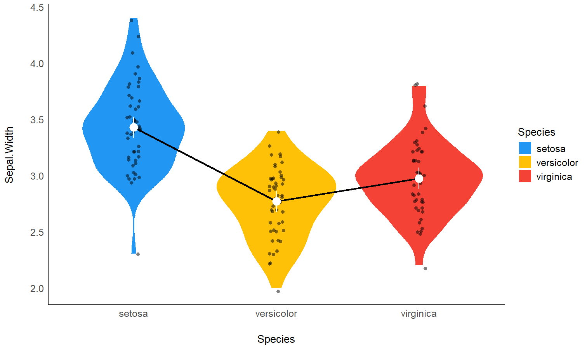
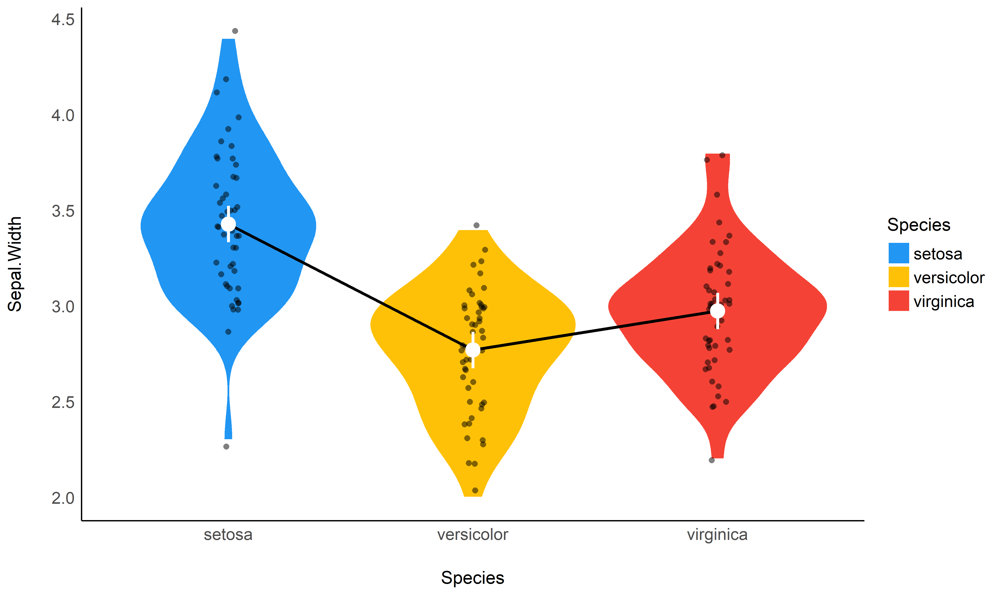
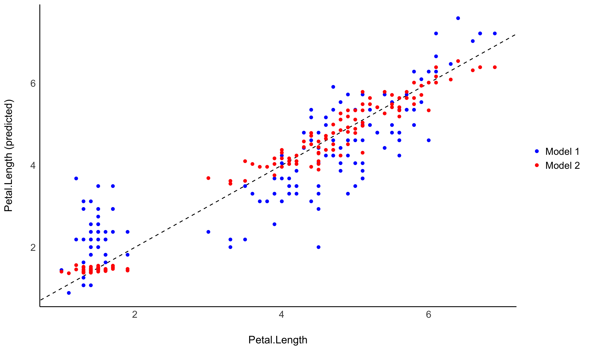
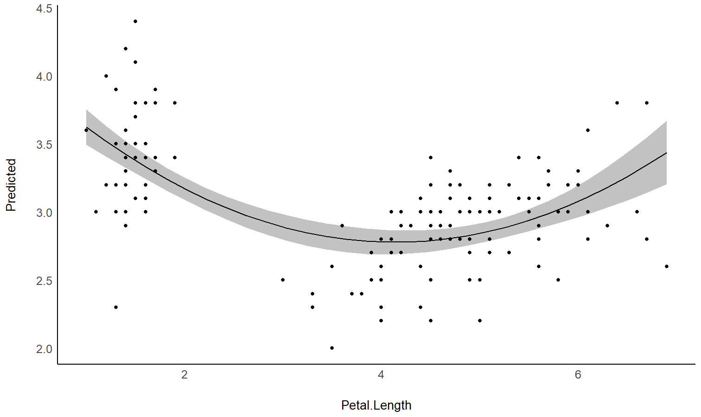

# estimate 

[](https://cran.r-project.org/package=estimate)
[](https://cran.r-project.org/package=estimate)
[](https://travis-ci.org/easystats/estimate)
[](https://codecov.io/gh/easystats/estimate)

`estimate` is a lightweight package helping with model-based
estimations, used in the computation of marginal means, contrast
analysis and predictions.

## Installation

Run the following:

``` r
install.packages("devtools")
devtools::install_github("easystats/estimate")
```

``` r
library("estimate")
```

## Documentation

[](https://easystats.github.io/estimate/)
[](https://easystats.github.io/blog/posts/)
[](https://easystats.github.io/estimate/reference/index.html)

Click on the buttons above to access the package
[**documentation**](https://easystats.github.io/estimate/) and the
[**easystats blog**](https://easystats.github.io/blog/posts/), and
check-out these vignettes:

  - [**Data
    grids**](https://easystats.github.io/estimate/articles/data_grid.html)
  - [**Marginal
    means**](https://easystats.github.io/estimate/articles/estimate_means.html)
  - [**Contrast
    analysis**](https://easystats.github.io/estimate/articles/estimate_contrasts.html)
  - [**Use a model to make
    predictions**](https://easystats.github.io/estimate/articles/estimate_response.html)
  - [**Describe non-linear
    curves**](https://easystats.github.io/estimate/articles/estimate_smooth.html)

# Features

The package is built around 5 main functions:

  - [`estimate_means()`](https://easystats.github.io/estimate/reference/estimate_means.html):
    Estimates the average values at each factor levels
  - [`estimate_contrasts()`](https://easystats.github.io/estimate/reference/estimate_contrasts.html):
    Estimates and tests contrasts between different factor levels
  - [`estimate_slopes()`](https://easystats.github.io/estimate/reference/estimate_slopes.html):
    Estimates the slopes of numeric predictors at different factor
    levels
  - [`estimate_response()`](https://easystats.github.io/estimate/reference/estimate_response.html):
    Predict the response variable using the model
  - [`estimate_smooth()`](https://easystats.github.io/estimate/reference/estimate_smooth.html):
    Describes a non-linear term (*e.g.* in GAMs) by its linear parts

These functions are powered by the
[`data_grid()`](https://easystats.github.io/estimate/reference/data_grid.html)
function, a smart tool for guessing the appropriate reference grid.

The package currently only supports `rstanarm` models, but will be
expanded to cover a large variety of frequentist and Bayesian models.

## Examples

### Create smart grids to represent complex interactions

``` r
library(rstanarm)
library(ggplot2)
library(see)
library(estimate)

# Fit model
model <- lm(Sepal.Length ~ Petal.Length * Petal.Width , data = iris)

# Create dataframe
newdata <- iris %>% 
  data_grid(c("Petal.Length", "Petal.Width"), length = 10) %>% 
  data_grid("Petal.Width", length=3, numerics = "combination", standardize = TRUE)
newdata$Predicted_Sepal.Length <- predict(model, newdata)

# Express values in an abstract way
newdata$Petal.Width <- parameters::format_standardize(newdata$Petal.Width, reference = iris$Petal.Width)

# Plot
iris %>% 
  ggplot(aes(x = Petal.Length, y = Sepal.Length)) +
  geom_point2(aes(fill = Petal.Width), color = "white", shape=21, size = 5) +  # Only shapes from 21 to 25 have a fill aesthetic
  geom_line(data = newdata, aes(y = Predicted_Sepal.Length, color = Petal.Width), size = 1) + 
  scale_color_viridis_d() +
  scale_fill_viridis_c(guide = FALSE) +
  theme_modern()
```

<!-- -->

### Estimate marginal means

<!-- -->

``` r
library(rstanarm)

model <- stan_glm(Sepal.Width ~ Species, data = iris)

estimate_means(model)
```

    ## Species    | Median |       89% CI
    ## ----------------------------------
    ## setosa     |   3.43 | [3.35, 3.50]
    ## versicolor |   2.77 | [2.70, 2.85]
    ## virginica  |   2.97 | [2.90, 3.05]

### Contrast analysis

``` r
estimate_contrasts(model)
## Level1     |     Level2 | Median |         89% CI |     pd | % in ROPE | Median (std.)
## --------------------------------------------------------------------------------------
## setosa     | versicolor |   0.66 |   [0.54, 0.76] |   100% |        0% |          1.51
## setosa     |  virginica |   0.45 |   [0.34, 0.56] |   100% |        0% |          1.04
## versicolor |  virginica |  -0.20 | [-0.31, -0.09] | 99.80% |     6.28% |         -0.47
```

``` r
library(see)

plot(estimate_contrasts(model), estimate_means(model))
```

<!-- -->

### Check the contrasts at different points of another linear predictor

``` r
model <- stan_glm(Sepal.Width ~ Species * Petal.Length, data = iris)

estimate_contrasts(model, modulate = "Petal.Length", length = 3)
```

    ## Level1     |     Level2 | Petal.Length | Median |        89% CI |     pd | % in ROPE | Median (std.)
    ## ----------------------------------------------------------------------------------------------------
    ## setosa     | versicolor |         1.00 |   1.55 |  [1.06, 1.99] |   100% |        0% |          3.55
    ## setosa     |  virginica |         1.00 |   1.22 |  [0.66, 1.75] | 99.92% |     0.07% |          2.79
    ## versicolor |  virginica |         1.00 |  -0.33 | [-1.03, 0.37] | 75.95% |    13.60% |         -0.75
    ## setosa     | versicolor |         3.95 |   1.76 |  [1.08, 2.56] | 99.95% |     0.05% |          4.04
    ## setosa     |  virginica |         3.95 |   1.80 |  [1.05, 2.60] | 99.95% |     0.05% |          4.13
    ## versicolor |  virginica |         3.95 |   0.03 | [-0.19, 0.25] | 59.82% |    53.27% |          0.08
    ## setosa     | versicolor |         6.90 |   1.99 |  [0.58, 3.67] | 97.58% |     1.07% |          4.57
    ## setosa     |  virginica |         6.90 |   2.37 |  [0.87, 4.01] | 98.85% |     0.27% |          5.44
    ## versicolor |  virginica |         6.90 |   0.39 | [-0.03, 0.81] | 92.92% |    10.70% |          0.89

### Find a predictor’s slopes at each factor level

<!-- -->

``` r
estimate_slopes(model)
## Species    | Median |        89% CI |     pd | % in ROPE | Median (std.)
## ------------------------------------------------------------------------
## setosa     |   0.14 | [-0.00, 0.30] | 93.30% |    32.10% |          0.06
## versicolor |   0.69 |  [0.58, 0.79] |   100% |        0% |          0.32
## virginica  |   0.75 |  [0.67, 0.85] |   100% |        0% |          0.35
```

### Generate predictions from your model to compare it with original data

``` r
estimate_response(model)
```

| Sepal.Length | Species | Median | CI\_low | CI\_high |
| -----------: | :------ | -----: | ------: | -------: |
|          5.1 | setosa  |   1.48 |    1.04 |     1.88 |
|          4.9 | setosa  |   1.45 |    1.00 |     1.88 |
|          4.7 | setosa  |   1.41 |    1.00 |     1.82 |
|          4.6 | setosa  |   1.37 |    0.93 |     1.79 |
|          5.0 | setosa  |   1.45 |    1.05 |     1.89 |
|          5.4 | setosa  |   1.53 |    1.14 |     2.01 |

### Estimate the link between the response and a predictor


``` r
model <- stan_glm(Sepal.Width ~ poly(Petal.Length, 2), data=iris)

estimate_link(model)
```

| Petal.Length | Median | CI\_low | CI\_high |
| -----------: | -----: | ------: | -------: |
|         1.00 |   3.62 |    3.51 |     3.73 |
|         1.98 |   3.18 |    3.11 |     3.24 |
|         2.97 |   2.90 |    2.82 |     2.97 |
|         3.95 |   2.78 |    2.71 |     2.86 |
|         4.93 |   2.83 |    2.78 |     2.89 |
|         5.92 |   3.05 |    2.96 |     3.14 |
|         6.90 |   3.44 |    3.24 |     3.63 |

### Describe the smooth term by its linear parts

``` r
estimate_smooth(model)
## Part | Start |  End |   Size | Trend | Linearity
## ------------------------------------------------
## 1    |  1.00 | 4.11 | 53.00% | -0.01 |      0.94
## 2    |  4.11 | 6.90 | 47.00% |  0.01 |      0.93
```
