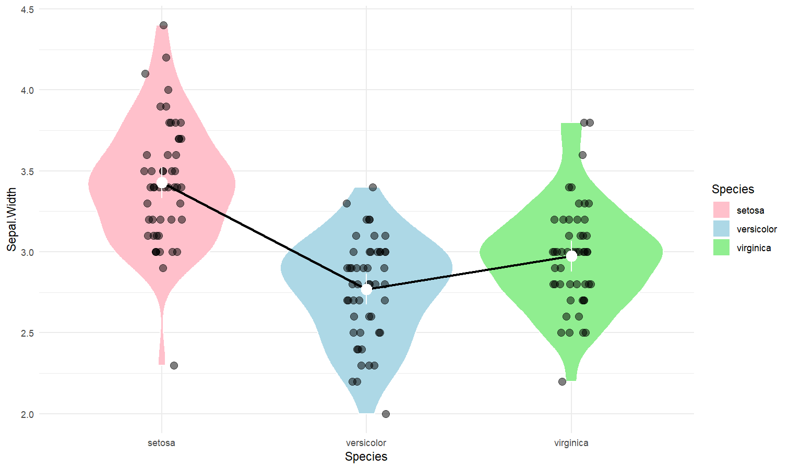
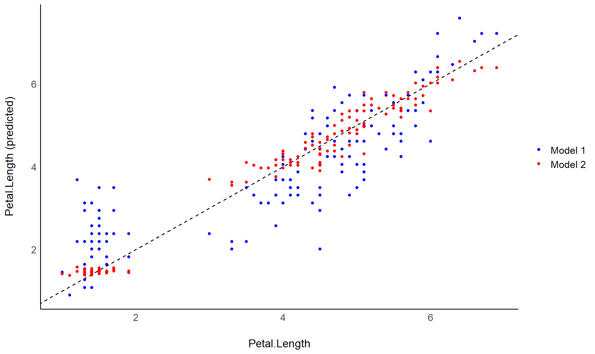

# modelbased 

[](https://github.com/easystats/modelbased/blob/master/inst/CITATION)

***Make the most out of your models***

------------------------------------------------------------------------

**modelbased** is a package helping with model-based estimations, to
easily compute of marginal means, contrast analysis and model
predictions.

## Installation

[](https://cran.r-project.org/package=modelbased)
[](https://easystats.r-universe.dev)
[](https://app.codecov.io/gh/easystats/modelbased)

The *modelbased* package is available on CRAN, while its latest
development version is available on R-universe (from *rOpenSci*).

| Type | Source | Command |
|----|----|----|
| Release | CRAN | `install.packages("modelbased")` |
| Development | R-universe | `install.packages("modelbased", repos = "https://easystats.r-universe.dev")` |

Once you have downloaded the package, you can then load it using:

``` r
library("modelbased")
```

> \[!TIP\] Instead of `library(modelbased)`, use `library(easystats)`,
> which will make all features of the easystats-ecosystem available. You
> can also use `easystats::install_latest()` to stay updated.

## Documentation

Access the package
[**documentation**](https://easystats.github.io/modelbased/), and
check-out these vignettes:

- [Data
  grids](https://easystats.github.io/modelbased/articles/visualisation_matrix.html)
- [What are, why use and how to get marginal
  means](https://easystats.github.io/modelbased/articles/estimate_means.html)
- [Contrast
  analysis](https://easystats.github.io/modelbased/articles/estimate_contrasts.html)
- [Marginal effects and
  derivatives](https://easystats.github.io/modelbased/articles/estimate_slopes.html)
- [Use a model to make
  predictions](https://easystats.github.io/modelbased/articles/estimate_response.html)
- [Interpret simple and complex models using the power of effect
  derivatives](https://easystats.github.io/modelbased/articles/derivatives.html)
- [How to use mixed models to estimate individuals’
  scores](https://easystats.github.io/modelbased/articles/estimate_grouplevel.html)
- [Visualize effects and
  interactions](https://easystats.github.io/modelbased/articles/estimate_relation.html)
- [The modelisation approach to
  statistics](https://easystats.github.io/modelbased/articles/modelisation_approach.html)

## Features

The core idea behind the **modelbased** package is that statistical
models often contain a lot more insights than what you get from simply
looking at the model parameters. In many cases, like models with
multiple interactions, non-linear effects, non-standard families,
complex random effect structures, the parameters can be hard to
interpret. This is where the **modelbased** package comes in.

To give a very simply example, imagine that you are interested in the
effect of 3 conditions *A*, *B* and *C* on a variable *Y*. A simple
linear model `Y ~ Condition` will give you 3 parameters: the intercept
(the average value of *Y* in condition *A*), and the relative effect of
condition *B* and *C*. But what you would like to also get is the
average value of *Y* in the other conditions too. Many people will
compute the average “by hand” (i.e., the *empirical average*) by
directly averaging their observed data in these groups. But did you know
that the *estimated average* (which can be much more relevant, e.g., if
you adjust for other variables in the model) is contained in your model,
and that you can get them easily by running `estimate_means()`?

The **modelbased** package is built around 4 main functions:

- [`estimate_means()`](https://easystats.github.io/modelbased/reference/estimate_means.html):
  Estimates the average values at each factor levels
- [`estimate_contrasts()`](https://easystats.github.io/modelbased/reference/estimate_contrasts.html):
  Estimates and tests contrasts between different factor levels
- [`estimate_slopes()`](https://easystats.github.io/modelbased/reference/estimate_slopes.html):
  Estimates the slopes of numeric predictors at different factor levels
  or alongside a numeric predictor
- [`estimate_prediction()`](https://easystats.github.io/modelbased/reference/estimate_expectation.html):
  Make predictions using the model

These functions are based on important statistical concepts, like [data
grids](https://easystats.github.io/insight/reference/get_datagrid.html),
[predictions](https://easystats.github.io/insight/reference/get_predicted.html)
and *marginal effects*, and leverages other packages like
[**emmeans**](https://rvlenth.github.io/emmeans/) and
[**marginaleffects**](https://marginaleffects.com/). We recommend
reading about all of that to get a deeper understanding of the hidden
power of your models.

## Examples

### Estimate marginal means

- **Problem**: My model has a factor as a predictor, and the parameters
  only return the difference between levels and the intercept. I want to
  see the values *at* each factor level.
- **Solution**: Estimate model-based means (“marginal means”). You can
  visualize them by plotting their confidence interval and the original
  data.

Check-out the function
[**documentation**](https://easystats.github.io/modelbased/reference/estimate_means.html)
and [**this
vignette**](https://easystats.github.io/modelbased/articles/estimate_means.html)
for a detailed walkthrough on *marginal means*.

``` r
library(modelbased)
library(ggplot2)

# 1. The model
model <- lm(Sepal.Width ~ Species, data = iris)

# 2. Obtain estimated means
means <- estimate_means(model, by = "Species")
means
## Estimated Marginal Means
## 
## Species    | Mean |   SE |       95% CI
## ---------------------------------------
## setosa     | 3.43 | 0.05 | [3.33, 3.52]
## versicolor | 2.77 | 0.05 | [2.68, 2.86]
## virginica  | 2.97 | 0.05 | [2.88, 3.07]
## 
## Marginal means estimated at Species

# 3. Custom plot
ggplot(iris, aes(x = Species, y = Sepal.Width)) +
  # Add base data
  geom_violin(aes(fill = Species), color = "white") +
  geom_jitter(width = 0.1, height = 0, alpha = 0.5, size = 3) +
  # Add pointrange and line for means
  geom_line(data = means, aes(y = Mean, group = 1), linewidth = 1) +
  geom_pointrange(
    data = means,
    aes(y = Mean, ymin = CI_low, ymax = CI_high),
    size = 1,
    color = "white"
  ) +
  # Improve colors
  scale_fill_manual(values = c("pink", "lightblue", "lightgreen")) +
  theme_minimal()
```



### Contrast analysis

- **Problem**: The parameters of my model only return the difference
  between some of the factor levels and the intercept. I want to see the
  differences between each levels, as I would do with post-hoc
  comparison tests in ANOVAs.
- **Solution**: Estimate model-based contrasts (“marginal contrasts”).
  You can visualize them by plotting their confidence interval.

Check-out [**this
vignette**](https://easystats.github.io/modelbased/articles/estimate_contrasts.html)
for a detailed walkthrough on *contrast analysis*.

``` r
# 1. The model
model <- lm(Sepal.Width ~ Species, data = iris)

# 2. Estimate marginal contrasts
contrasts <- estimate_contrasts(model, contrast = "Species")
contrasts
## Marginal Contrasts Analysis
## 
## Level1     |     Level2 | Difference |         95% CI |   SE | t(147) |      p
## ------------------------------------------------------------------------------
## setosa     | versicolor |       0.66 | [ 0.49,  0.82] | 0.07 |   9.69 | < .001
## setosa     |  virginica |       0.45 | [ 0.29,  0.62] | 0.07 |   6.68 | < .001
## versicolor |  virginica |      -0.20 | [-0.37, -0.04] | 0.07 |  -3.00 | 0.003 
## 
## Marginal contrasts estimated at Species
## p-value adjustment method: Holm (1979)
```


### Check the contrasts at different points of another linear predictor

- **Problem**: In the case of an interaction between a factor and a
  continuous variable, you might be interested in computing how the
  differences between the factor levels (the contrasts) change depending
  on the other continuous variable.
- **Solution**: You can estimate the marginal contrasts at different
  values of a continuous variable (the *modulator*), and plot these
  differences (they are significant if their 95% CI doesn’t cover 0).

``` r
model <- lm(Sepal.Width ~ Species * Petal.Length, data = iris)

estimate_contrasts(model, contrast = "Species", by = "Petal.Length", length = 3)
## Marginal Contrasts Analysis
## 
## Level1     |     Level2 | Petal.Length | Difference |        95% CI |   SE
## --------------------------------------------------------------------------
## setosa     | versicolor |         1.00 |       1.70 | [ 0.87, 2.53] | 0.34
## setosa     | versicolor |         3.95 |       1.74 | [ 0.16, 3.32] | 0.65
## setosa     | versicolor |         6.90 |       1.78 | [-1.71, 5.26] | 1.44
## setosa     |  virginica |         1.00 |       1.34 | [ 0.38, 2.30] | 0.40
## setosa     |  virginica |         3.95 |       1.79 | [ 0.19, 3.40] | 0.66
## setosa     |  virginica |         6.90 |       2.25 | [-1.19, 5.69] | 1.42
## versicolor |  virginica |         1.00 |      -0.36 | [-1.55, 0.83] | 0.49
## versicolor |  virginica |         3.95 |       0.06 | [-0.30, 0.42] | 0.15
## versicolor |  virginica |         6.90 |       0.47 | [-0.22, 1.16] | 0.28
## 
## Level1     | t(144) |      p
## ----------------------------
## setosa     |   4.97 | < .001
## setosa     |   2.67 | 0.023 
## setosa     |   1.24 | 0.304 
## setosa     |   3.38 | 0.002 
## setosa     |   2.70 | 0.023 
## setosa     |   1.58 | 0.304 
## versicolor |  -0.73 | 0.468 
## versicolor |   0.37 | 0.710 
## versicolor |   1.65 | 0.304 
## 
## Marginal contrasts estimated at Species
## p-value adjustment method: Holm (1979)
```

``` r
# Recompute contrasts with a higher precision (for a smoother plot)
contrasts <- estimate_contrasts(model, contrast = "Species", by = "Petal.Length", length = 20)

# Add Contrast column by concatenating
contrasts$Contrast <- paste(contrasts$Level1, "-", contrasts$Level2)

# Plot
ggplot(contrasts, aes(x = Petal.Length, y = Difference, )) +
  # Add line and CI band
  geom_line(aes(color = Contrast)) +
  geom_ribbon(aes(ymin = CI_low, ymax = CI_high, fill = Contrast), alpha = 0.2) +
  # Add line at 0, indicating no difference
  geom_hline(yintercept = 0, linetype = "dashed") +
  # Colors
  theme_modern()
```


### Create smart grids to represent complex interactions

- **Problem**: I want to graphically represent the interaction between
  two continuous variable. On top of that, I would like to express one
  of them in terms of standardized change (i.e., standard deviation
  relative to the mean).
- **Solution**: Create a data grid following the desired specifications,
  and feed it to the model to obtain predictions. Format some of the
  columns for better readability, and plot using **ggplot**.

Check-out [**this
vignette**](https://easystats.github.io/modelbased/articles/visualisation_matrix.html)
for a detailed walkthrough on *visualisation matrices*.

``` r
# 1. Fit model and get visualization matrix
model <- lm(Sepal.Length ~ Petal.Length * Petal.Width, data = iris)

# 2. Create a visualisation matrix with expected Z-score values of Petal.Width
vizdata <- insight::get_datagrid(model, by = c("Petal.Length", "Petal.Width = c(-1, 0, 1)"))

# 3. Revert from expected SD to actual values
vizdata <- unstandardize(vizdata, select = "Petal.Width")

# 4. Add predicted relationship from the model
vizdata <- modelbased::estimate_expectation(vizdata)

# 5. Express Petal.Width as z-score ("-1 SD", "+2 SD", etc.)
vizdata$Petal.Width <- effectsize::format_standardize(vizdata$Petal.Width, reference = iris$Petal.Width)

# 6. Plot
ggplot(iris, aes(x = Petal.Length, y = Sepal.Length)) +
  # Add points from original dataset (only shapes 21-25 have a fill aesthetic)
  geom_point(aes(fill = Petal.Width), size = 5, shape = 21) +
  # Add relationship lines
  geom_line(data = vizdata, aes(y = Predicted, color = Petal.Width), linewidth = 1) +
  # Improve colors / themes
  scale_color_viridis_d(direction = -1) +
  scale_fill_viridis_c(guide = "none") +
  theme_minimal()
```


### Generate predictions from your model to compare it with original data

- **Problem**: You fitted different models, and you want to intuitively
  visualize how they compare in terms of fit quality and prediction
  accuracy, so that you don’t only rely on abstract indices of
  performance.
- **Solution**: You can predict the response variable from different
  models and plot them against the original true response. The closest
  the points are on the identity line (the diagonal), the closest they
  are from a perfect fit.

Check-out [**this
vignette**](https://easystats.github.io/modelbased/articles/estimate_response.html)
for a detailed walkthrough on *predictions*.

``` r
# Fit model 1 and predict the response variable
model1 <- lm(Petal.Length ~ Sepal.Length, data = iris)
pred1 <- estimate_expectation(model1)
pred1$Petal.Length <- iris$Petal.Length # Add true response

# Print first 5 lines of output
head(pred1, n = 5)
## Model-based Expectation
## 
## Sepal.Length | Predicted |   SE |       95% CI | Residuals | Petal.Length
## -------------------------------------------------------------------------
## 5.10         |      2.38 | 0.10 | [2.19, 2.57] |     -0.98 |         1.40
## 4.90         |      2.00 | 0.11 | [1.79, 2.22] |     -0.60 |         1.40
## 4.70         |      1.63 | 0.12 | [1.39, 1.87] |     -0.33 |         1.30
## 4.60         |      1.45 | 0.13 | [1.19, 1.70] |      0.05 |         1.50
## 5.00         |      2.19 | 0.10 | [1.99, 2.39] |     -0.79 |         1.40
## 
## Variable predicted: Petal.Length

# Same for model 2
model2 <- lm(Petal.Length ~ Sepal.Length * Species, data = iris)
pred2 <- estimate_expectation(model2)
pred2$Petal.Length <- iris$Petal.Length


# Initialize plot for model 1
ggplot(data = pred1, aes(x = Petal.Length, y = Predicted)) +
  # with identity line (diagonal) representing perfect predictions
  geom_abline(linetype = "dashed") +
  # Add the actual predicted points of the models
  geom_point(aes(color = "Model 1")) +
  geom_point(data = pred2, aes(color = "Model 2")) +
  # Aesthetics changes
  labs(y = "Petal.Length (predicted)", color = NULL) +
  scale_color_manual(values = c("Model 1" = "blue", "Model 2" = "red")) +
  theme_modern()
```


### Extract and format group-level random effects

- **Problem**: You have a mixed model and you would like to easily
  access the random part, i.e., the group-level effects (e.g., the
  individuals scores).
- **Solution**: You can apply `estimate_grouplevel` on a mixed model.

See [**this
vignette**](https://easystats.github.io/modelbased/articles/estimate_grouplevel.html)
for more information.

``` r
library(lme4)

model <- lmer(mpg ~ drat + (1 + drat | cyl), data = mtcars)

random <- estimate_grouplevel(model)
random
## Group | Level |   Parameter | Coefficient |   SE |         95% CI
## -----------------------------------------------------------------
## cyl   |     4 | (Intercept) |       -3.45 | 0.56 | [-4.55, -2.36]
## cyl   |     4 |        drat |        2.24 | 0.36 | [ 1.53,  2.95]
## cyl   |     6 | (Intercept) |        0.13 | 0.84 | [-1.52,  1.78]
## cyl   |     6 |        drat |       -0.09 | 0.54 | [-1.15,  0.98]
## cyl   |     8 | (Intercept) |        3.32 | 0.73 | [ 1.89,  4.74]
## cyl   |     8 |        drat |       -2.15 | 0.47 | [-3.07, -1.23]

plot(random) +
  geom_hline(yintercept = 0, linetype = "dashed") +
  theme_minimal()
```



### Estimate derivative of non-linear relationships (e.g., in GAMs)

- **Problem**: You model a non-linear relationship using polynomials,
  splines or GAMs. You want to know which parts of the curve are
  significant positive or negative trends.
- **Solution**: You can estimate the *derivative* of smooth using
  `estimate_slopes`.

The two plots below represent the modeled (non-linear) effect estimated
by the model, i.e., the relationship between the outcome and the
predictor, as well as the “trend” (or slope) of that relationship at any
given point. You can see that whenever the slope is negative, the effect
is below 0, and vice versa, with some regions of the effect being
significant (i.e., positive or negative with enough confidence) while
the others denote regions where the relationship is rather flat.

Check-out [**this
vignette**](https://easystats.github.io/modelbased/articles/estimate_slopes.html)
for a detailed walkthrough on *marginal effects*.

<!-- TODO: currently fails with emmeans 1.8.0 //-->

``` r
library(patchwork)

# Fit a non-linear General Additive Model (GAM)
model <- mgcv::gam(Sepal.Width ~ s(Petal.Length), data = iris)

# 1. Compute derivatives
deriv <- estimate_slopes(model,
  trend = "Petal.Length",
  by = "Petal.Length",
  length = 100
)

# 2. Visualize predictions and derivative
plot(estimate_relation(model, length = 100)) /
  plot(deriv) +
  geom_hline(yintercept = 0, linetype = "dashed")
```


### Describe the smooth term by its linear parts

- **Problem**: You model a non-linear relationship using polynomials,
  splines or GAMs. You want to describe it in terms of linear parts:
  where does it decrease, how much, where does it increase, etc.
- **Solution**: You can apply `describe_nonlinear()` on a predicted
  relationship that will return the different parts of increase and
  decrease.

``` r
model <- lm(Sepal.Width ~ poly(Petal.Length, 2), data = iris)

# 1. Visualize
vizdata <- estimate_relation(model, length = 30)

ggplot(vizdata, aes(x = Petal.Length, y = Predicted)) +
  geom_ribbon(aes(ymin = CI_low, ymax = CI_high), alpha = 0.3) +
  geom_line() +
  # Add original data points
  geom_point(data = iris, aes(x = Petal.Length, y = Sepal.Width)) +
  # Aesthetics
  theme_modern()
```


``` r


# 2. Describe smooth line
describe_nonlinear(vizdata, x = "Petal.Length")
## Start |  End | Length | Change | Slope |   R2
## ---------------------------------------------
## 1.00  | 4.05 |   0.50 |  -0.84 | -0.28 | 0.05
## 4.05  | 6.90 |   0.47 |   0.66 |  0.23 | 0.05
```

### Plot all posterior draws for Bayesian models predictions

See [**this
vignette**](https://easystats.github.io/modelbased/articles/estimate_response.html)
for a walkthrough on how to do that.


<!-- Needs to be re-implemented after revision of visualisation_recipe()
&#10;## Understand interactions between two continuous variables
&#10;Also referred to as **Johnson-Neyman intervals**, this plot shows how the effect (the "slope") of one variable varies depending on another variable. It is useful in the case of complex interactions between continuous variables.
&#10;For instance, the plot below shows that the effect of `hp` (the y-axis) is significantly negative only when `wt` is low (`< ~4`).
&#10;
``` r
model <- lm(mpg ~ hp * wt, data = mtcars)
&#10;slopes <- estimate_slopes(model, trend = "hp", by = "wt")
&#10;plot(slopes)
```
-->

### Visualize predictions with random effects

Aside from plotting the coefficient of each random effect (as done
[here](https://github.com/easystats/modelbased#extract-and-format-group-level-random-effects)),
we can also visualize the predictions of the model for each of these
levels, which can be useful to diagnostic or see how they contribute to
the fixed effects. We will do that by making predictions with
`estimate_relation()` and setting `include_random` to `TRUE`.

Let’s model the reaction time with the number of days of sleep
deprivation as fixed effect and the participants as random intercept.

``` r
library(lme4)

model <- lmer(Reaction ~ Days + (1 | Subject), data = sleepstudy)

preds <- estimate_relation(model, include_random = TRUE)

plot(preds, ribbon = list(alpha = 0)) # Make CI ribbon transparent for clarity
```


As we can see, each participant has a different “intercept” (starting
point on the y-axis), but all their slopes are the same: this is because
the only slope is the “general” one estimated across all participants by
the fixed effect. Let’s address that and allow the slope to vary for
each participant too.

``` r
model <- lmer(Reaction ~ Days + (1 + Days | Subject), data = sleepstudy)

preds <- estimate_relation(model, include_random = TRUE)

plot(preds, ribbon = list(alpha = 0.1))
```


As we can see, the effect is now different for all participants. Let’s
plot, on top of that, the “fixed” effect estimated across all these
individual effects.

``` r
fixed_pred <- estimate_relation(model) # This time, include_random is FALSE (default)

plot(preds, ribbon = list(alpha = 0)) + # Previous plot
  geom_ribbon(data = fixed_pred, aes(x = Days, ymin = CI_low, ymax = CI_high), alpha = 0.4) +
  geom_line(data = fixed_pred, aes(x = Days, y = Predicted), linewidth = 2)
```


## Code of Conduct

Please note that the modelbased project is released with a [Contributor
Code of
Conduct](https://easystats.github.io/modelbased/CODE_OF_CONDUCT.html).
By contributing to this project, you agree to abide by its terms.
