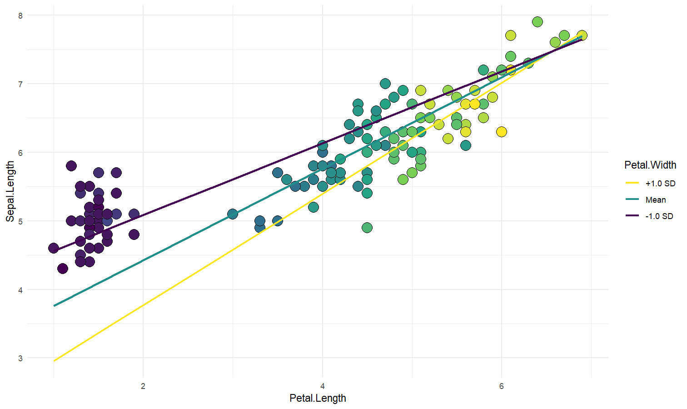

# modelbased 

[](https://github.com/easystats/modelbased/blob/master/inst/CITATION)
[](https://cran.r-project.org/package=modelbased)
[](https://cranlogs.r-pkg.org/)

***Taking your models to new heights***

------------------------------------------------------------------------

:warning: `estimate_link()` now does *not* transform predictions on the
response scale for GLMs. To keep the previous behaviour, use the new
`estimate_relation()` instead. This follows a change in how predictions
are made internally (which now relies on
[`get_predicted()`](https://easystats.github.io/insight/reference/get_predicted.html),
so more details can be found there). This will allow *modelbased* to be
more robust and polyvalent. Apologies for the breaks.

------------------------------------------------------------------------

`modelbased` is a package helping with model-based estimations, to
easily compute of marginal means, contrast analysis and model
predictions.

## Installation

[](https://cran.r-project.org/package=modelbased)

[](https://codecov.io/gh/easystats/modelbased)

Run the following to install the stable release of **modelbased** from
CRAN:

``` r
install.packages("modelbased")
```

Or this one to install the latest development version:

``` r
install.packages("remotes")
remotes::install_github("easystats/modelbased")
```

## Documentation

[](https://easystats.github.io/modelbased/)
[](https://easystats.github.io/blog/posts/)
[](https://easystats.github.io/modelbased/reference/index.html)

Click on the buttons above to access the package
[**documentation**](https://easystats.github.io/modelbased/) and the
[**easystats blog**](https://easystats.github.io/blog/posts/), and
check-out these vignettes:

-   [**Visualisation
    matrix**](https://easystats.github.io/modelbased/articles/visualisation_matrix.html)
-   [**Marginal
    means**](https://easystats.github.io/modelbased/articles/estimate_means.html)
-   [**Contrast
    analysis**](https://easystats.github.io/modelbased/articles/estimate_contrasts.html)
-   [**Use a model to make
    predictions**](https://easystats.github.io/modelbased/articles/estimate_response.html)
-   [**Describe non-linear
    curves**](https://easystats.github.io/modelbased/articles/describe_nonlinear.html)

# Features

The package is built around 5 main functions:

-   [`estimate_means()`](https://easystats.github.io/modelbased/reference/estimate_means.html):
    Estimates the average values at each factor levels
-   [`estimate_contrasts()`](https://easystats.github.io/modelbased/reference/estimate_contrasts.html):
    Estimates and tests contrasts between different factor levels
-   [`estimate_slopes()`](https://easystats.github.io/modelbased/reference/estimate_slopes.html):
    Estimates the slopes of numeric predictors at different factor
    levels
-   [`estimate_response()`](https://easystats.github.io/modelbased/articles/estimate_response.html):
    Predict the response variable using the model
-   [`describe_nonlinear()`](https://easystats.github.io/modelbased/reference/describe_nonlinear.html):
    Describes a non-linear term (*e.g.* in GAMs) by its linear parts

These functions are powered by the
[`visualisation_matrix()`](https://easystats.github.io/modelbased/reference/visualisation_matrix.html)
function, a smart tool for guessing the appropriate reference grid.

## Create smart grids to represent complex interactions

-   **Problem**: I want to graphically represent the interaction between
    two continuous variable. On top of that, I would like to express one
    of them in terms of standardized change (i.e., standard deviation
    relative to the mean).
-   **Solution**: Create a data grid following the desired
    specifications, and feed it to the model to obtain predictions.
    Format some of the columns for better readability, and plot using
    `ggplot`.

Check-out [**this
vignette**](https://easystats.github.io/modelbased/articles/visualisation_matrix.html)
for a detailed walkthrough on *visualisation matrices*.

``` r
library(ggplot2)
library(see)
library(modelbased)

# 1. Fit model and get visualization matrix
model <- lm(Sepal.Length ~ Petal.Length * Petal.Width, data = iris) 

# 2. Create a visualisation matrix with expected Z-score values of Petal.Width
vizdata <- modelbased::visualisation_matrix(model, target = c("Petal.Length", "Petal.Width = c(-1, 0, 1)")) 

# 3. Revert from expected SD to actual values
vizdata <- effectsize::unstandardize(vizdata, select = "Petal.Width") 

# 4. Add predicted relationship from the model
vizdata <- modelbased::estimate_expectation(vizdata)

# 5. Express Petal.Width as z-score ("-1 SD", "+2 SD", etc.)
vizdata$Petal.Width <- effectsize::format_standardize(vizdata$Petal.Width, reference = iris$Petal.Width)

# 6. Plot
ggplot(iris, aes(x = Petal.Length, y = Sepal.Length)) +
  # Add points from original dataset (only shapes 21-25 have a fill aesthetic)
  geom_point2(aes(fill = Petal.Width), shape = 21, size = 5) + 
  # Add relationship lines
  geom_line(data = vizdata, aes(y = Predicted, color = Petal.Width), size = 1) +
  # Improve colors / themes
  scale_color_viridis_d(direction = -1) +
  scale_fill_viridis_c(guide = FALSE) +
  theme_modern()
```

<!-- -->

## Estimate marginal means

-   **Problem**: My model has a factor as a predictor, and the
    parameters only return the difference between levels and the
    intercept. I want to see the values *at* each factor level.
-   **Solution**: Estimate model-based means (“marginal means”). You can
    visualize them by plotting their confidence interval and the
    original data.

Check-out [**this
vignette**](https://easystats.github.io/modelbased/articles/estimate_means.html)
for a detailed walkthrough on *marginal means*.

``` r
# 1. The model
model <- lm(Sepal.Width ~ Species, data = iris)

# 2. Obtain estimated means
means <- modelbased::estimate_means(model)
means
## Estimated Marginal Means
## 
## Species    | Mean |   SE |       95% CI
## ---------------------------------------
## setosa     | 3.43 | 0.05 | [3.33, 3.52]
## versicolor | 2.77 | 0.05 | [2.68, 2.86]
## virginica  | 2.97 | 0.05 | [2.88, 3.07]
## 
## Marginal means estimated for Species

# 3. Plot 
ggplot(iris, aes(x = Species, y = Sepal.Width)) +
  # Add base data 
  geom_violin(aes(fill = Species), color = "white") +
  geom_jitter2(width = 0.05, alpha = 0.5) +
  
  # Add pointrange and line from means
  geom_line(data = means, aes(y = Mean, group = 1), size = 1) +
  geom_pointrange(
    data = means,
    aes(y = Mean, ymin = CI_low, ymax = CI_high),
    size = 1,
    color = "white"
  ) +
  # Improve colors
  scale_fill_material() +
  theme_modern()
```

<!-- -->

## Contrast analysis

-   **Problem**: The parameters of my model only return the difference
    between some of the factor levels and the intercept. I want to see
    the differences between each levels, as I would do with post-hoc
    comparison tests in ANOVAs.
-   **Solution**: Estimate model-based contrasts (“marginal contrasts”).
    You can visualize them by plotting their confidence interval.

Check-out [**this
vignette**](https://easystats.github.io/modelbased/articles/estimate_contrasts.html)
for a detailed walkthrough on *contrast analysis*.

``` r
# 1. The model
model <- lm(Sepal.Width ~ Species, data = iris)

# 2. Estimate marginal contrasts
contrasts <- modelbased::estimate_contrasts(model)
contrasts
## Marginal Contrasts Analysis
## 
## Level1     |     Level2 | Difference |         95% CI |   SE | t(147) |      p
## ------------------------------------------------------------------------------
## setosa     | versicolor |       0.66 | [ 0.49,  0.82] | 0.07 |   9.69 | < .001
## setosa     |  virginica |       0.45 | [ 0.29,  0.62] | 0.07 |   6.68 | < .001
## versicolor |  virginica |      -0.20 | [-0.37, -0.04] | 0.07 |  -3.00 | 0.009 
## 
## Marginal contrasts estimated for Species
## p-value adjustment method: Holm (1979)
```

<!-- -->

## Check the contrasts at different points of another linear predictor

-   **Problem**: In the case of an interaction between a factor and a
    continuous variable, you might be interested in computing how the
    differences between the factor levels (the contrasts) change
    depending on the other continuous variable.
-   **Solution**: You can estimate the marginal contrasts at different
    values of a continuous variable (the *modulator*), and plot these
    differences (they are significant if their 95% CI doesn’t cover 0).

``` r
model <- lm(Sepal.Width ~ Species * Petal.Length, data = iris)

estimate_contrasts(model, modulate = "Petal.Length", length = 3)
## Marginal Contrasts Analysis
## 
## Level1     |     Level2 | Petal.Length | Difference |        95% CI |   SE | t(144) |      p
## --------------------------------------------------------------------------------------------
## setosa     | versicolor |         1.00 |       1.70 | [ 0.87, 2.53] | 0.34 |   4.97 | < .001
## setosa     | versicolor |         3.95 |       1.74 | [ 0.16, 3.32] | 0.65 |   2.67 | 0.023 
## setosa     | versicolor |         6.90 |       1.78 | [-1.71, 5.26] | 1.44 |   1.24 | 0.434 
## setosa     |  virginica |         1.00 |       1.34 | [ 0.38, 2.30] | 0.40 |   3.38 | 0.003 
## setosa     |  virginica |         3.95 |       1.79 | [ 0.19, 3.40] | 0.66 |   2.70 | 0.021 
## setosa     |  virginica |         6.90 |       2.25 | [-1.19, 5.69] | 1.42 |   1.58 | 0.257 
## versicolor |  virginica |         1.00 |      -0.36 | [-1.55, 0.83] | 0.49 |  -0.73 | 0.747 
## versicolor |  virginica |         3.95 |       0.06 | [-0.30, 0.42] | 0.15 |   0.37 | 0.926 
## versicolor |  virginica |         6.90 |       0.47 | [-0.22, 1.16] | 0.28 |   1.65 | 0.229 
## 
## Marginal contrasts estimated for Species
## p-value adjustment method: Holm (1979)
```

``` r
# Recompute contrasts with a higher precision (for a smoother plot)
contrasts <- estimate_contrasts(model, modulate = "Petal.Length", length = 20)

# Add Contrast column by concatenating 
contrasts$Contrast <- paste(contrasts$Level1, "-", contrasts$Level2)

# Plot
ggplot(contrasts, aes(x = Petal.Length, y = Difference,)) +
  # Add line and CI band
  geom_line(aes(color = Contrast)) +
  geom_ribbon(aes(ymin = CI_low, ymax=CI_high, fill = Contrast), alpha = 0.2) +
  # Add line at 0, indicating no difference
  geom_hline(yintercept = 0, linetype = "dashed") +
  # Colors
  theme_modern()
```

<!-- -->

## Generate predictions from your model to compare it with original data

-   **Problem**: You fitted different models, and you want to
    intuitively visualize how they compare in terms of fit quality and
    prediction accuracy, so that you don’t only rely on abstract indices
    of performance.
-   **Solution**: You can predict the response variable from different
    models and plot them against the original true response. The closest
    the points are on the identity line (the diagonal), the closest they
    are from a perfect fit.

Check-out [**this
vignette**](https://easystats.github.io/modelbased/articles/estimate_response.html)
for a detailed walkthrough on *predictions*.

``` r
# Fit model 1 and predict the response variable
model1 <- lm(Petal.Length ~ Sepal.Length, data = iris)
pred1 <- modelbased::estimate_response(model1)
pred1$Petal.Length <- iris$Petal.Length  # Add true response

# Print first 5 lines of output
head(pred1, n = 5)
## Model-based Prediction
## 
## Sepal.Length | Predicted |   SE |        95% CI | Residuals | Petal.Length
## --------------------------------------------------------------------------
## 5.10         |      2.38 | 0.87 | [ 0.65, 4.10] |      0.98 |         1.40
## 4.90         |      2.00 | 0.87 | [ 0.28, 3.73] |      0.60 |         1.40
## 4.70         |      1.63 | 0.88 | [-0.10, 3.36] |      0.33 |         1.30
## 4.60         |      1.45 | 0.88 | [-0.29, 3.18] |     -0.05 |         1.50
## 5.00         |      2.19 | 0.87 | [ 0.46, 3.92] |      0.79 |         1.40
## 
## Variable predicted: Petal.Length

# Same for model 2
model2 <- lm(Petal.Length ~ Sepal.Length * Species, data = iris)
pred2 <- modelbased::estimate_response(model2)
pred2$Petal.Length <- iris$Petal.Length 


# Initialize plot for model 1
ggplot(data = pred1, aes(x = Petal.Length, y = Predicted)) +
  # with identity line (diagonal) representing perfect predictions
  geom_abline(linetype = "dashed") +
  # Add the actual predicted points of the models
  geom_point(aes(color = "Model 1")) +
  geom_point(data = pred2, aes(color = "Model 2")) +
  # Aesthetics changes
  labs(y = "Petal.Length (predicted)", color = NULL) +
  scale_color_manual(values = c("Model 1" = "blue", "Model 2" = "red")) +
  theme_modern()
```

<!-- -->

## Extract and Format Group-level Random Effects

-   **Problem**: You have a mixed model and you would like to easily
    access the random part, i.e., the group-level effects (e.g., the
    individuals scores).
-   **Solution**: You can apply `estimate_grouplevel` on a mixed model.

See [**this
vignette**](https://easystats.github.io/modelbased/articles/estimate_grouplevel.html)
for more information.

``` r
library(lme4)

model <- lmer(mpg ~ drat + (1 + drat | cyl), data = mtcars)

modelbased::estimate_grouplevel(model)
## Group | Level |   Parameter | Coefficient |   SE |         95% CI
## -----------------------------------------------------------------
## cyl   |     4 | (Intercept) |       -3.45 | 0.56 | [-4.55, -2.36]
## cyl   |     4 |        drat |        2.24 | 0.36 | [ 1.53,  2.95]
## cyl   |     6 | (Intercept) |        0.13 | 0.84 | [-1.52,  1.78]
## cyl   |     6 |        drat |       -0.09 | 0.54 | [-1.15,  0.98]
## cyl   |     8 | (Intercept) |        3.32 | 0.73 | [ 1.89,  4.74]
## cyl   |     8 |        drat |       -2.15 | 0.47 | [-3.07, -1.23]
```

<!-- TODO: add plotting example once 'see' on cran -->

## Describe the smooth term by its linear parts

-   **Problem**: You model a non-linear relationship using polynomials,
    splines or GAMs. You want to describe it in terms of linear parts:
    where does it decrease, how much, where does it increase, etc.
-   **Solution**: You can apply `describe_nonlinear` on a predicted
    relationship that will return the different parts of increase and
    decrease.

See [**this
vignette**](https://easystats.github.io/modelbased/articles/describe_nonlinear.html)
for more information.

``` r
model <- lm(Sepal.Width ~ poly(Petal.Length, 2), data = iris)

# 1. Visualize
vizdata <- estimate_relation(model, length = 30)

ggplot(vizdata, aes(x = Petal.Length, y = Predicted)) +
  geom_ribbon(aes(ymin = CI_low, ymax = CI_high), alpha = 0.3) +
  geom_line() +
  # Add original data points
  geom_point(data = iris, aes(x = Petal.Length, y = Sepal.Width)) +
  # Aesthetics
  theme_modern()
```

<!-- -->

``` r

# 2. Describe smooth line
describe_nonlinear(vizdata, x = "Petal.Length")
## Start |  End | Length | Change | Slope |   R2
## ---------------------------------------------
## 1.00  | 4.05 |   0.50 |  -0.84 | -0.28 | 0.05
## 4.05  | 6.90 |   0.47 |   0.66 |  0.23 | 0.05
```

## Plot all posterior draws for Bayesian models predictions

See [**this
vignette**](https://easystats.github.io/modelbased/articles/estimate_response.html)
for a walkthrough on how to do that.


