# Interpret simple and complex models using the power of effect derivatives

One floating assumption that can be encountered is that “complex models”
should be used for “complex” stuff (data, designs, …), and that simple
models are enough for simple tasks. **Why shoot a fly with a bazooka?**
In this vignette, we are going to show that, sometimes, the bazooka can
be so versatile that it works just as easily on a fly as a flyswatter.
In particular, we will investigate how the combination **GAM + Effects
Derivative** can be used, even in simple contexts, to **make your data
analysis easier**.

## The Traditional Approach

Let’s say we are interested in the relationship between *y* and *x* in
the following dataset:

\
`# Package to fit GAMs`\
[`library`](https://rdrr.io/r/base/library.html)`(``mgcv``)`\
\
`# Tidyverse`\
[`library`](https://rdrr.io/r/base/library.html)`(`[`ggplot2`](https://ggplot2.tidyverse.org)`)`\
[`library`](https://rdrr.io/r/base/library.html)`(`[`easystats`](https://easystats.github.io/easystats/)`)`\
\
[`set.seed`](https://rdrr.io/r/base/Random.html)`(``333``)`\
\
`# Generate data`\
`data`` ``<-`` ``bayestestR``::`[`simulate_correlation`](https://easystats.github.io/bayestestR/reference/simulate_correlation.html)`(``r ``=`` ``0.85``, n ``=`` ``1000``, names ``=`` `[`c`](https://rdrr.io/r/base/c.html)`(``"y"``, ``"x"``)``, mean ``=`` `[`c`](https://rdrr.io/r/base/c.html)`(``100``, ``0``)``, sd ``=`` `[`c`](https://rdrr.io/r/base/c.html)`(``15``, ``1``)``)`\
\
[`ggplot`](https://ggplot2.tidyverse.org/reference/ggplot.html)`(``data``, `[`aes`](https://ggplot2.tidyverse.org/reference/aes.html)`(``x``, ``y``)``)`` ``+`\
`  `[`geom_point`](https://ggplot2.tidyverse.org/reference/geom_point.html)`(``)`

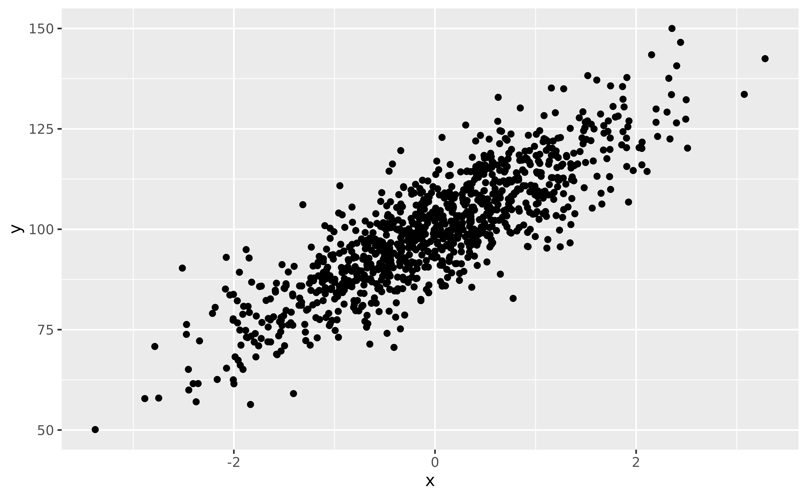

Upon visualizing the data, some people might say: “well, the most
straightforward thing to do is to run a **correlation analysis**” (they
might not be wrong, but for the sake of the demonstration, we will push
things further here). Let’s start with that:

\
`rez`` ``<-`` `[`cor.test`](https://rdrr.io/r/stats/cor.test.html)`(``data``$``y``, ``data``$``x``)`\
`report``::`[`report`](https://easystats.github.io/report/reference/report.html)`(``rez``)`

    > Effect sizes were labelled following Funder's (2019) recommendations.
    > 
    > The Pearson's product-moment correlation between data$y and data$x is positive,
    > statistically significant, and very large (r = 0.85, 95% CI [0.83, 0.87],
    > t(998) = 50.97, p < .001)

Great, we know there is a significant correlation between the two
variables! 🥳

But what we would like to know is **for every increase of 1 on *x*, how
much does *y* increase?** In other words, what is the **slope** of the
relationship?

The traditional approach to this is to fit a **linear model**, and
assess its **parameters**. Indeed, the slope of the linear relationship
between a predictor and its outcome is actually what the **effects**
estimated by the regression correspond to.

Let’s fit a linear regression model, visualize it, and describe its
parameters.

\
`model_lm`` ``<-`` `[`lm`](https://rdrr.io/r/stats/lm.html)`(``y`` ``~`` ``x``, data ``=`` ``data``)`\
\
`modelbased``::`[`estimate_relation`](https://easystats.github.io/modelbased/reference/estimate_expectation.md)`(``model_lm``)`` ``|>`\
`  `[`plot`](https://rdrr.io/r/graphics/plot.default.html)`(``)`

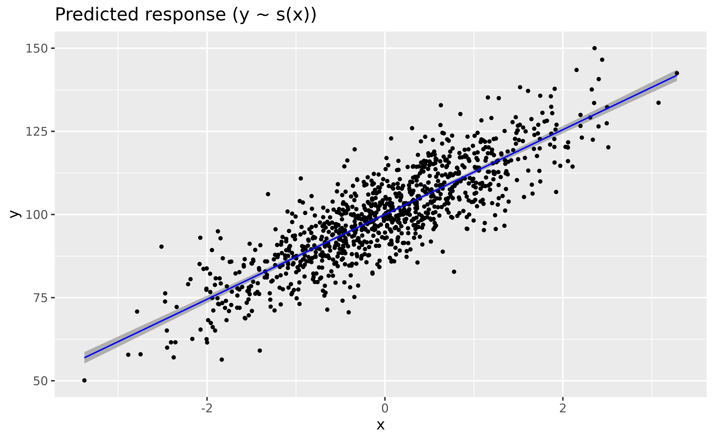

\
`parameters``::`[`parameters`](https://easystats.github.io/parameters/reference/model_parameters.html)`(``model_lm``)`

    > Parameter   | Coefficient |   SE |          95% CI | t(998) |      p
    > --------------------------------------------------------------------
    > (Intercept) |      100.00 | 0.25 | [99.51, 100.49] | 400.00 | < .001
    > x           |       12.75 | 0.25 | [12.26,  13.24] |  50.97 | < .001

The parameters table shows us that the **effect of x** is `12.75`. This
means that for every increase of 1 on `x`, `y` increases by `12.75`.

Congrats, we’ve answered our question!

## GAMs can be used for linear relationships too!

> *A new player has entered the game.*

You might have heard of **General Additive Models**, aka **GAMs**, that
extend general linear models (GLMs) by enabling an elegant and robust
way of modelling non-linear relationships. But it’s not because they are
good with curvy relationships that they cannot do simple stuff too! We
can even use them **for linear links**, or, in general, when we are not
sure about the exact shape of the relationship. Because GAMs usually
penalize wiggly patterns, they have no problems with approximating
linear relationship, if this is what the data indicates.

GAMs can be fitted using the `mgcv` package, and the only change is that
we need to specify a **smooth** term
([`s()`](https://rdrr.io/pkg/mgcv/man/s.html)) for the variable for
which we want to estimate the (non-necessarily linear) relationship.

\
`model_gam`` ``<-`` ``mgcv``::`[`gam`](https://rdrr.io/pkg/mgcv/man/gam.html)`(``y`` ``~`` `[`s`](https://rdrr.io/pkg/mgcv/man/s.html)`(``x``)``, data ``=`` ``data``)`\
\
`modelbased``::`[`estimate_relation`](https://easystats.github.io/modelbased/reference/estimate_expectation.md)`(``model_gam``)`` ``|>`\
`  `[`plot`](https://rdrr.io/r/graphics/plot.default.html)`(``line ``=`` `[`list`](https://rdrr.io/r/base/list.html)`(``color ``=`` ``"blue"``)``)`

\
`parameters``::`[`parameters`](https://easystats.github.io/parameters/reference/model_parameters.html)`(``model_gam``)`

    > # Fixed Effects
    > 
    > Parameter   | Coefficient |   SE |          95% CI | t(998.00) |      p
    > -----------------------------------------------------------------------
    > (Intercept) |      100.00 | 0.25 | [99.51, 100.49] |    400.00 | < .001
    > 
    > # Smooth Terms
    > 
    > Parameter       |       F |   df |      p
    > -----------------------------------------
    > Smooth term (x) | 2598.40 | 1.00 | < .001

Wow, the GAM-based modeled relationship is near-exactly the same as that
of the GLM! **GAMs are powerful** 😎

Okay, that’s cool, but there’s one *slight* issue. If you look at the
parameters table, there is indeed one line for the “smooth term”, but it
has… **no coefficient!** Indeed, because GAMs don’t model straight
lines, it doesn’t return the value of the slope. That’s why some people
consider GAMs complicated to discuss statistically, as their parameters
are not easily interpretable.

> Owww, so it is an issue considering our question about the effect of
> *x* on *y* 😕

Or **is it?**

## Effect Derivatives

Let us introduce another concept that is likely to get very popular in
the near future within the world of regressions. **Derivatives**. You
might remember from your math class in high school that derivatives are
basically the *pattern of the slope of a pattern*
_((pattern-ception much)).

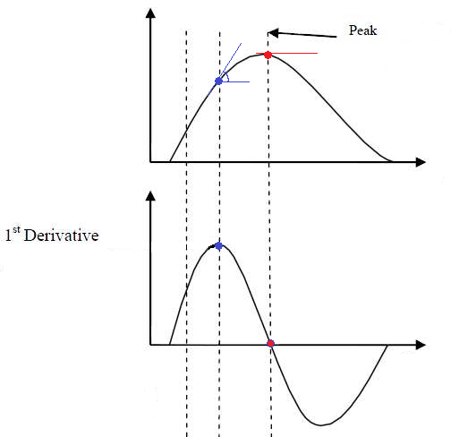

In the figure above, the above plot shows a non-linear relationship
between the variables, and the below-plot shows its **1st order
derivative**, i.e., the evolution of the slope of that curve. It might
take a bit of time to mentally wrap your head around this
transformation, but once you get it, it will become very easy to think
in terms of derivatives.

You can see that the derivative peaks when the slope of the relationship
is at its highest (when it is the steepest), and then decrease again
until reaching 0. A zero-crossing of the derivative means an inversion
of the the trend; it is when the relationship starts to be negative.

Derivatives can be computed for statistical models, including simple
ones such as linear regressions. Before you look at the answer below,
try to think and imagine what would the derivative plot of our
previously computed linear model would look like?

We know that the slope is `12.75` (from our parameters analysis). Does
it change across the course of the relationship? No, because it is a
straight line, so the slope is constant. If the slope is constant, then
the derivative should be… a constant line too, right? Let’s verify this.

To compute the derivative, we can use the
[`estimate_slopes()`](https://easystats.github.io/modelbased/reference/estimate_slopes.md)
function, and specify that we want to know: the trend of *x* **over the
course of** (“at”) itself.

\
`deriv`` ``<-`` ``modelbased``::`[`estimate_slopes`](https://easystats.github.io/modelbased/reference/estimate_slopes.md)`(``model_lm``, trend ``=`` ``"x"``, by ``=`` ``"x"``)`\
\
[`plot`](https://rdrr.io/r/graphics/plot.default.html)`(``deriv``)`` ``+`` ``# add a dashed line at 0 to show absence of effect`\
`  `[`geom_hline`](https://ggplot2.tidyverse.org/reference/geom_abline.html)`(``yintercept ``=`` ``0``, linetype ``=`` ``"dashed"``)`

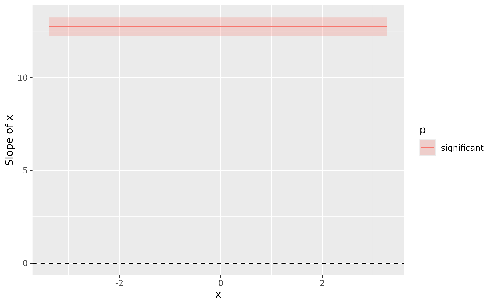

\
[`summary`](https://rdrr.io/r/base/summary.html)`(``deriv``)`

    > Johnson-Neymann Intervals
    > 
    > Start |  End | Direction | Confidence 
    > --------------------------------------
    > -3.38 | 3.28 | positive  | Significant
    > 
    > Marginal effects estimated for x
    > Type of slope was dY/dX

The plot shows a straight horizontal line at 12.75, with a fixed
confidence interval (the same as in the parameter table). That is
expected, by definition, a linear model models a straight line with a
fixed slope.

By running [`summary()`](https://rdrr.io/r/base/summary.html) on the
derivative, we obtain a summary by “segments” (positive, flat,
negative). Here, there is only one segment, which average coefficient
corresponds to the regression parameter.

**This means that we don’t really need the parameters table.** Indeed,
all the information about the slope can be retrieved from the effect
derivative. And guess what… it can be applied to **any model**!

Such as GAMs. Lets’ to the same for our GAM model:

\
`deriv`` ``<-`` ``modelbased``::`[`estimate_slopes`](https://easystats.github.io/modelbased/reference/estimate_slopes.md)`(``model_gam``, trend ``=`` ``"x"``, by ``=`` ``"x"``)`\
\
[`plot`](https://rdrr.io/r/graphics/plot.default.html)`(``deriv``, line ``=`` `[`list`](https://rdrr.io/r/base/list.html)`(``color ``=`` ``"blue"``)``)`` ``+`\
`  `[`geom_hline`](https://ggplot2.tidyverse.org/reference/geom_abline.html)`(``yintercept ``=`` ``0``, linetype ``=`` ``"dashed"``)`

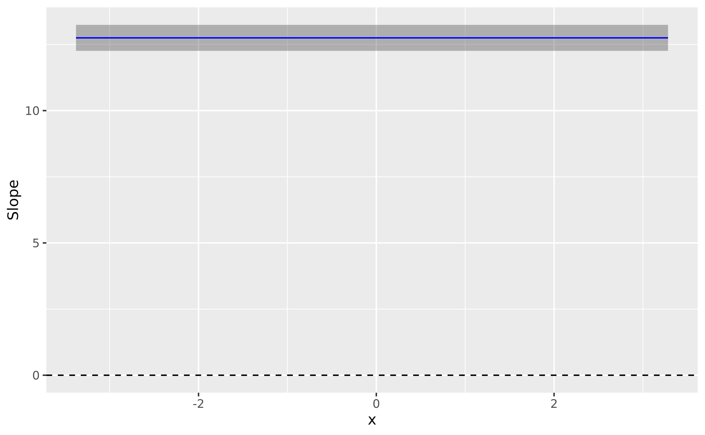

\
[`summary`](https://rdrr.io/r/base/summary.html)`(``deriv``)`

    > Johnson-Neymann Intervals
    > 
    > Start |  End | Direction | Confidence 
    > --------------------------------------
    > -3.38 | 3.28 | positive  | Significant
    > 
    > Marginal effects estimated for x
    > Type of slope was dY/dX

Isn’t that amazing, the results are *identical*. The moral of the story
is that **GAMs can be used in a wide variety of contexts, even for
simple cases**, and that derivatives are an easy way of interpreting
them.

Let’s jump to another example!

## GAM + Derivatives \> LM: a polynomial regression example

We mentioned that one of the GAMs “limitation” is that their parameters
are not easily interpretable. We were assuming that for other classes of
models, such as GLMs, it was the case.

However, it is **very common to have difficult-to-interpret parameters
in normal regression models too!** Let’s take the case of a **polynomial
regression**, that we could use to model the following data:

\
`data``$``y2`` ``<-`` ``data``$``x``^``2`` ``+`` `[`rnorm`](https://rdrr.io/r/stats/Normal.html)`(`[`nrow`](https://rdrr.io/r/base/nrow.html)`(``data``)``, sd ``=`` ``0.5``)`\
\
[`ggplot`](https://ggplot2.tidyverse.org/reference/ggplot.html)`(``data``, `[`aes`](https://ggplot2.tidyverse.org/reference/aes.html)`(``x``, ``y2``)``)`` ``+`\
`  `[`geom_point`](https://ggplot2.tidyverse.org/reference/geom_point.html)`(``)`

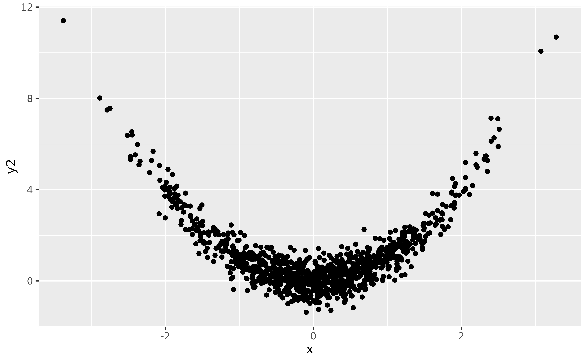

Let us fit a polynomial regression:

\
`model_poly`` ``<-`` `[`lm`](https://rdrr.io/r/stats/lm.html)`(``y2`` ``~`` `[`poly`](https://rdrr.io/r/stats/poly.html)`(``x``, ``2``)``, data ``=`` ``data``)`\
\
`# Length is increased to have a smoother line`\
`modelbased``::`[`estimate_relation`](https://easystats.github.io/modelbased/reference/estimate_expectation.md)`(``model_poly``, length ``=`` ``30``)`` ``|>`\
`  `[`plot`](https://rdrr.io/r/graphics/plot.default.html)`(``)`

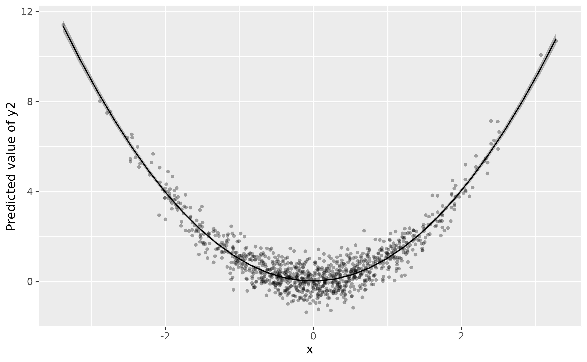

\
`parameters``::`[`parameters`](https://easystats.github.io/parameters/reference/model_parameters.html)`(``model_poly``)`

    > Parameter      | Coefficient |   SE |         95% CI | t(997) |      p
    > ----------------------------------------------------------------------
    > (Intercept)    |        1.01 | 0.02 | [ 0.98,  1.04] |  62.32 | < .001
    > x [1st degree] |       -1.37 | 0.51 | [-2.38, -0.37] |  -2.68 | 0.007 
    > x [2nd degree] |       44.82 | 0.51 | [43.82, 45.83] |  87.38 | < .001

If you look at the parameters table, it is also a bit unclear what do
the coefficient refer too. How to interpret these numbers? Trying to
understand that would require you a lot of search and understanding
about how polynomials work. **Ain’t nobody got time for dat’!**

Instead, we can rely on our *good ol’* derivatives to obtain the “linear
slope” at every point of the curve.

\
`deriv`` ``<-`` ``modelbased``::`[`estimate_slopes`](https://easystats.github.io/modelbased/reference/estimate_slopes.md)`(``model_poly``, trend ``=`` ``"x"``, by ``=`` ``"x"``, length ``=`` ``100``)`\
\
[`plot`](https://rdrr.io/r/graphics/plot.default.html)`(``deriv``)`` ``+`\
`  `[`geom_hline`](https://ggplot2.tidyverse.org/reference/geom_abline.html)`(``yintercept ``=`` ``0``, linetype ``=`` ``"dashed"``)`

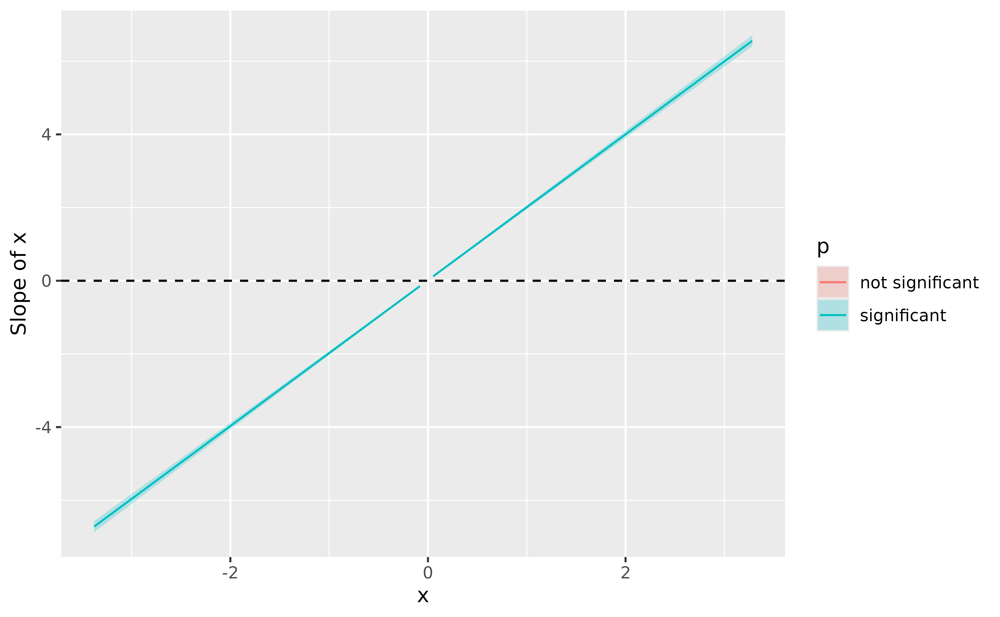

\
[`summary`](https://rdrr.io/r/base/summary.html)`(``deriv``)`

    > Johnson-Neymann Intervals
    > 
    > Start |   End | Direction | Confidence     
    > -------------------------------------------
    > -3.38 | -0.08 | negative  | Significant    
    > -0.01 | -0.01 | negative  | Not Significant
    > 0.05  |  3.28 | positive  | Significant    
    > 
    > Marginal effects estimated for x
    > Type of slope was dY/dX

If you know a bit theory about derivatives, you won’t be surprised to
find out that the derivative of a 2nd order polynomial (`x + x^2`) is
actually a linear line. We can conclude from this plot that the slope is
(**significantly**, because the confidence interval does not cover 0)
negative until 0, and then becomes positive. 0 corresponds indeed to the
point of inversion of the curve.

Moral of the story? **Derivatives can be used to easily interpret and
draw conclusions about relationships from models in which parameters are
not straightforward to interpret.**

But, if you’ve been attentive up to this point, you might wonder: **why
bother with polynomials at all when GAMs can do the trick?**

\
`model_gam2`` ``<-`` ``mgcv``::`[`gam`](https://rdrr.io/pkg/mgcv/man/gam.html)`(``y2`` ``~`` `[`s`](https://rdrr.io/pkg/mgcv/man/s.html)`(``x``)``, data ``=`` ``data``)`\
\
[`plot`](https://rdrr.io/r/graphics/plot.default.html)`(``modelbased``::`[`estimate_relation`](https://easystats.github.io/modelbased/reference/estimate_expectation.md)`(``model_gam2``, length ``=`` ``100``)``, line ``=`` `[`list`](https://rdrr.io/r/base/list.html)`(``color ``=`` ``"blue"``)``)`

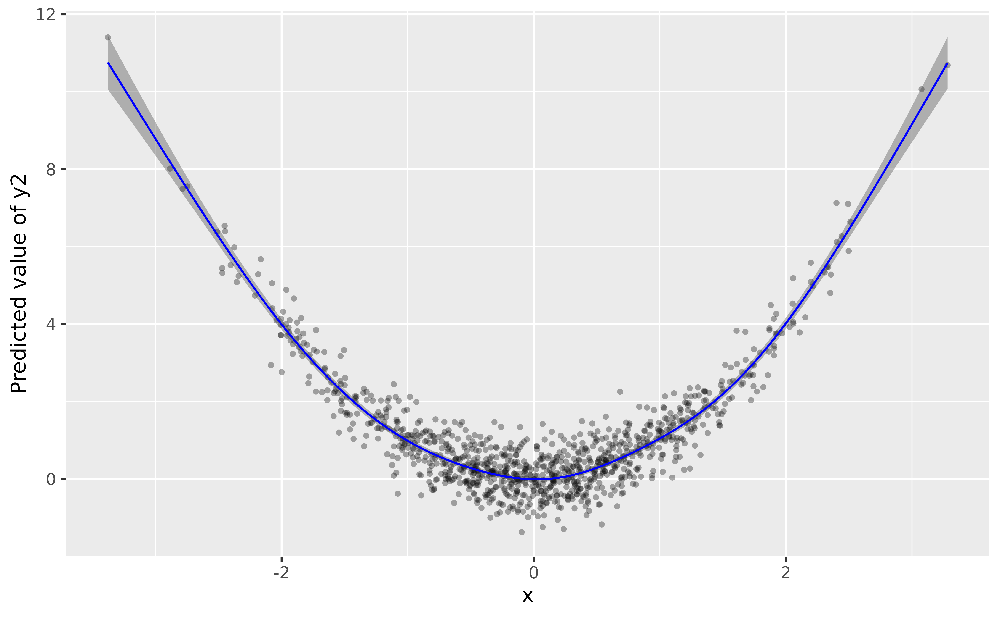

\
`# Increase precision`\
`deriv`` ``<-`` ``modelbased``::`[`estimate_slopes`](https://easystats.github.io/modelbased/reference/estimate_slopes.md)`(``model_gam2``, trend ``=`` ``"x"``, by ``=`` ``"x"``, length ``=`` ``100``)`\
\
[`plot`](https://rdrr.io/r/graphics/plot.default.html)`(``deriv``, line ``=`` `[`list`](https://rdrr.io/r/base/list.html)`(``color ``=`` ``"blue"``)``)`` ``+`\
`  `[`geom_hline`](https://ggplot2.tidyverse.org/reference/geom_abline.html)`(``yintercept ``=`` ``0``, linetype ``=`` ``"dashed"``)`

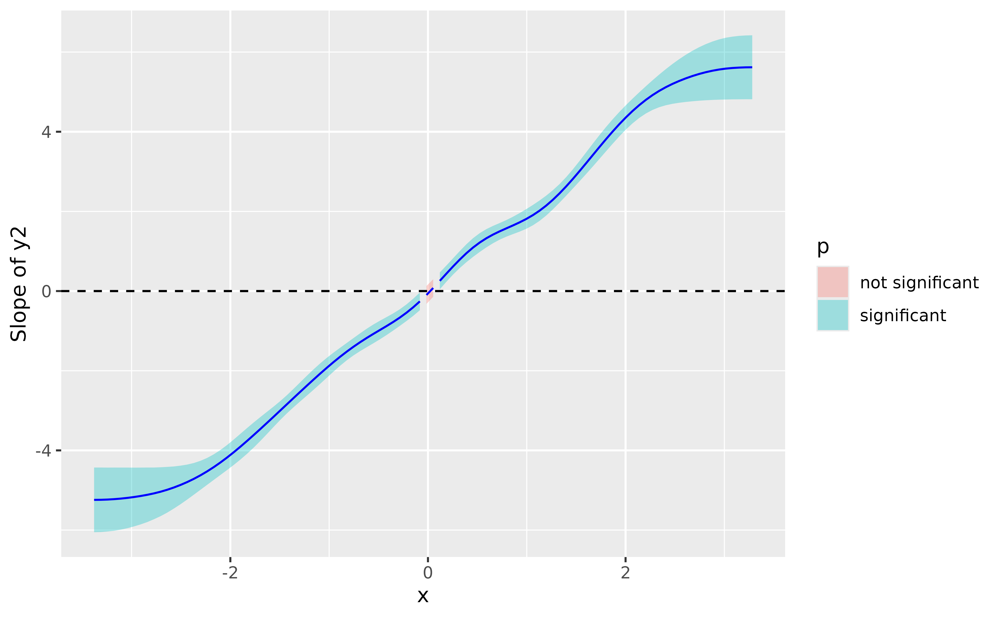

\
[`summary`](https://rdrr.io/r/base/summary.html)`(``deriv``)`

    > Johnson-Neymann Intervals
    > 
    > Start |   End | Direction | Confidence     
    > -------------------------------------------
    > -3.38 | -0.08 | negative  | Significant    
    > -0.01 | -0.01 | negative  | Not Significant
    > 0.05  |  0.05 | positive  | Not Significant
    > 0.12  |  3.28 | positive  | Significant    
    > 
    > Marginal effects estimated for x
    > Type of slope was dY/dX

The conclusion is very similar, it shows a significant effect that goes
from negative to positive and becomes flat (i.e., non-significant)
around 0.

What about *3rd-degree-type* relationships? It works the same way:

\
`data``$``y3`` ``<-`` ``data``$``x``^``3`` ``+`` `[`rnorm`](https://rdrr.io/r/stats/Normal.html)`(`[`nrow`](https://rdrr.io/r/base/nrow.html)`(``data``)``, sd ``=`` ``1``)`\
\
`model_gam3`` ``<-`` ``mgcv``::`[`gam`](https://rdrr.io/pkg/mgcv/man/gam.html)`(``y3`` ``~`` `[`s`](https://rdrr.io/pkg/mgcv/man/s.html)`(``x``)``, data ``=`` ``data``)`\
\
[`plot`](https://rdrr.io/r/graphics/plot.default.html)`(``modelbased``::`[`estimate_relation`](https://easystats.github.io/modelbased/reference/estimate_expectation.md)`(``model_gam3``, length ``=`` ``100``)``, line ``=`` `[`list`](https://rdrr.io/r/base/list.html)`(``color ``=`` ``"blue"``)``)`

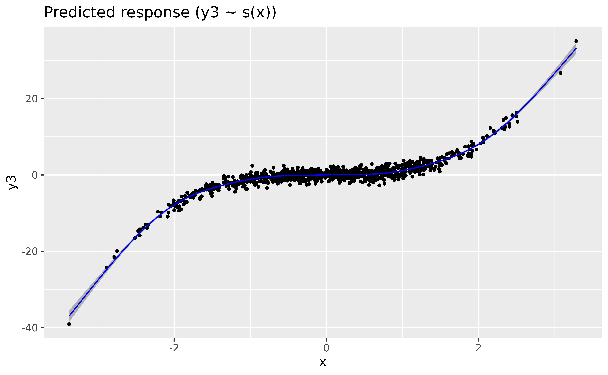

\
`deriv`` ``<-`` ``modelbased``::`[`estimate_slopes`](https://easystats.github.io/modelbased/reference/estimate_slopes.md)`(``model_gam3``, trend ``=`` ``"x"``, by ``=`` ``"x"``, length ``=`` ``100``)`\
\
[`plot`](https://rdrr.io/r/graphics/plot.default.html)`(``deriv``, line ``=`` `[`list`](https://rdrr.io/r/base/list.html)`(``color ``=`` ``"blue"``)``)`` ``+`\
`  `[`geom_hline`](https://ggplot2.tidyverse.org/reference/geom_abline.html)`(``yintercept ``=`` ``0``, linetype ``=`` ``"dashed"``)`

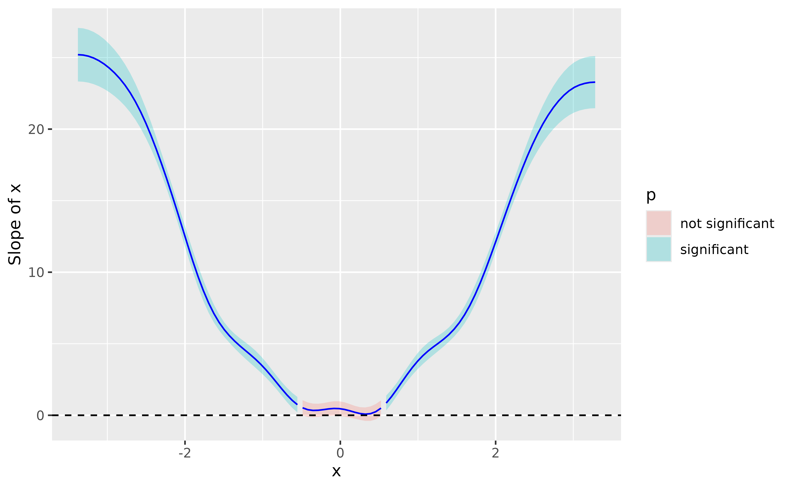

Again, the GAM nicely recovered the shape of the relationship.

**In summary, effects derivatives can be used to easily leverage the
power of GAMs.**
