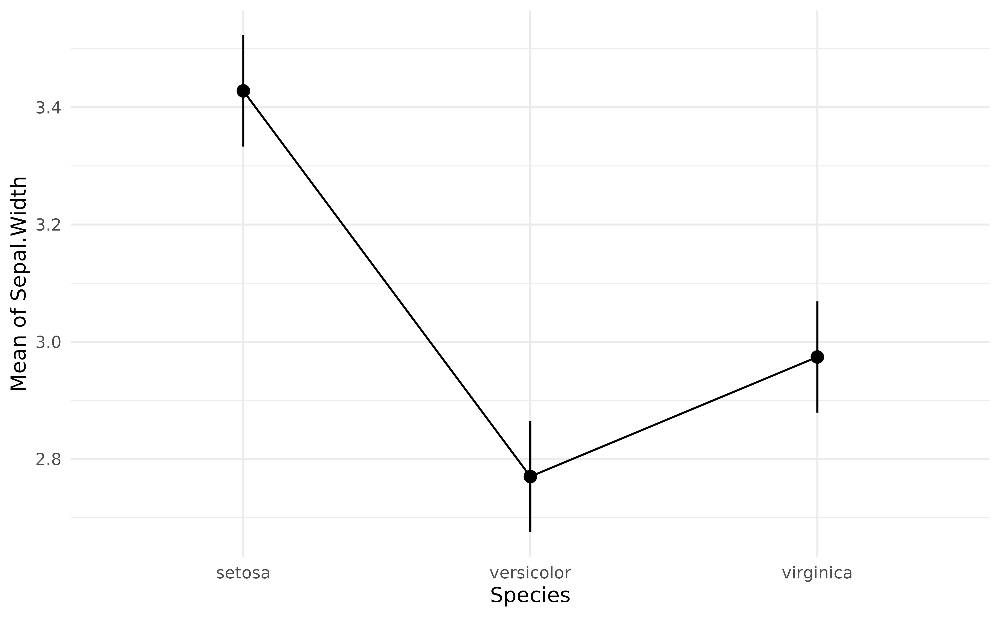

# Contrast analysis

## Testing pairwise differences

In the [**previous
tutorial**](https://easystats.github.io/modelbased/articles/estimate_means.html),
we computed marginal means at the 3 different `Species` levels from the
[`iris`](https://en.wikipedia.org/wiki/Iris_flower_data_set) dataset.
However, one might also want to **statistically test** the differences
between each levels, which can be achieved through **contrast
analysis**. Although the procedure is much more powerful, its aim is
analogous to the ***post hoc*** analysis (pretty much consisting of
pairwise *t*-tests), which are heavily utilized in behavioral sciences
as a way to follow up on hypotheses about global differences tested by
ANOVAs with more specific hypotheses about pairwise differences.

Let’s carry out contrast analysis on the simple model from the previous
tutorial:

``` r

library(ggplot2)
library(modelbased)
data(iris)

model <- lm(Sepal.Width ~ Species, data = iris)
means <- estimate_means(model, by = "Species")

plot(means, point = list(width = 0.1)) +
  theme_minimal()
```



**Contrast analysis** can be achieved through the `estimate_contrasts`
function:

``` r

estimate_contrasts(model, contrast = "Species")
```

    > Marginal Contrasts Analysis
    > 
    > Level1     | Level2     | Difference |   SE |         95% CI | t(147) |      p
    > ------------------------------------------------------------------------------
    > versicolor | setosa     |      -0.66 | 0.07 | [-0.79, -0.52] |  -9.69 | < .001
    > virginica  | setosa     |      -0.45 | 0.07 | [-0.59, -0.32] |  -6.68 | < .001
    > virginica  | versicolor |       0.20 | 0.07 | [ 0.07,  0.34] |   3.00 |  0.003
    > 
    > Variable predicted: Sepal.Width
    > Predictors contrasted: Species
    > p-values are uncorrected.

We can conclude that all pairwise differences are statistically
significant.

## Complex model

Again, as contrast analysis is based on marginal means, it can be
applied to more complex models:

``` r

model <- lm(Sepal.Width ~ Species * Petal.Width, data = iris)
contrasts <- estimate_contrasts(model, contrast = "Species")
contrasts
```

    > Marginal Contrasts Analysis
    > 
    > Level1     | Level2     | Difference |   SE |         95% CI | t(144) |      p
    > ------------------------------------------------------------------------------
    > versicolor | setosa     |      -1.59 | 0.39 | [-2.37, -0.81] |  -4.04 | < .001
    > virginica  | setosa     |      -1.77 | 0.41 | [-2.59, -0.96] |  -4.29 | < .001
    > virginica  | versicolor |      -0.18 | 0.15 | [-0.47,  0.10] |  -1.27 |  0.205
    > 
    > Variable predicted: Sepal.Width
    > Predictors contrasted: Species
    > Predictors averaged: Petal.Width (1.2)
    > p-values are uncorrected.

For instance, if we add `Petal.Width` in the model, we can see that the
difference between *versicolor* and *virginica* becomes not significant
(and even changes sign).

Note that we can plot simple contrast analysis through **lighthouse
plots**:

``` r

plot(contrasts, estimate_means(model, by = "Species")) +
  theme_minimal()
```


These represent the estimated means and their CI range (in black), while
the grey areas show the CI range of the difference (as compared to the
point estimate). One easy way to interpret lighthouse plots is that if
the whole beam goes up or down (i.e., the upper limit and the lower
limit are of the same direction), the difference is likely significant.

## Changes in difference

Interestingly, we can also see how these differences are modulated by
another continuous variable. Based on the model above (including the
interaction with `Petal.Width`), we will compute the contrasts at 100
equally-spaced points of `Petal.Width`, that we will then visualise.

``` r

contrasts <- estimate_contrasts(
  model,
  contrast = "Species",
  by = "Petal.Width",
  length = 100,
  # we use a emmeans here because marginaleffects doesn't
  # generate more than 25 rows for pairwise comparisons
  backend = "emmeans"
)

# Create a variable with the two levels concatenated
contrasts$Contrast <- paste(contrasts$Level1, "-", contrasts$Level2)

# Visualise the changes in the differences
ggplot(contrasts, aes(x = Petal.Width, y = Difference)) +
  geom_ribbon(aes(fill = Contrast, ymin = CI_low, ymax = CI_high), alpha = 0.2) +
  geom_line(aes(colour = Contrast), linewidth = 1) +
  geom_hline(yintercept = 0, linetype = "dashed") +
  theme_minimal() +
  ylab("Difference")
```


As we can see, the difference between *versicolor* and *virginica*
increases as `Petal.Width` increases.

## Conclusion

Contrast analysis can be a powerful tool to interpret and understand
statistical models.

## References
