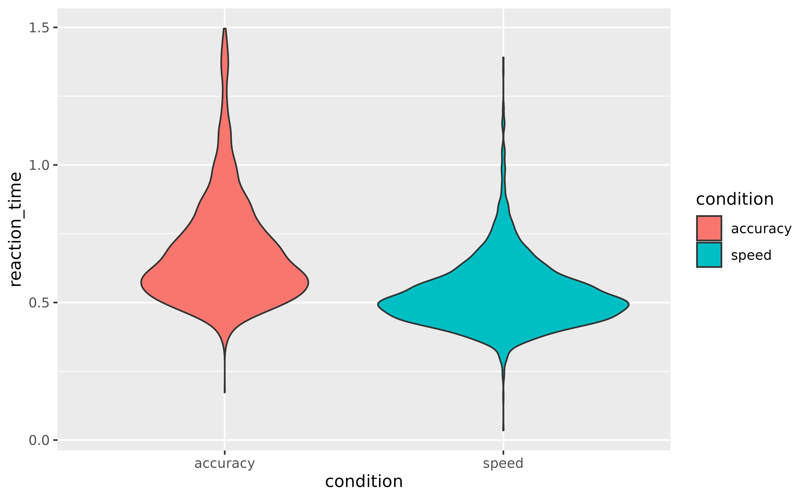
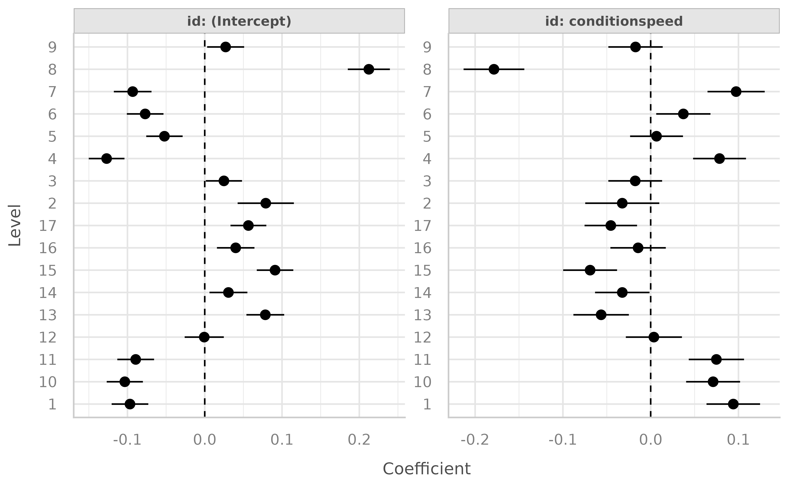
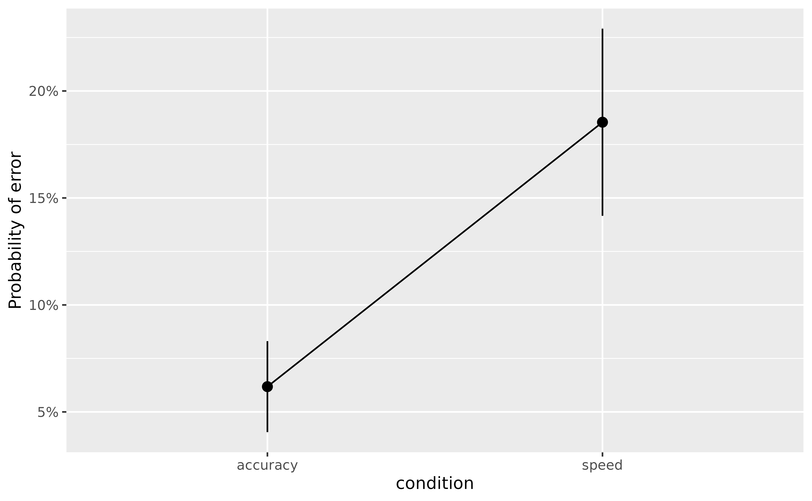
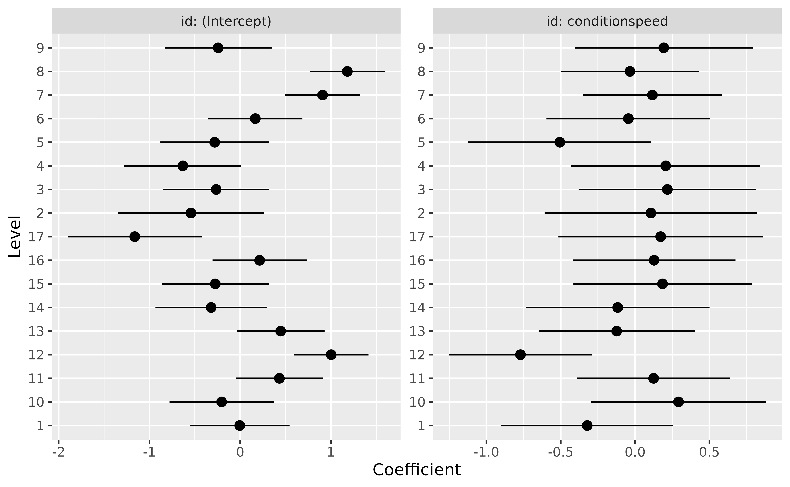

# How to use Mixed models to Estimate Individuals' Scores

Mixed models are powerful tools that can be used for a variety of
interesting purposes. Indeed, while they are typically used to be more
accurate and resilient in estimating population-level effects (aka the
“fixed” effects), they can also be used to gain insight into group-level
effects (e.g., individuals’ scores, if the random factors are
individuals).

For this practical walkthrough on **advanced mixed model analysis**, we
will use the **Speed-Accuracy Data** (Wagenmakers, Ratcliff, Gomez, &
McKoon, 2008) from the `rtdists` package, in which **17 participants**
(the **id** variable) performed some reaction time (RT) task under two
conditions, speed and accuracy (the **condition** variable).

Our hypotheses is that participants are **faster** (i.e., lower RT) in
the speed condition as compared to the accuracy condition. On the other
hand, they will make less **errors** in the accuracy condition as
compared to the speed condition.

In the following, we will load the necessary packages and clean the data
by removing outliers and out-of-scope data.

``` r

library(easystats)
library(rtdists)

# Remove outliers &  Keep only word condition
data <- rtdists::speed_acc |>
  data_filter(rt < 1.5 & stim_cat == "word" & frequency == "low") |>
  data_rename(select = c(reaction_time = "rt"))

# Add new 'error' column that is 1 if the response doesn't match the category
data <- data_modify(
  data,
  error = ifelse(as.character(response) != as.character(stim_cat), 1, 0)
)
```

## Speed (RT)

### Population-level Effects

For the reaction time, we will start by removing all the incorrect
responses, since they are not reflective of a “successful” cognitive
process. Then, and we will plot the RT according to the condition and
stimulus category.

``` r

library(ggplot2)
data_rt <- data_filter(data, error == 0)

ggplot(data = data_rt, aes(y = reaction_time, x = condition, fill = condition)) +
  geom_violin()
```



The descriptive visualisation indeed seems to suggest that people are
slower in the **accuracy** condition as compared to the **speed**
condition. And there could also be a slight effect of **frequency**.

Let’s verify that using the [**modelisation
approach**](https://easystats.github.io/modelbased/articles/modelisation_approach.html).

``` r

library(lme4)
model_full <- lmer(
  reaction_time ~ condition + (1 + condition | id) + (1 | stim),
  data = data_rt
)
```

Let’s unpack the formula of this model. We’re tying to predict
`reaction_time` using different terms. These can be separated into two
groups, the *fixed* effects and the *random* effects. Having `condition`
as a fixed effect means that we are interested in estimating the
**“general”** effect of the condition, across all subjects and items
(i.e., at the ***population level***). On top of that effect of
condition, a second ‘fixed’ parameter was implicitly specified and will
be estimated, the **intercept** (as you might know, one has to
explicitly remove it through `reaction_time ~ 0 + condition`, otherwise
it is added automatically).

Let’s investigate these two fixed parameters first:

``` r

parameters(model_full, effects = "fixed")
```

    > # Fixed Effects
    > 
    > Parameter         | Coefficient |   SE |         95% CI | t(4506) |      p
    > --------------------------------------------------------------------------
    > (Intercept)       |        0.69 | 0.02 | [ 0.65,  0.74] |   30.44 | < .001
    > condition [speed] |       -0.16 | 0.02 | [-0.19, -0.12] |   -8.53 | < .001

Because `condition` is a factor with two levels, these parameters are
easily interpretable. The *intercept* corresponds to the `reaction_time`
at the baseline level of the factor (accuracy), and the effect of
condition corresponds to the change in `reaction_time` between the
intercept and the speed condition. In other words, the effect of
`condition` refers to the difference between the two conditions,
`speed - accuracy`.

As we can see, this difference is significant, and people have, **in
general**, a lower `reaction_time` (the sign is negative) in the speed
condition.

Let’s visualize the [marginal
means](https://easystats.github.io/modelbased/articles/estimate_means.html)
estimated by the model:

``` r

means <- estimate_means(model_full, by = "condition", backend = "marginaleffects")

plot(means, point = list(alpha = 0.1, width = 0.1)) +
  theme_minimal()
```


Now, what’s up with the **random effects**. In the formula, we specified
random intercepts (i.e., the right part of the bar `|` symbol) for `id`
(the participants) and `stim`. That means that **each participant and
each stimulus will have its own “Intercept” parameter** (which, as we’ve
seen before, corresponds to the `reaction_time` in the accuracy
condition). Additionally, we’ve specified the random effect (“random
slope” - the left side of the bar) of `condition` for each participant.
That means that **each participant will have its own effect of
condition** computed.

But do we need such a complex model? Let’s compare it to a model without
specifying random intercepts for the stimuli.

``` r

model <- lmer(reaction_time ~ condition + (condition | id), data = data_rt)

test_performance(model_full, model)
```

    > Name       |   Model |      BF | df | df_diff |  Chi2 |      p
    > --------------------------------------------------------------
    > model_full | lmerMod |         |  7 |         |       |       
    > model      | lmerMod | < 0.001 |  6 |      -1 | 36.78 | < .001
    > Models were detected as nested (in terms of fixed parameters) and are compared in sequential order.

Mmmh, it seems that the simpler model performs **a lot worse** (the
Bayes Factor is lower than 1). We could run `compare_performance()` to
learn more details, but for this example we will go ahead and keep the
**worse model** (for simplicity and conciseness when inspecting the
random effects later, but keep in mind that in real life it’s surely not
the best thing to do).

### Group-level Effects

That’s nice to know, but how to actually **get access** to these
group-level scores. We can use the
[`estimate_grouplevel()`](https://easystats.github.io/modelbased/reference/estimate_grouplevel.md)
function to retrieve them.

``` r

random <- estimate_grouplevel(model)
random
```

    > Group | Level | Parameter         | Coefficient |   SE |         95% CI
    > -----------------------------------------------------------------------
    > id    | 1     | (Intercept)       |       -0.10 | 0.01 | [-0.12, -0.07]
    > id    | 1     | condition [speed] |        0.09 | 0.02 | [ 0.06,  0.12]
    > id    | 2     | (Intercept)       |        0.08 | 0.02 | [ 0.04,  0.12]
    > id    | 2     | conditionspeed    |       -0.03 | 0.02 | [-0.07,  0.01]
    > id    | 3     | (Intercept)       |        0.02 | 0.01 | [ 0.00,  0.05]
    > id    | 3     | conditionspeed    |       -0.02 | 0.02 | [-0.05,  0.01]
    > id    | 4     | (Intercept)       |       -0.13 | 0.01 | [-0.15, -0.10]
    > id    | 4     | conditionspeed    |        0.08 | 0.02 | [ 0.05,  0.11]
    > id    | 5     | (Intercept)       |       -0.05 | 0.01 | [-0.08, -0.03]
    > id    | 5     | conditionspeed    |    6.67e-03 | 0.02 | [-0.02,  0.04]
    > id    | 6     | (Intercept)       |       -0.08 | 0.01 | [-0.10, -0.05]
    > id    | 6     | conditionspeed    |        0.04 | 0.02 | [ 0.01,  0.07]
    > id    | 7     | (Intercept)       |       -0.09 | 0.01 | [-0.12, -0.07]
    > id    | 7     | conditionspeed    |        0.10 | 0.02 | [ 0.06,  0.13]
    > id    | 8     | (Intercept)       |        0.21 | 0.01 | [ 0.19,  0.24]
    > id    | 8     | conditionspeed    |       -0.18 | 0.02 | [-0.21, -0.14]
    > id    | 9     | (Intercept)       |        0.03 | 0.01 | [ 0.00,  0.05]
    > id    | 9     | conditionspeed    |       -0.02 | 0.02 | [-0.05,  0.01]
    > id    | 10    | (Intercept)       |       -0.10 | 0.01 | [-0.13, -0.08]
    > id    | 10    | conditionspeed    |        0.07 | 0.02 | [ 0.04,  0.10]
    > id    | 11    | (Intercept)       |       -0.09 | 0.01 | [-0.11, -0.07]
    > id    | 11    | conditionspeed    |        0.07 | 0.02 | [ 0.04,  0.11]
    > id    | 12    | (Intercept)       |   -6.47e-04 | 0.01 | [-0.03,  0.02]
    > id    | 12    | conditionspeed    |    3.65e-03 | 0.02 | [-0.03,  0.04]
    > id    | 13    | (Intercept)       |        0.08 | 0.01 | [ 0.05,  0.10]
    > id    | 13    | conditionspeed    |       -0.06 | 0.02 | [-0.09, -0.02]
    > id    | 14    | (Intercept)       |        0.03 | 0.01 | [ 0.01,  0.06]
    > id    | 14    | conditionspeed    |       -0.03 | 0.02 | [-0.06,  0.00]
    > id    | 15    | (Intercept)       |        0.09 | 0.01 | [ 0.07,  0.11]
    > id    | 15    | conditionspeed    |       -0.07 | 0.02 | [-0.10, -0.04]
    > id    | 16    | (Intercept)       |        0.04 | 0.01 | [ 0.02,  0.06]
    > id    | 16    | conditionspeed    |       -0.01 | 0.02 | [-0.05,  0.02]
    > id    | 17    | (Intercept)       |        0.06 | 0.01 | [ 0.03,  0.08]
    > id    | 17    | conditionspeed    |       -0.05 | 0.02 | [-0.08, -0.02]

Each of our participant (the **Level** column), numbered from 1 to 17,
has two rows, corresponding to its own deviation from the main effect of
the **intercept** and **condition effect**.

We can easily visualize the random effects:

``` r

plot(random) +
  geom_hline(yintercept = 0, linetype = "dashed") +
  theme_lucid()
```



*Note: we need to use `hline` to effectively add a `vline` at 0 because
the coordinates are flipped in the plot.*

We can also use
[`reshape_grouplevel()`](https://easystats.github.io/modelbased/reference/estimate_grouplevel.md)
to select only the *Coefficient* column (and skip the information about
the uncertainty - which in real life is equally important!) and make it
match the original data. The resulting table has the same length as the
original dataset and can be merged with it: **it’s a convenient way to
re-incorporate the random effects into the data for further re-use**.

``` r

reshaped <- reshape_grouplevel(random, indices = "Coefficient")

head(reshaped)
```

    >   id Intercept conditionspeed
    > 1  1    -0.097         0.0941
    > 2  2     0.079        -0.0324
    > 3  3     0.025        -0.0176
    > 4  4    -0.127         0.0784
    > 5  5    -0.052         0.0067
    > 6  6    -0.077         0.0372

Let’s merge it with the original data.

``` r

data_rt <- data_join(data_rt, reshaped, join = "full", by = "id")
```

### Correlation with empirical scores

We said above that the random effects are the group-level (the group
unit is, in this model, the participants) version of the
population-level effects (the fixed effects). One important thing to
note is that they represent the **deviation from the fixed effect**, so
a coefficient close to 0 means that the participants’ effect is the same
as the population-level effect. In other words, it’s **“in the norm”**
(note that we can also obtain the group-specific effect corresponding to
the sum of the fixed and random by changing the `type` argument).

Nevertheless, let’s compute some **empirical scores**, such as the
condition averages for each participant.

We will group the data by participant and condition, get the mean RT,
and then reshape the data so that we have, for each participant, the two
means as two columns. Then, we will create a new dataframe (we will use
the same - and overwrite it - to keep it concise), in which we will only
keep the mean RT in the **accuracy** condition, and the difference with
the **speed** condition *(reminds you of something?)*.

``` r

data_sub <- aggregate(reaction_time ~ id + condition, data_rt, mean)
data_sub <- data_rt |>
  data_summary(reaction_time = mean(reaction_time), by = c("id", "condition")) |>
  reshape_wider(
    names_from = "condition", values_from = "reaction_time", names_prefix = "empirical_"
  ) |>
  data_modify(empirical_speed = empirical_accuracy - empirical_speed)
data_sub
```

    >    id empirical_accuracy empirical_speed
    > 1   1               0.59           0.053
    > 2   2               0.77           0.165
    > 3   3               0.72           0.175
    > 4   4               0.56           0.086
    > 5   5               0.64           0.165
    > 6   6               0.62           0.130
    > 7   7               0.59           0.042
    > 8   8               0.91           0.353
    > 9   9               0.72           0.174
    > 10 10               0.59           0.089
    > 11 11               0.60           0.078
    > 12 12               0.69           0.153
    > 13 13               0.77           0.214
    > 14 14               0.72           0.195
    > 15 15               0.78           0.229
    > 16 16               0.73           0.164
    > 17 17               0.75           0.206

Now, how to these **empirical scores** compare with the **random
effects** estimated by the model? Let’s merge the empirical scores with
the random effects scores. For that, we will run
[`summary()`](https://rdrr.io/r/base/summary.html) on the **reshaped**
random effects to remove all the duplicate rows (and have only one row
per participant, so that it matches the format of `data_sub`).

We can now reshape the random effects to have the same format as
`data_sub` and merge them.

``` r

data_sub <- data_join(data_sub, summary(reshaped), by = "id")
data_sub
```

    >    id empirical_accuracy empirical_speed Intercept conditionspeed
    > 1   1               0.59           0.053  -0.09676         0.0941
    > 2   2               0.77           0.165   0.07896        -0.0324
    > 3   3               0.72           0.175   0.02481        -0.0176
    > 4   4               0.56           0.086  -0.12699         0.0784
    > 5   5               0.64           0.165  -0.05216         0.0067
    > 6   6               0.62           0.130  -0.07711         0.0372
    > 7   7               0.59           0.042  -0.09326         0.0973
    > 8   8               0.91           0.353   0.21236        -0.1785
    > 9   9               0.72           0.174   0.02704        -0.0173
    > 10 10               0.59           0.089  -0.10344         0.0711
    > 11 11               0.60           0.078  -0.08936         0.0749
    > 12 12               0.69           0.153  -0.00065         0.0036
    > 13 13               0.77           0.214   0.07838        -0.0564
    > 14 14               0.72           0.195   0.03066        -0.0324
    > 15 15               0.78           0.229   0.09098        -0.0690
    > 16 16               0.73           0.164   0.04005        -0.0143
    > 17 17               0.75           0.206   0.05650        -0.0454

Let’s run a correlation between the model-based scores and the empirical
scores.

``` r

correlation(data_sub) |>
  summary(redundant = TRUE) |>
  cor_sort() |>
  plot()
```


First thing to notice is that **everything is significantly and strongly
correlated**!.

Then, the empirical scores for accuracy and condition, corresponding to
the “raw” average of RT, correlate **almost perfectly with their
model-based counterpart**
(r\_{empirical\\accuracy/Coefficient\\Intercept} = 1;
r\_{empirical\\condition/Coefficient\\conditionspeed} \> .99). That’s
reassuring, it means that our model has managed to estimate some
intuitive parameters!

Finally, we can observe that there is a strong and negative correlation
(which is even more salient with model-based indices) between the RT in
the accuracy condition and the effect of the speed condition:

``` r

ggplot(data_sub, aes(x = Intercept, y = conditionspeed)) +
  geom_point() +
  geom_smooth(method = "lm") +
  theme_minimal()
```


The slower they are in the accuracy condition, the bigger the difference
with the speed condition.

### Reliability

Extracting random effects is also useful to compute the
***reliability*** of a given paradigm. The key idea is to compare the
inter-individual variability in the random effects to their
intra-individual variability in the data (Williams et al., 2020).

For that, we first need to compute the variability (SD) of the
point-estimates across participants.

``` r

reliability <- random |>
  data_summary(sd_between = sd(Coefficient), by = "Parameter")
reliability
```

    > Parameter      | sd_between
    > ---------------------------
    > (Intercept)    |       0.09
    > conditionspeed |       0.07

Then, we compute the average variability (SE) of the random effects
within participants, and add it to the previous table.

``` r

reliability <- random |>
  data_summary(sd_within = mean(SE), by = "Parameter") |>
  data_join(reliability)
reliability
```

    > Parameter      | sd_within | sd_between
    > ---------------------------------------
    > (Intercept)    |      0.01 |       0.09
    > conditionspeed |      0.02 |       0.07

The reliability is then the ratio of the between-participants
variability to the within-participants variability. The more any
estimate varies in-between participants compared to within participants,
the more reliable it is.

``` r

reliability |>
  data_modify(reliability = sd_between / sd_within)
```

    > Parameter      | sd_within | sd_between | reliability
    > -----------------------------------------------------
    > (Intercept)    |      0.01 |       0.09 |        7.24
    > conditionspeed |      0.02 |       0.07 |        4.39

Reliability values of more than 1 suggest a higher variability between
participants than within participants, which is a good sign for the
reliability of the estimates.

## Accuracy

In this section, we will take interest in the accuracy - the probability
of making errors, using **logistic models**. For this, we will use the
dataset that still includes the errors (`data`, and not `data_rt` used
in the previous section).

We will fit a logistic mixed model to predict the likelihood of making
error depending on the condition. Similarly, we specified a random
intercept and random effect of condition for the participants.

``` r

model <- glmer(
  error ~ condition + (1 + condition | id),
  data = data,
  family = "binomial"
)

parameters(model, effects = "fixed")
```

    > # Fixed Effects
    > 
    > Parameter         | Log-Odds |   SE |         95% CI |      z |      p
    > ----------------------------------------------------------------------
    > (Intercept)       |    -2.91 | 0.19 | [-3.28, -2.53] | -15.16 | < .001
    > condition [speed] |     1.32 | 0.15 | [ 1.02,  1.61] |   8.73 | < .001

The parameters suggest that in general, participants indeed make more
errors in the speed condition as compared to the accuracy condition. We
can visualize the average probability (i.e., the **marginal means**) of
making errors in the two conditions.

``` r

plot(estimate_means(model, by = "condition"), show_data = FALSE)
```



Similarly, we can extract the group-level effects, clean them (rename
the columns, otherwise it will be the same names as for the RT model),
and merge them with the previous ones.

``` r

random <- estimate_grouplevel(model)

plot(random)
```



## References
