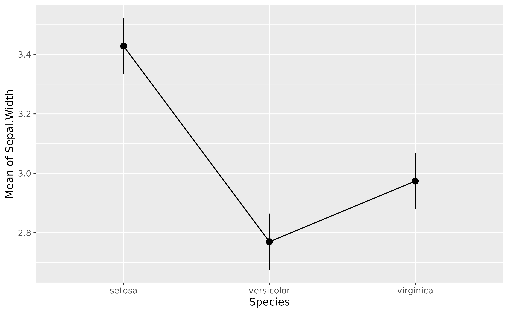

# What are, why use and how to get marginal means

This vignette will introduce the concept of **marginal means**.

## Raw Means

The [`iris`](https://en.wikipedia.org/wiki/Iris_flower_data_set)
dataset, available in base `R`, contains observations of three types of
*iris* flowers (the `Species` variable); *Setosa*, *Versicolor* and
*Virginica*, for which different features were measured, such as the
length and width of the sepals and petals.

A traditional starting point, when reporting such data, is to start by
descriptive statistics. For instance, **what is the mean `Sepal.Width`
for each of the three species**.

We can compute the means very easily by grouping the observations by
species, and then computing the mean and the standard deviation (SD):

``` r

library(easystats)

iris |>
  data_group("Species") |>
  describe_distribution(select = "Sepal.Width")
```

    > Species    |    Variable | Mean |   SD |  IQR |        Range | Skewness
    > -----------------------------------------------------------------------
    > setosa     | Sepal.Width | 3.43 | 0.38 | 0.52 | [2.30, 4.40] |     0.04
    > versicolor | Sepal.Width | 2.77 | 0.31 | 0.50 | [2.00, 3.40] |    -0.36
    > virginica  | Sepal.Width | 2.97 | 0.32 | 0.40 | [2.20, 3.80] |     0.37
    > 
    > Species    | Kurtosis |  n | n_Missing
    > --------------------------------------
    > setosa     |     0.95 | 50 |         0
    > versicolor |    -0.37 | 50 |         0
    > virginica  |     0.71 | 50 |         0

We can also visualize it with a plot:

``` r

library(ggplot2)
ggplot(iris, aes(x = Species, y = Sepal.Width, fill = Species)) +
  geom_violin() +
  geom_jitter(width = 0.05) +
  theme_modern()
```


However, these **raw means** might be biased, as the number of
observations in each group might be different. Moreover, there might be
some hidden covariance or mediation with other variables in the dataset,
creating a “spurious” influence (confounding) on the means.

**How can we take these influences into account while calculating
means?**

## Marginal Means

Another way of analysing the means is to actually **statistically model
them**, rather than simply describe them as they appear in the data. For
instance, we could fit a simple Bayesian linear regression modelling the
relationship between `Species` and `Sepal.Width`.

Marginal means are basically means extracted from a statistical model,
and represent average of response variable (here, `Sepal.Width`) for
each level of predictor variable (here, `Species`).

``` r

library(modelbased)
model <- lm(Sepal.Width ~ Species, data = iris)
means <- estimate_means(model, by = "Species")
means
```

    > Estimated Marginal Means
    > 
    > Species    | Mean |   SE |       95% CI | t(147)
    > ------------------------------------------------
    > setosa     | 3.43 | 0.05 | [3.33, 3.52] |  71.36
    > versicolor | 2.77 | 0.05 | [2.68, 2.86] |  57.66
    > virginica  | 2.97 | 0.05 | [2.88, 3.07] |  61.91
    > 
    > Variable predicted: Sepal.Width
    > Predictors modulated: Species

Note that the means computed here are not that different than the raw
means we created above. From which we can surmise that there are not
many spurious influences that we need to worry about in the `iris`
dataset. But this might not be the case for your dataset.

We can now add these means, as well as the [**credible interval
(CI)**](https://easystats.github.io/bayestestR/articles/credible_interval.html)
representing the uncertainty of the estimation, as an overlay on the
previous plot:

``` r

p <- ggplot(iris, aes(x = Species, y = Sepal.Width, fill = Species)) +
  geom_violin() +
  geom_jitter(width = 0.05) +
  geom_line(data = means, aes(y = Mean, group = 1)) +
  geom_pointrange(
    data = means,
    aes(y = Mean, ymin = CI_low, ymax = CI_high),
    size = 1,
    color = "white"
  ) +
  theme_minimal()
p
```


Note that *modelbased* provides some automated plotting capabilities for
quick visual checks:

``` r

plot(means)
```



## Complex Models

The power of marginal means resides in the fact that they can be
estimated from much more complex models. For instance, we could fit a
model that takes into account the interaction with the other variable,
`Petal.Width`. The estimated means will be “adjusted” (or will take into
account) for variations of these other components.

``` r

model <- lm(Sepal.Width ~ Species + Petal.Width, data = iris)
means_complex <- estimate_means(model, by = "Species")

means_complex
```

    > Estimated Marginal Means
    > 
    > Species    | Mean |   SE |       95% CI | t(146)
    > ------------------------------------------------
    > setosa     | 4.17 | 0.12 | [3.93, 4.42] |  33.89
    > versicolor | 2.67 | 0.05 | [2.58, 2.76] |  59.07
    > virginica  | 2.33 | 0.11 | [2.11, 2.54] |  21.39
    > 
    > Variable predicted: Sepal.Width
    > Predictors modulated: Species
    > Predictors averaged: Petal.Width (1.2)

Now let’s add to our previous plot the marginal means from the more
complex model (shown in purple) next to each other, which should help us
notice how the adjusted means change depending on the predictors.

``` r

p +
  geom_line(data = means_complex, aes(y = Mean, group = 1), color = "purple") +
  geom_pointrange(
    data = means_complex,
    aes(y = Mean, ymin = CI_low, ymax = CI_high),
    size = 1,
    color = "purple"
  )
```


That’s interesting! It seems that after adjusting (“controlling for”)
the model for petal characteristics, the differences between `Species`
seem to be magnified!

**But are these differences “significant”?**

That’s where the contrast analysis comes into play! Click [here to read
the tutorial on **contrast
analysis**](https://easystats.github.io/modelbased/articles/estimate_contrasts.html).

## References
