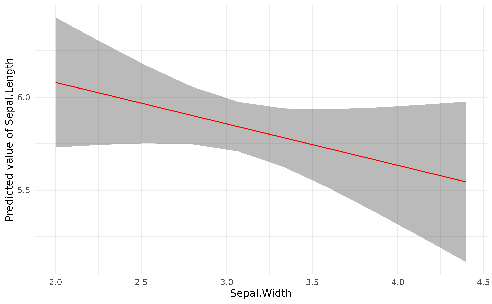
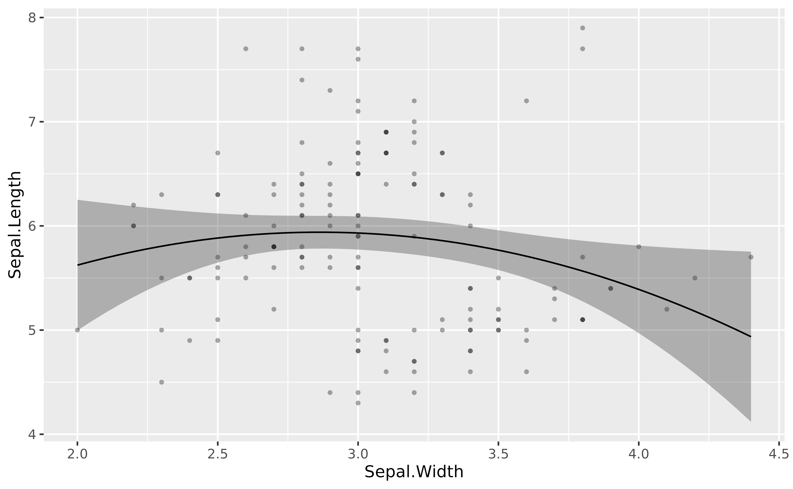
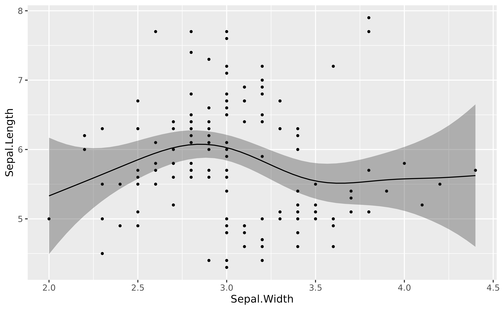

# Visualize effects and interactions

This vignette will present how to visualize the effects and interactions
using
[`estimate_relation()`](https://easystats.github.io/modelbased/reference/estimate_expectation.md).

Note that the statistically correct name of `estimate_relation` is
`estimate_expectation` (which can be used as an alias), as it refers to
expected predictions (read
[more](https://easystats.github.io/insight/reference/get_predicted.html)).

## Simple regression

### Linear relationship

[`library`](https://rdrr.io/r/base/library.html)`(`[`modelbased`](https://easystats.github.io/modelbased/)`)`` `` ``model`` ``<-`` `[`lm`](https://rdrr.io/r/stats/lm.html)`(``Sepal.Length`` ``~`` ``Sepal.Width``, data ``=`` ``iris``)`` `` ``visualization_data`` ``<-`` `[`estimate_relation`](https://easystats.github.io/modelbased/reference/estimate_expectation.md)`(``model``)`` `[`head`](https://rdrr.io/r/utils/head.html)`(``visualization_data``)`

    > Model-based Predictions
    > 
    > Sepal.Width | Predicted |   SE |       95% CI
    > ---------------------------------------------
    > 2.00        |      6.08 | 0.18 | [5.73, 6.43]
    > 2.27        |      6.02 | 0.14 | [5.74, 6.30]
    > 2.53        |      5.96 | 0.11 | [5.75, 6.17]
    > 2.80        |      5.90 | 0.08 | [5.75, 6.06]
    > 3.07        |      5.84 | 0.07 | [5.71, 5.97]
    > 3.33        |      5.78 | 0.08 | [5.62, 5.94]
    > 
    > Variable predicted: Sepal.Length
    > Predictors modulated: Sepal.Width

[`library`](https://rdrr.io/r/base/library.html)`(`[`ggplot2`](https://ggplot2.tidyverse.org)`)`` `[`plot`](https://rdrr.io/r/graphics/plot.default.html)`(``visualization_data``, line ``=`` `[`list`](https://rdrr.io/r/base/list.html)`(``color ``=`` ``"red"``)``)`` ``+`` `` `[`theme_minimal`](https://ggplot2.tidyverse.org/reference/ggtheme.html)`(``)`

## More complex regressions

### Polynomial

[`lm`](https://rdrr.io/r/stats/lm.html)`(``Sepal.Length`` ``~`` `[`poly`](https://rdrr.io/r/stats/poly.html)`(``Sepal.Width``, ``2``)``, data ``=`` ``iris``)`` ``|>`` `` ``modelbased``::`[`estimate_relation`](https://easystats.github.io/modelbased/reference/estimate_expectation.md)`(``length ``=`` ``50``)`` ``|>`` `` `[`plot`](https://rdrr.io/r/graphics/plot.default.html)`(``)`

### Additive Models

[`library`](https://rdrr.io/r/base/library.html)`(``mgcv``)`

    > Loading required package: nlme

    > This is mgcv 1.9-4. For overview type '?mgcv'.

`mgcv``::`[`gam`](https://rdrr.io/pkg/mgcv/man/gam.html)`(``Sepal.Length`` ``~`` `[`s`](https://rdrr.io/pkg/mgcv/man/s.html)`(``Sepal.Width``)``, data ``=`` ``iris``)`` ``|>`` `` ``modelbased``::`[`estimate_relation`](https://easystats.github.io/modelbased/reference/estimate_expectation.md)`(``length ``=`` ``50``)`` ``|>`` `` `[`plot`](https://rdrr.io/r/graphics/plot.default.html)`(``)`

## References
