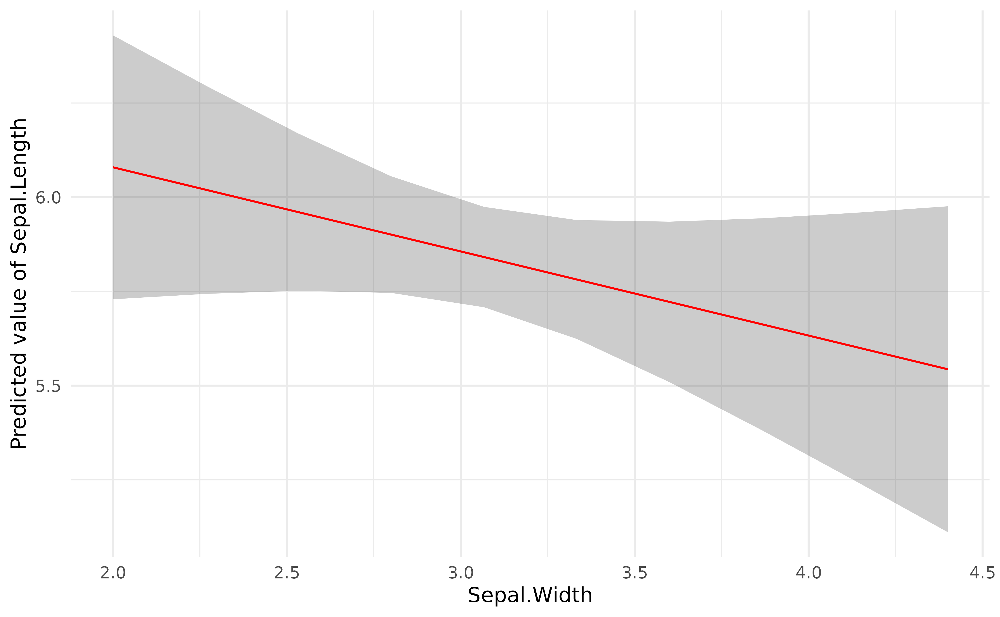
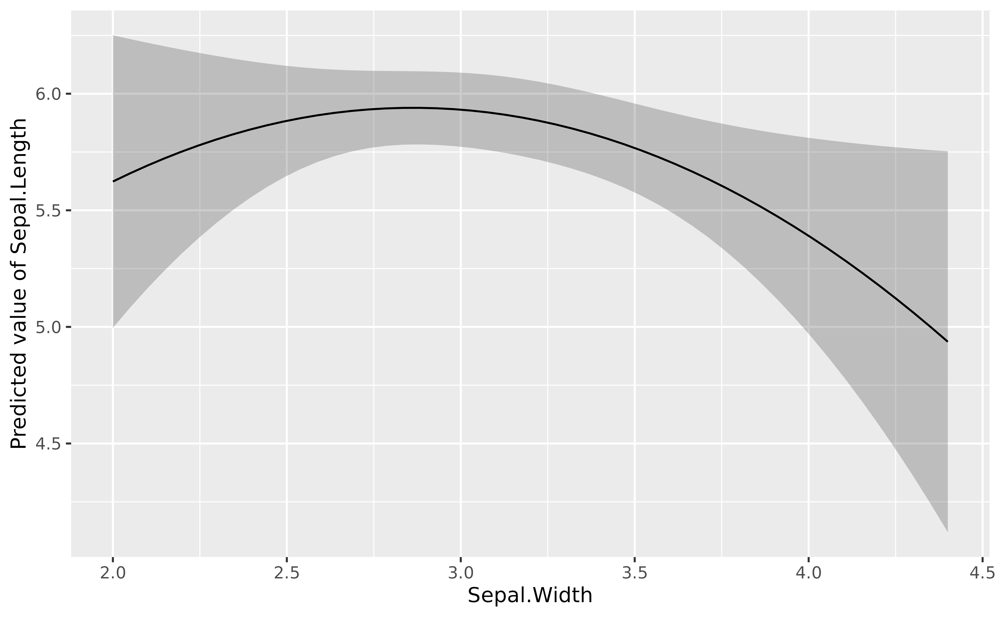
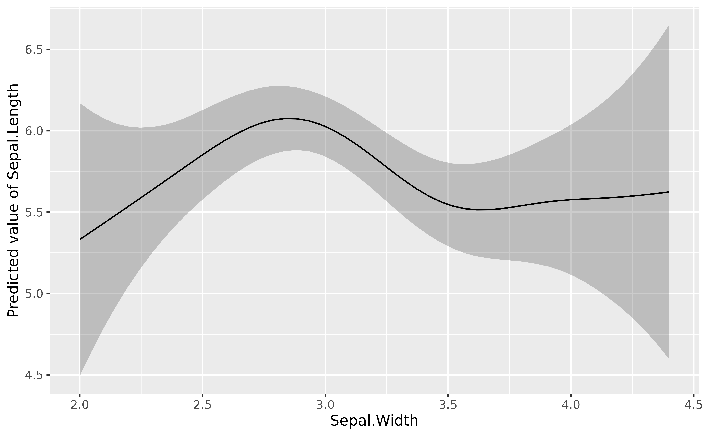

# Visualize effects and interactions

This vignette will present how to visualize the effects and interactions
using
[`estimate_relation()`](https://easystats.github.io/modelbased/reference/estimate_expectation.md).

Note that the statistically correct name of `estimate_relation` is
`estimate_expectation` (which can be used as an alias), as it refers to
expected predictions (read
[more](https://easystats.github.io/insight/reference/get_predicted.html)).

## Simple regression

### Linear relationship

``` r

library(modelbased)

model <- lm(Sepal.Length ~ Sepal.Width, data = iris)

visualization_data <- estimate_relation(model)
head(visualization_data)
```

    > Model-based Predictions
    > 
    > Sepal.Width | Predicted |   SE |       95% CI
    > ---------------------------------------------
    > 2.00        |      6.08 | 0.18 | [5.73, 6.43]
    > 2.27        |      6.02 | 0.14 | [5.74, 6.30]
    > 2.53        |      5.96 | 0.11 | [5.75, 6.17]
    > 2.80        |      5.90 | 0.08 | [5.75, 6.06]
    > 3.07        |      5.84 | 0.07 | [5.71, 5.97]
    > 3.33        |      5.78 | 0.08 | [5.62, 5.94]
    > 
    > Variable predicted: Sepal.Length
    > Predictors modulated: Sepal.Width

``` r

library(ggplot2)
plot(visualization_data, line = list(color = "red")) +
  theme_minimal()
```



## More complex regressions

### Polynomial

``` r

lm(Sepal.Length ~ poly(Sepal.Width, 2), data = iris) |>
  modelbased::estimate_relation(length = 50) |>
  plot()
```



### Additive Models

``` r

library(mgcv)
```

    > Loading required package: nlme

    > This is mgcv 1.9-4. For overview type '?mgcv'.

``` r

mgcv::gam(Sepal.Length ~ s(Sepal.Width), data = iris) |>
  modelbased::estimate_relation(length = 50) |>
  plot()
```



## References
