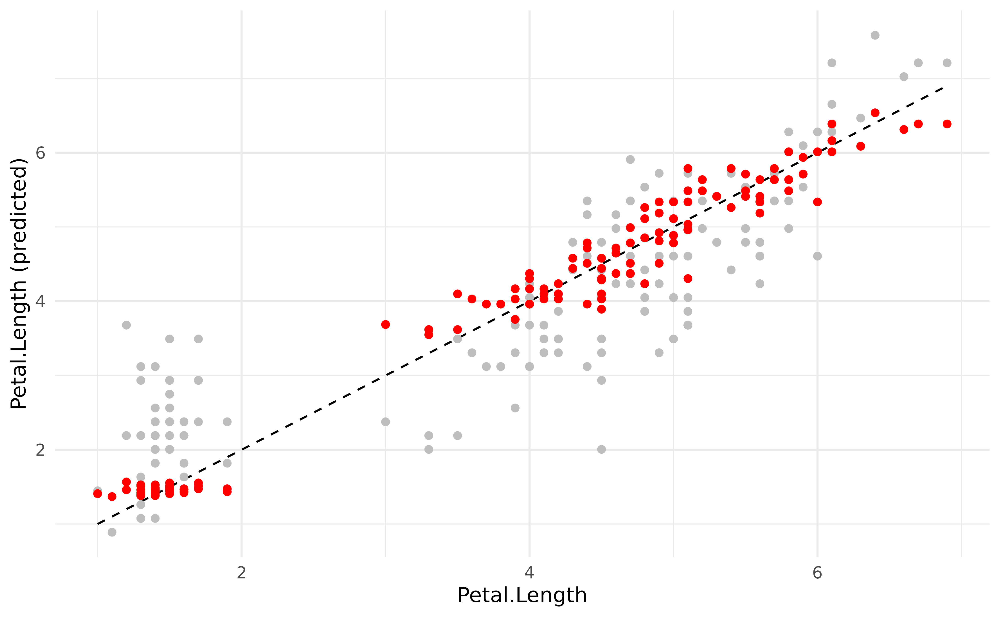
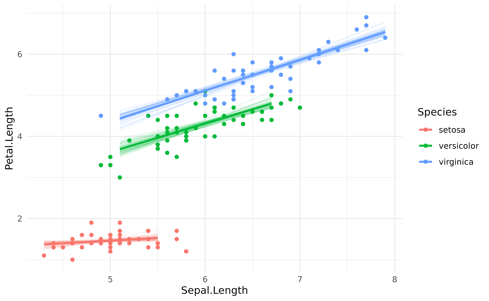

# Use a model to make predictions

## Prediction against original data

Generating prediction from the model can be used for a wide variety of
reasons, one of them being visualisation. This can be achieved via the
[`estimate_expectation()`](https://easystats.github.io/modelbased/reference/estimate_expectation.md)
function and its visualisation spinoff,
[`estimate_relation()`](https://easystats.github.io/modelbased/reference/estimate_expectation.md).

Let’s start by fitting a linear regression.

``` r

library(modelbased)

model <- lm(Petal.Length ~ Sepal.Length, data = iris)
```

We might be interested in comparing the values predicted by the model to
the actual “true” values. This can be done by generating predictions:

``` r

pred_data <- estimate_expectation(model)
head(pred_data)
```

    > Model-based Predictions
    > 
    > Sepal.Length | Predicted |   SE |       95% CI | Residuals
    > ----------------------------------------------------------
    > 5.10         |      2.38 | 0.10 | [2.19, 2.57] |     -0.98
    > 4.90         |      2.00 | 0.11 | [1.79, 2.22] |     -0.60
    > 4.70         |      1.63 | 0.12 | [1.39, 1.87] |     -0.33
    > 4.60         |      1.45 | 0.13 | [1.19, 1.70] |      0.05
    > 5.00         |      2.19 | 0.10 | [1.99, 2.39] |     -0.79
    > 5.40         |      2.93 | 0.08 | [2.78, 3.09] |     -1.23
    > 
    > Variable predicted: Petal.Length

The output is a data frame containing predicted values (the median and
CI of the posterior distribution) for **each of the value of the
original data frame** (used for fitting the model). Hence, we can simply
add the original response column (`Petal.Length`) to this data and plot
the original against the predicted data (on top of the identity line,
representing the perfect relationship).

``` r

library(ggplot2)

pred_data$Petal.Length <- iris$Petal.Length

pred_data |>
  ggplot(aes(x = Petal.Length, y = Predicted)) +
  geom_line(aes(x = Petal.Length, y = Petal.Length), linetype = "dashed") +
  geom_point() +
  ylab("Petal.Length (predicted)") +
  theme_minimal()
```


It seems like our model does not perform too bad. What if we added
information about the `Species` in the model?

``` r

model <- lm(Petal.Length ~ Sepal.Length * Species, data = iris)

pred_data$Predicted_2 <- estimate_expectation(model)$Predicted
```

We could now plot the second observations, based on a more complex
model, as a red overlay to the previous points:

``` r

pred_data |>
  ggplot() +
  geom_line(aes(x = Petal.Length, y = Petal.Length), linetype = "dashed") +
  geom_point(aes(x = Petal.Length, y = Predicted), color = "grey") +
  geom_point(aes(x = Petal.Length, y = Predicted_2), color = "red") +
  ylab("Petal.Length (predicted)") +
  theme_minimal()
```



The new model generated much more accurate predictions (closer from the
underlying regression line).

## Estimating response *vs.* relation

Rather than visualizing the predictions made by a model, we are often
interested in visualizing the *relation*. In the model above, this would
be the relationship between the response and the two predictors. This
can be achieved by generating the predictions on the [**data
grid**](https://easystats.github.io/modelbased/articles/visualisation_matrix.html)
of the model’s data instead of the original dataset.

We will do that to visualise the relationship between the response
(`Petal.Length`) and the predictors (`Sepal.Length` and `Species`).

``` r

predicted <- estimate_expectation(model, data = "grid")

iris |>
  ggplot(aes(x = Sepal.Length)) +
  geom_point(aes(y = Petal.Length, color = Species)) +
  geom_ribbon(data = predicted, aes(ymin = CI_low, ymax = CI_high, fill = Species), alpha = 0.3) +
  geom_line(data = predicted, aes(y = Predicted, color = Species), linewidth = 1) +
  theme_minimal()
```


However, you might notice that the **Credible Interval (CI) bands are
quite big**. This is where
[`estimate_relation()`](https://easystats.github.io/modelbased/reference/estimate_expectation.md)
is coming in. In a traditional, frequentist, regression, the predictions
are deterministic: they will always fall on the regression line.
However, in a Bayesian framework, they are probabilistic. Hence here,
predicting the response is not the same that predicting **the link**
(*i.e.*, the regression line and the uncertainty interval associated
*with this line*).

In order to facilitate visualization of links, we added
[`estimate_relation()`](https://easystats.github.io/modelbased/reference/estimate_expectation.md)
as a shortcut to
[`estimate_expectation()`](https://easystats.github.io/modelbased/reference/estimate_expectation.md)
with `data = "grid"` and, for Bayesian models, `predict = "link"` and
some smoothing by default.
[`estimate_expectation()`](https://easystats.github.io/modelbased/reference/estimate_expectation.md)
would be used in the context of generating actual predictions for the
existing or new data, whereas
[`estimate_relation()`](https://easystats.github.io/modelbased/reference/estimate_expectation.md)
is more relevant in the context of visualization and plotting.

``` r

predicted <- estimate_relation(model)

iris |>
  ggplot(aes(x = Sepal.Length)) +
  geom_point(aes(y = Petal.Length, color = Species)) +
  geom_ribbon(data = predicted, aes(ymin = CI_low, ymax = CI_high, fill = Species), alpha = 0.3) +
  geom_line(data = predicted, aes(y = Predicted, color = Species), linewidth = 1) +
  theme_minimal()
```


## Different CI levels

The purpose of CI bands is to provide information about the uncertainty
related to the estimation. In the Bayesian framework, the credible
intervals are directly related to the shape of the posterior
distribution. Thus, showing different CI levels (for instance, 69%, 89%
and 99%).

``` r

predicted <- estimate_relation(model, ci = c(0.69, 0.89, 0.99))

iris |>
  ggplot(aes(x = Sepal.Length)) +
  geom_point(aes(y = Petal.Length, color = Species)) +
  geom_ribbon(data = predicted, aes(ymin = CI_low_0.99, ymax = CI_high_0.99, fill = Species), alpha = 0.2) +
  geom_ribbon(data = predicted, aes(ymin = CI_low_0.89, ymax = CI_high_0.89, fill = Species), alpha = 0.3) +
  geom_ribbon(data = predicted, aes(ymin = CI_low_0.69, ymax = CI_high_0.69, fill = Species), alpha = 0.3) +
  geom_line(data = predicted, aes(y = Predicted, color = Species), linewidth = 1) +
  theme_minimal()
```


## Adding individual iterations

Let’s now fit the same model under the Bayesian framework.

**Note**: If you’re not familiar with the Bayesian framework, we
recommend starting with [**this gentle
introduction**](https://easystats.github.io/bayestestR/articles/bayestestR.html).

``` r

library(rstanarm)

model <- stan_glm(Petal.Length ~ Sepal.Length * Species,
  refresh = 0, seed = 3,
  data = iris
)
```

The `refresh` and `seed` arguments are included for reproducibility and
readability, but they are not critical to the model.

Instead (or in addition to) representing confidence intervals, one can
also represent every individual **posterior draw**, which correspond to
a random selection of all possible links compatible with the observed
data. It is a nice insight into the “true” underlying probabilities.

``` r

# Keep only 100 draws (keeping all the draws is slower)
predicted <- estimate_relation(model, keep_iterations = TRUE, iterations = 100)

# Format draws for plotting
iterations <- bayestestR::reshape_iterations(predicted)
iterations$group <- paste0(iterations$iter_group, iterations$Species)

iris |>
  ggplot(aes(x = Sepal.Length)) +
  geom_point(aes(y = Petal.Length, color = Species)) +
  geom_line(data = iterations, aes(y = iter_value, color = Species, group = group), alpha = 0.1) +
  geom_line(data = predicted, aes(y = Predicted, color = Species), linewidth = 1) +
  theme_minimal()
```


Note that it is also possible to obtain similar plots without Bayesian
models, by **bootstrapping** the predictions. This can be done by
setting the iterations argument to some number (e.g., 50).

``` r

model <- lm(Petal.Length ~ Sepal.Length * Species, data = iris)

# Bootstrap with n=50 iterations
predicted <- estimate_relation(model, keep_iterations = TRUE, iterations = 50)

# Format draws for plotting
iterations <- bayestestR::reshape_iterations(predicted)
iterations$group <- paste0(iterations$iter_group, iterations$Species)

p <- iris |>
  ggplot(aes(x = Sepal.Length)) +
  geom_point(aes(y = Petal.Length, color = Species)) +
  geom_line(data = iterations, aes(y = iter_value, color = Species, group = group), alpha = 0.1) +
  geom_line(data = predicted, aes(y = Predicted, color = Species), linewidth = 1) +
  theme_minimal()
p
```



## References
