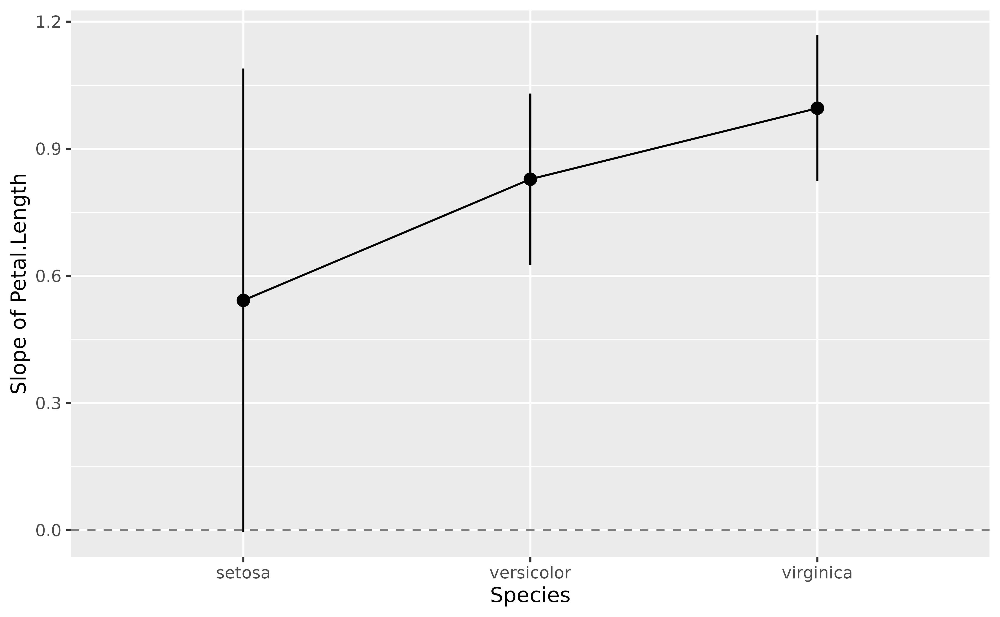

# Estimate marginal effects

This vignette will present how to estimate marginal effects and
derivatives using
[`estimate_slopes()`](https://easystats.github.io/modelbased/reference/estimate_slopes.md).

**Marginal means *vs.* Marginal effects**. Marginal slopes are to
numeric predictors what marginal means are to categorical predictors, in
the sense that they can eventually be “averaged over” other predictors
of the model. The key difference is that, while marginal means return
averages of the outcome variable, which allows you to say for instance
“the average reaction time in the C1 condition is 1366 ms”, marginal
effects return **averages of coefficients**. This allows you to say, for
instance, “the average *effect of x* in the C1 condition is 0.33”. When
you visualize marginal effects, the y-axis is the effect/slope/beta of a
given numeric predictor.

Let’s see some examples.

## Marginal effects over a factor’s levels

Let’s fit a linear model with a factor interacting with a continuous
predictor and visualize it.

``` r

library(ggplot2)
library(parameters)
library(performance)
library(modelbased)

model <- lm(Sepal.Length ~ Petal.Length * Species, data = iris)

estimate_relation(model) |>
  plot()
```


It seems like the slope of the effect is roughly similar (in the same
direction) across the different factor levels.

``` r

parameters(model)
```

    > Parameter                           | Coefficient |   SE |         95% CI
    > -------------------------------------------------------------------------
    > (Intercept)                         |        4.21 | 0.41 | [ 3.41,  5.02]
    > Petal Length                        |        0.54 | 0.28 | [ 0.00,  1.09]
    > Species [versicolor]                |       -1.81 | 0.60 | [-2.99, -0.62]
    > Species [virginica]                 |       -3.15 | 0.63 | [-4.41, -1.90]
    > Petal Length × Species [versicolor] |        0.29 | 0.30 | [-0.30,  0.87]
    > Petal Length × Species [virginica]  |        0.45 | 0.29 | [-0.12,  1.03]
    > 
    > Parameter                           | t(144) |      p
    > -----------------------------------------------------
    > (Intercept)                         |  10.34 | < .001
    > Petal Length                        |   1.96 | 0.052 
    > Species [versicolor]                |  -3.02 | 0.003 
    > Species [virginica]                 |  -4.97 | < .001
    > Petal Length × Species [versicolor] |   0.97 | 0.334 
    > Petal Length × Species [virginica]  |   1.56 | 0.120

Moreover, the interaction is not significant. However, we see below that
removing the interaction does not *substantially* improve the model’s
performance. So, for the sake of the demonstration, let’s say we want to
keep the maximal effect structure.

``` r

model2 <- lm(Sepal.Length ~ Petal.Length + Species, data = iris)

test_performance(model, model2)
```

    > Name   | Model |    BF | df | df_diff | Chi2 |     p
    > ----------------------------------------------------
    > model  |    lm |       |  7 |         |      |      
    > model2 |    lm | 26.52 |  5 |      -2 | 3.47 | 0.177
    > Models were detected as nested (in terms of fixed parameters) and are compared in sequential order.

Although we are satisfied with our model and its performance, imagine we
are not interested in the effect of `Petal.Length` for different
Species, but rather, in its **general trend** “across” all different
species. We need to compute the **marginal effect** of the predictor,
which corresponds to its slope *averaged* (it’s a bit more complex than
a simple averaging but that’s the idea) over the different factor
levels.

``` r

slopes <- estimate_slopes(model, trend = "Petal.Length")

slopes
```

    > Estimated Marginal Effects
    > 
    > Slope |   SE |       95% CI | t(144) |      p
    > ---------------------------------------------
    > 0.79  | 0.10 | [0.59, 0.99] |   7.69 | < .001
    > 
    > Marginal effects estimated for Petal.Length
    > Type of slope was dY/dX

We can see that the effect of `Petal.Length`, **marginalized over
Species**, is positive and significant.

## Effects for each factor’s levels

``` r

slopes <- estimate_slopes(model, trend = "Petal.Length", by = "Species")

slopes
```

    > Estimated Marginal Effects
    > 
    > Species    | Slope |   SE |        95% CI | t(144) |      p
    > -----------------------------------------------------------
    > setosa     |  0.54 | 0.28 | [ 0.00, 1.09] |   1.96 |  0.052
    > versicolor |  0.83 | 0.10 | [ 0.63, 1.03] |   8.10 | < .001
    > virginica  |  1.00 | 0.09 | [ 0.82, 1.17] |  11.43 | < .001
    > 
    > Marginal effects estimated for Petal.Length
    > Type of slope was dY/dX

``` r

plot(slopes)
```



## Interactions between two continuous variables

Interactions between two continuous variables are often not
straightforward to visualize and interpret. Thanks to the model-based
approach, one can represent the effect of one of the variables as a
function of the other variable.

Such plot, also referred to as **Johnson-Neyman intervals**, shows how
the effect (the “slope”) of one variable varies depending on another
variable. It is useful in the case of complex interactions between
continuous variables. See also [this
vignette](https://easystats.github.io/modelbased/articles/introduction_comparisons_3.html)
for further details.

For instance, the plot below shows that the effect of `hp` (the y-axis)
is significantly negative only when `wt` is low (`< ~4`).

``` r

model <- lm(mpg ~ hp * wt, data = mtcars)

slopes <- estimate_slopes(model, trend = "hp", by = "wt")

plot(slopes) +
  geom_hline(yintercept = 0, linetype = "dashed", color = "red") +
  theme_minimal()
```


## Describing and reporting non-linear relationships (e.g., in GAMs)

**Complex problems require modern solutions.**

General Additive Models (GAMs) are a powerful class of models that
extend the capabilities of traditional GLMs. In particular, they are
able to parsimoniously model possibly non-linear relationship.

Let’s take for instance the following model:

``` r

# Fit a non-linear General Additive Model (GAM)
model <- mgcv::gam(Sepal.Width ~ s(Petal.Length), data = iris)

estimate_relation(model, length = 50) |>
  plot()
```


The GAMs nicely models the complex relationship between the two
variables (if we don’t take into account the different species of
course).

But how to interpret and report in a manuscript such results? We can’t
simply paste the figure right? Right? Reviewers will want some
statistics, some numbers between brackets, otherwise it doesn’t look
serious does it.

``` r

parameters::parameters(model)
```

    > # Fixed Effects
    > 
    > Parameter   | Coefficient |   SE |       95% CI | t(142.33) |      p
    > --------------------------------------------------------------------
    > (Intercept) |        3.06 | 0.03 | [3.01, 3.11] |    118.31 | < .001
    > 
    > # Smooth Terms
    > 
    > Parameter                  |     F |   df |      p
    > --------------------------------------------------
    > Smooth term (Petal Length) | 17.52 | 6.67 | < .001

The problem with GAMs is that their parameters (i.e., the coefficients),
are not easily interpretable. Here we can see one line corresponding to
the smooth term. It’s significant, great, but what does it mean? And if
we run the GAM using other packages (e.g.,
[rstanarm](https://mc-stan.org/rstanarm/) or
[brms](https://github.com/paul-buerkner/brms)), the parameters will not
be the same. What to do!

Because the meaning of these parameters is somewhat disconnected with
our need for relationship understanding, another possibility is to
compute the **marginal linear effect** of the smooth term, i.e., the
“derivative”, using `estimate_slopes`.

``` r

# Compute derivative
deriv <- estimate_slopes(model,
  trend = "Petal.Length",
  by = "Petal.Length",
  length = 100
)

# Visualise
plot(deriv) +
  geom_hline(yintercept = 0, linetype = "dashed", color = "red") +
  theme_minimal()
```


This plot represents the “slope” of the curve at each point of the
curve. As you can see, there is a significant negative trend (after
Petal.Length = 2), followed by a significant positive trend (around
Petal.Length = 4). **Marginal derivatives** allow us to make inferences
at each point of the relationship!

Finally, to help reporting that in a manuscript, we can divide this into
chunks and obtain a summary for the trend of each chunk, including the
direction of the effects and whether it is statistically significant or
not.

``` r

summary(deriv)
```

    > Johnson-Neymann Intervals
    > 
    > Start |  End | Direction | Confidence     
    > ------------------------------------------
    > 1.00  | 1.72 | positive  | Not Significant
    > 1.77  | 1.95 | negative  | Not Significant
    > 2.01  | 3.15 | negative  | Significant    
    > 3.21  | 3.44 | negative  | Not Significant
    > 3.50  | 3.68 | positive  | Not Significant
    > 3.74  | 4.28 | positive  | Significant    
    > 4.34  | 6.24 | positive  | Not Significant
    > 6.30  | 6.90 | negative  | Not Significant
    > 
    > Marginal effects estimated for Petal.Length
    > Type of slope was dY/dX

## References

Johnson, P.O. & Fay, L.C. (1950). The Johnson-Neyman technique, its
theory and application. Psychometrika, 15, 349-367. doi:
10.1007/BF02288864
