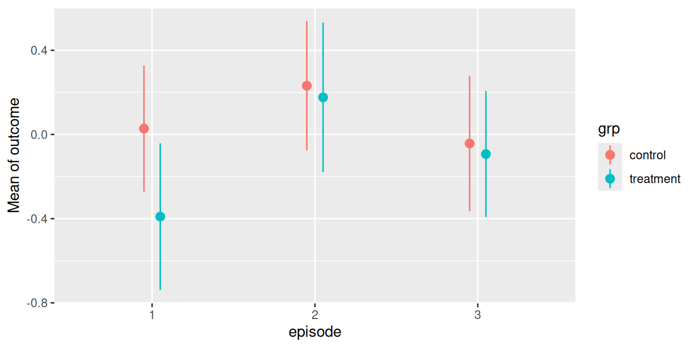
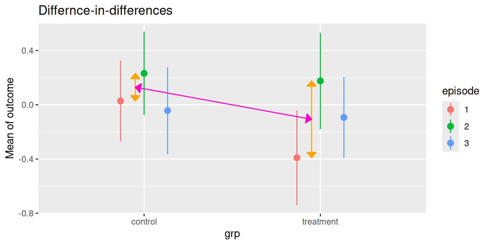

# Contrasts and pairwise comparisons

This vignette is the first in a 5-part series:

1.  **Contrasts and Pairwise Comparisons**

2.  [**User Defined Contrasts and Joint
    Tests**](https://easystats.github.io/modelbased/articles/introduction_comparisons_2.html)

3.  [**Comparisons of Slopes, Floodlight and Spotlight Analysis
    (Johnson-Neyman
    Intervals)**](https://easystats.github.io/modelbased/articles/introduction_comparisons_3.html)

4.  [**Contrasts and Comparisons for Generalized Linear
    Models**](https://easystats.github.io/modelbased/articles/introduction_comparisons_4.html)

5.  [**Contrasts and Comparisons for Zero-Inflation
    Models**](https://easystats.github.io/modelbased/articles/introduction_comparisons_5.html)

## Hypothesis testing for categorical predictors

A reason to compute adjusted predictions (or estimated marginal means)
is to help understanding the relationship between predictors and outcome
of a regression model. The next step, which often follows this, is to
see if there are statistically significant differences. These could be,
for example, differences between groups, i.e. between the levels of
categorical predictors or whether trends differ significantly from each
other.

The *modelbased* package provides a function,
[`estimate_contrasts()`](https://easystats.github.io/modelbased/reference/estimate_contrasts.md),
which does exactly this: testing differences of predictions or marginal
means for statistical significance. This is usually called *contrasts*
or *(pairwise) comparisons*, or *marginal effects* (if the difference
refers to a one-unit change of predictors). This vignette shows some
examples how to use the
[`estimate_contrasts()`](https://easystats.github.io/modelbased/reference/estimate_contrasts.md)
function and how to test whether differences in predictions are
statistically significant.

First, different examples for *pairwise comparisons* are shown, later we
will see how to test *differences-in-differences* (in the *emmeans*
package, also called *interaction contrasts*).

### Within `episode`, do levels differ?

We start with a toy example, where we have a linear model with two
categorical predictors. No interaction is involved for now.

We display a simple table of regression coefficients, created with
[`model_parameters()`](https://easystats.github.io/parameters/reference/model_parameters.html)
from the *parameters* package.

``` r

library(modelbased)
library(parameters)
library(ggplot2)

set.seed(123)
n <- 200
d <- data.frame(
  outcome = rnorm(n),
  grp = as.factor(sample(c("treatment", "control"), n, TRUE)),
  episode = as.factor(sample(1:3, n, TRUE)),
  sex = as.factor(sample(c("female", "male"), n, TRUE, prob = c(0.4, 0.6)))
)
model1 <- lm(outcome ~ grp + episode, data = d)
model_parameters(model1)
#> Parameter       | Coefficient |   SE |        95% CI | t(196) |     p
#> ---------------------------------------------------------------------
#> (Intercept)     |       -0.08 | 0.13 | [-0.33, 0.18] |  -0.60 | 0.552
#> grp [treatment] |       -0.17 | 0.13 | [-0.44, 0.09] |  -1.30 | 0.197
#> episode [2]     |        0.36 | 0.16 | [ 0.03, 0.68] |   2.18 | 0.031
#> episode [3]     |        0.10 | 0.16 | [-0.22, 0.42] |   0.62 | 0.538
```

#### Predictions

Let us look at the adjusted predictions.

``` r

my_predictions <- estimate_means(model1, "episode")
my_predictions
#> Estimated Marginal Means
#> 
#> episode |           Mean (CI)
#> -----------------------------
#> 1       | -0.16 (-0.39, 0.07)
#> 2       |  0.20 (-0.04, 0.43)
#> 3       | -0.06 (-0.28, 0.16)
#> 
#> Variable predicted: outcome
#> Predictors modulated: episode
#> Predictors averaged: grp

plot(my_predictions)
```


We now see that, for instance, the predicted *outcome* when
`espisode = 2` is 0.2.

#### Pairwise comparisons

We could now ask whether the predicted outcome for `episode = 1` is
significantly different from the predicted outcome at `episode = 2`.


To do this, we use the
[`estimate_contrasts()`](https://easystats.github.io/modelbased/reference/estimate_contrasts.md)
function. By default, a pairwise comparison is performed. You can
specify other comparisons as well, using the `comparison` argument. For
now, we go on with the simpler example of contrasts or pairwise
comparisons.

``` r

# argument `comparison` defaults to "pairwise"
estimate_contrasts(model1, "episode")
#> Marginal Contrasts Analysis
#> 
#> Level1 | Level2 |     Difference (CI) |     p
#> ---------------------------------------------
#> 2      | 1      |  0.36 ( 0.03, 0.68) | 0.031
#> 3      | 1      |  0.10 (-0.22, 0.42) | 0.538
#> 3      | 2      | -0.26 (-0.58, 0.06) | 0.112
#> 
#> Variable predicted: outcome
#> Predictors contrasted: episode
#> Predictors averaged: grp
#> p-values are uncorrected.
```

For our quantity of interest, the contrast between episode levels 2 and
1, we see the value 0.36, which is exactly the difference between the
predicted outcome for `episode = 1` (-0.16) and `episode = 2` (0.20).
The related p-value is 0.031, indicating that the difference between the
predicted values of our outcome at these two levels of the factor
*episode* is indeed statistically significant.

We can also define “representative values” via the `contrast` or `by`
arguments. For example, we could specify the levels of `episode`
directly, to simplify the output:

``` r

estimate_contrasts(model1, contrast = "episode=c(1,2)")
#> Marginal Contrasts Analysis
#> 
#> Level1 | Level2 |   Difference (CI) |     p
#> -------------------------------------------
#> 2      | 1      | 0.36 (0.03, 0.68) | 0.031
#> 
#> Variable predicted: outcome
#> Predictors contrasted: episode=c(1,2)
#> Predictors averaged: grp
#> p-values are uncorrected.
```

### Does same level of episode differ between groups?

The next example includes a pairwise comparison of an interaction
between two categorical predictors.

``` r

model2 <- lm(outcome ~ grp * episode, data = d)
model_parameters(model2)
#> Parameter                     | Coefficient |   SE |        95% CI | t(194) |     p
#> -----------------------------------------------------------------------------------
#> (Intercept)                   |        0.03 | 0.15 | [-0.27, 0.33] |   0.18 | 0.853
#> grp [treatment]               |       -0.42 | 0.23 | [-0.88, 0.04] |  -1.80 | 0.074
#> episode [2]                   |        0.20 | 0.22 | [-0.23, 0.63] |   0.94 | 0.350
#> episode [3]                   |       -0.07 | 0.22 | [-0.51, 0.37] |  -0.32 | 0.750
#> grp [treatment] × episode [2] |        0.36 | 0.33 | [-0.29, 1.02] |   1.09 | 0.277
#> grp [treatment] × episode [3] |        0.37 | 0.32 | [-0.27, 1.00] |   1.14 | 0.254
```

#### Predictions

First, we look at the predicted values of *outcome* for all combinations
of the involved interaction term.

``` r

my_predictions <- estimate_means(model2, by = c("episode", "grp"))
my_predictions
#> Estimated Marginal Means
#> 
#> episode | grp       |            Mean (CI)
#> ------------------------------------------
#> 1       | control   |  0.03 (-0.27,  0.33)
#> 2       | control   |  0.23 (-0.08,  0.54)
#> 3       | control   | -0.04 (-0.36,  0.28)
#> 1       | treatment | -0.39 (-0.74, -0.04)
#> 2       | treatment |  0.18 (-0.18,  0.53)
#> 3       | treatment | -0.09 (-0.39,  0.21)
#> 
#> Variable predicted: outcome
#> Predictors modulated: episode, grp

plot(my_predictions)
```



#### Pairwise comparisons

We could now ask whether the predicted outcome for `episode = 2` is
significantly different depending on the level of `grp`? In other words,
do the groups `treatment` and `control` differ when `episode = 2`?


Again, to answer this question, we calculate all pairwise comparisons,
i.e. the comparison (or test for differences) between all combinations
of our *focal predictors*. The focal predictors we’re interested here
are our two variables used for the interaction.

``` r

# we want "episode = 2-2" and "grp = control-treatment"
estimate_contrasts(model2, contrast = c("episode", "grp"))
#> Marginal Contrasts Analysis
#> 
#> Level1       | Level2       |     Difference (CI) |     p
#> ---------------------------------------------------------
#> 1, treatment | 1, control   | -0.42 (-0.88, 0.04) | 0.074
#> 2, control   | 1, control   |  0.20 (-0.23, 0.63) | 0.350
#> 2, treatment | 1, control   |  0.15 (-0.32, 0.61) | 0.529
#> 3, control   | 1, control   | -0.07 (-0.51, 0.37) | 0.750
#> 3, treatment | 1, control   | -0.12 (-0.54, 0.30) | 0.573
#> 2, control   | 1, treatment |  0.62 ( 0.16, 1.09) | 0.009
#> 2, treatment | 1, treatment |  0.57 ( 0.07, 1.06) | 0.026
#> 3, control   | 1, treatment |  0.35 (-0.13, 0.82) | 0.150
#> 3, treatment | 1, treatment |  0.30 (-0.16, 0.76) | 0.203
#> 2, treatment | 2, control   | -0.06 (-0.52, 0.41) | 0.816
#> 3, control   | 2, control   | -0.27 (-0.72, 0.17) | 0.225
#> 3, treatment | 2, control   | -0.32 (-0.75, 0.10) | 0.137
#> 3, control   | 2, treatment | -0.22 (-0.70, 0.26) | 0.368
#> 3, treatment | 2, treatment | -0.27 (-0.73, 0.19) | 0.254
#> 3, treatment | 3, control   | -0.05 (-0.49, 0.39) | 0.821
#> 
#> Variable predicted: outcome
#> Predictors contrasted: episode, grp
#> p-values are uncorrected.
```

For our quantity of interest, the contrast between groups `treatment`
and `control` when `episode = 2` is 0.06. We find this comparison in row
10 of the above output.

As we can see,
[`estimate_contrasts()`](https://easystats.github.io/modelbased/reference/estimate_contrasts.md)
returns pairwise comparisons of all possible combinations of factor
levels from our focal variables. If we’re only interested in a very
specific comparison, we have two options to simplify the output:

1.  We could directly formulate this comparison. Therefore, we need to
    know the parameters of interests (see below).

2.  We pass specific values or levels to the `contrast` argument.

##### Option 1: Directly specify the comparison

``` r

estimate_means(model2, by = c("episode", "grp"))
#> Estimated Marginal Means
#> 
#> episode | grp       |            Mean (CI)
#> ------------------------------------------
#> 1       | control   |  0.03 (-0.27,  0.33)
#> 2       | control   |  0.23 (-0.08,  0.54)
#> 3       | control   | -0.04 (-0.36,  0.28)
#> 1       | treatment | -0.39 (-0.74, -0.04)
#> 2       | treatment |  0.18 (-0.18,  0.53)
#> 3       | treatment | -0.09 (-0.39,  0.21)
#> 
#> Variable predicted: outcome
#> Predictors modulated: episode, grp
```

In the above output, each row is considered as one coefficient of
interest. Our groups we want to include in our comparison are rows two
(`grp = control` and `episode = 2`) and five (`grp = treatment` and
`episode = 2`), so our “quantities of interest” are `b2` and `b5`. Our
null hypothesis we want to test is whether both predictions are equal,
i.e. `comparison = "b5 = b2"` (we could also specify `"b2 = b5"`,
results would be the same, just signs are switched). We can now
calculate the desired comparison directly:

``` r

# compute specific contrast directly
estimate_contrasts(model2, contrast = c("episode", "grp"), comparison = "b2 = b5")
#> Marginal Contrasts Analysis
#> 
#> Parameter |    Difference (CI) |     p
#> --------------------------------------
#> b2=b5     | 0.06 (-0.41, 0.52) | 0.816
#> 
#> Variable predicted: outcome
#> Predictors contrasted: episode, grp
#> p-values are uncorrected.
#> Parameters:
#> b2 = episode [2], grp [control]
#> b5 = episode [2], grp [treatment]
```

##### Option 2: Specify values or levels

Again, using representative values for the `contrast` argument, we can
also simplify the output using an alternative syntax:

``` r

# return pairwise comparisons for specific values, in
# this case for episode = 2 in both groups
estimate_contrasts(model2, contrast = c("episode=2", "grp"))
#> Marginal Contrasts Analysis
#> 
#> Level1    | Level2  |     Difference (CI) |     p
#> -------------------------------------------------
#> treatment | control | -0.06 (-0.52, 0.41) | 0.816
#> 
#> Variable predicted: outcome
#> Predictors contrasted: episode=2, grp
#> p-values are uncorrected.
```

This is equivalent to the above example, where we directly specified the
comparison we’re interested in. However, the `comparison` argument might
provide more flexibility in case you want more complex comparisons. See
examples below.

### Do different episode levels differ between groups?

We can repeat the steps shown above to test any combination of group
levels for differences.

#### Pairwise comparisons

For instance, we could now ask whether the predicted outcome for
`episode = 1` in the `treatment` group is significantly different from
the predicted outcome for `episode = 3` in the `control` group.


The contrast we are interested in is between `episode = 1` in the
`treatment` group and `episode = 3` in the `control` group. These are
the predicted values in rows three and four (c.f. above table of
predicted values), thus we `comparison` whether `"b4 = b3"`.

``` r

estimate_contrasts(model2, contrast = c("episode", "grp"), comparison = "b4 = b3")
#> Marginal Contrasts Analysis
#> 
#> Parameter |     Difference (CI) |     p
#> ---------------------------------------
#> b4=b3     | -0.35 (-0.82, 0.13) | 0.150
#> 
#> Variable predicted: outcome
#> Predictors contrasted: episode, grp
#> p-values are uncorrected.
#> Parameters:
#> b4 = episode [1], grp [treatment]
#> b3 = episode [3], grp [control]
```

Another way to produce this pairwise comparison, we can reduce the table
of predicted values by providing [specific values or
levels](https://easystats.github.io/insight/reference/get_datagrid.html)
in the `by` or `contrast` argument:

``` r

estimate_means(model2, by = c("episode=c(1,3)", "grp"))
#> Estimated Marginal Means
#> 
#> episode | grp       |            Mean (CI)
#> ------------------------------------------
#> 1       | control   |  0.03 (-0.27,  0.33)
#> 3       | control   | -0.04 (-0.36,  0.28)
#> 1       | treatment | -0.39 (-0.74, -0.04)
#> 3       | treatment | -0.09 (-0.39,  0.21)
#> 
#> Variable predicted: outcome
#> Predictors modulated: episode=c(1,3), grp
```

`episode = 1` in the `treatment` group and `episode = 3` in the
`control` group refer now to rows two and three in the reduced output,
thus we also can obtain the desired comparison this way:

``` r

estimate_contrasts(
  model2,
  contrast = c("episode = c(1, 3)", "grp"),
  comparison = "b3 = b2"
)
#> Marginal Contrasts Analysis
#> 
#> Parameter |     Difference (CI) |     p
#> ---------------------------------------
#> b3=b2     | -0.35 (-0.82, 0.13) | 0.150
#> 
#> Variable predicted: outcome
#> Predictors contrasted: episode = c(1, 3), grp
#> p-values are uncorrected.
#> Parameters:
#> b3 = episode [1], grp [treatment]
#> b2 = episode [3], grp [control]
```

### Does difference between two levels of episode in the control group differ from difference of same two levels in the treatment group?

The `comparison` argument also allows us to compare
difference-in-differences (aka *interaction contrasts*). For example, is
the difference between two episode levels in one group significantly
different from the difference of the same two episode levels in the
other group?



As a reminder, we look at the table of predictions again:

``` r

estimate_means(model2, c("episode", "grp"))
#> Estimated Marginal Means
#> 
#> episode | grp       |            Mean (CI)
#> ------------------------------------------
#> 1       | control   |  0.03 (-0.27,  0.33)
#> 2       | control   |  0.23 (-0.08,  0.54)
#> 3       | control   | -0.04 (-0.36,  0.28)
#> 1       | treatment | -0.39 (-0.74, -0.04)
#> 2       | treatment |  0.18 (-0.18,  0.53)
#> 3       | treatment | -0.09 (-0.39,  0.21)
#> 
#> Variable predicted: outcome
#> Predictors modulated: episode, grp
```

The first difference of episode levels 1 and 2 in the control group
refer to rows one and two in the above table (`b1` and `b2`). The
difference for the same episode levels in the treatment group refer to
the difference between rows four and five (`b4` and `b5`). Thus, we have
`b1 - b2` and `b4 - b5`, and our null hypothesis is that these two
differences are equal: `comparison = "(b1 - b2) = (b4 - b5)"`.

``` r

estimate_contrasts(
  model2,
  c("episode", "grp"),
  comparison = "(b1 - b2) = (b4 - b5)"
)
#> Marginal Contrasts Analysis
#> 
#> Parameter   |    Difference (CI) |     p
#> ----------------------------------------
#> b1-b2=b4-b5 | 0.36 (-0.29, 1.02) | 0.277
#> 
#> Variable predicted: outcome
#> Predictors contrasted: episode, grp
#> p-values are uncorrected.
#> Parameters:
#> b1 = episode [1], grp [control]
#> b2 = episode [2], grp [control]
#> b4 = episode [1], grp [treatment]
#> b5 = episode [2], grp [treatment]
```

Let’s replicate this step-by-step:

1.  Predicted value of *outcome* for `episode = 1` in the control group
    is 0.03.
2.  Predicted value of *outcome* for `episode = 2` in the control group
    is 0.23.
3.  The first difference is 0.20.
4.  Predicted value of *outcome* for `episode = 1` in the treatment
    group is -0.39.
5.  Predicted value of *outcome* for `episode = 2` in the treatment
    group is 0.18.
6.  The second difference is -0.17.
7.  Our quantity of interest is the difference between these two
    differences, which is (considering rounding inaccuracy) 0.36. This
    difference is not statistically significant (p = 0.277).

## Conclusion

While the current implementation in
[`estimate_contrasts()`](https://easystats.github.io/modelbased/reference/estimate_contrasts.md)
already covers many common use cases for testing contrasts and pairwise
comparison, there still might be the need for more sophisticated
comparisons. In this case, we recommend using the
[*marginaleffects*](https://marginaleffects.com/) package directly. Some
further related recommended readings are the vignettes about
[Comparisons](https://marginaleffects.com/chapters/comparisons.html) or
[Hypothesis
Tests](https://marginaleffects.com/chapters/hypothesis.html).

[Go to next vignette: **User Defined Contrasts and Joint
Tests**](https://easystats.github.io/modelbased/articles/introduction_comparisons_2.html)
