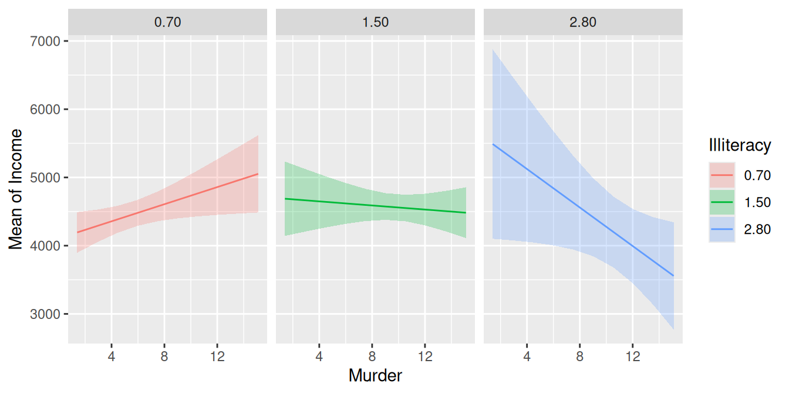

# Slopes, floodlight and spotlight analysis (Johnson-Neyman intervals)

This vignette is the third in a 5-part series:

1.  [**Contrasts and Pairwise
    Comparisons**](https://easystats.github.io/modelbased/articles/introduction_comparisons_1.html)

2.  [**User Defined Contrasts and Joint
    Tests**](https://easystats.github.io/modelbased/articles/introduction_comparisons_2.html)

3.  **Comparisons of Slopes, Floodlight and Spotlight Analysis
    (Johnson-Neyman Intervals)**

4.  [**Contrasts and Comparisons for Generalized Linear
    Models**](https://easystats.github.io/modelbased/articles/introduction_comparisons_4.html)

5.  [**Contrasts and Comparisons for Zero-Inflation
    Models**](https://easystats.github.io/modelbased/articles/introduction_comparisons_5.html)

## Contrasts and comparisons for slopes of numeric predictors

For numeric focal terms, it is possible to calculate contrasts for
slopes, or the *linear trend* of these focal terms. Let’s start with a
simple example again.

``` r

library(modelbased)
library(parameters)
data(iris)
m <- lm(Sepal.Width ~ Sepal.Length + Species, data = iris)
model_parameters(m)
#> Parameter            | Coefficient |   SE |         95% CI | t(146) |      p
#> ----------------------------------------------------------------------------
#> (Intercept)          |        1.68 | 0.24 | [ 1.21,  2.14] |   7.12 | < .001
#> Sepal Length         |        0.35 | 0.05 | [ 0.26,  0.44] |   7.56 | < .001
#> Species [versicolor] |       -0.98 | 0.07 | [-1.13, -0.84] | -13.64 | < .001
#> Species [virginica]  |       -1.01 | 0.09 | [-1.19, -0.82] | -10.80 | < .001
```

We can already see from the coefficient table that the slope for
`Sepal.Length` is 0.35. We will thus find the same increase for the
predicted values in our outcome when our focal variable, `Sepal.Length`
increases by one unit.

``` r

estimate_means(m, "Sepal.Length=c(4,5,6,7)")
#> Estimated Marginal Means
#> 
#> Sepal.Length | Mean |   SE |       95% CI | t(146)
#> --------------------------------------------------
#> 4            | 2.41 | 0.09 | [2.24, 2.59] |  27.24
#> 5            | 2.76 | 0.05 | [2.67, 2.85] |  60.55
#> 6            | 3.11 | 0.02 | [3.06, 3.16] | 126.07
#> 7            | 3.46 | 0.06 | [3.35, 3.58] |  59.16
#> 
#> Variable predicted: Sepal.Width
#> Predictors modulated: Sepal.Length=c(4,5,6,7)
#> Predictors averaged: Species
```

Consequently, in this case of a simple slope, we see the same result for
the estimated linear trend of `Sepal.Length`:

``` r

estimate_slopes(m, "Sepal.Length")
#> Estimated Marginal Effects
#> 
#> Slope |   SE |       95% CI | t(146) |      p
#> ---------------------------------------------
#> 0.35  | 0.05 | [0.26, 0.44] |   7.56 | < .001
#> 
#> Marginal effects estimated for Sepal.Length
#> Type of slope was dY/dX
```

### Is the linear trend of `Sepal.Length` significant for the different levels of `Species`?

Let’s move on to a more complex example with an interaction between a
numeric and categorical variable.

#### Predictions

``` r

m <- lm(Sepal.Width ~ Sepal.Length * Species, data = iris)
pred <- estimate_means(m, c("Sepal.Length", "Species"))
plot(pred)
```


#### Slopes by group

We can see that the slope of `Sepal.Length` is different within each
group of `Species`.


Since we don’t want to do pairwise comparisons, we still use
[`estimate_slopes()`](https://easystats.github.io/modelbased/reference/estimate_slopes.md)
to test whether the linear trend (by groups) is significant or not. In
this case, when interaction terms are included, the linear trend
(*slope*) for our numeric focal predictor, `Sepal.Length`, is tested for
each level of `Species`.

``` r

estimate_slopes(m, "Sepal.Length", by = "Species")
#> Estimated Marginal Effects
#> 
#> Species    | Slope |   SE |       95% CI | t(144) |      p
#> ----------------------------------------------------------
#> setosa     |  0.80 | 0.11 | [0.58, 1.02] |   7.23 | < .001
#> versicolor |  0.32 | 0.08 | [0.17, 0.47] |   4.24 | < .001
#> virginica  |  0.23 | 0.06 | [0.11, 0.35] |   3.79 | < .001
#> 
#> Marginal effects estimated for Sepal.Length
#> Type of slope was dY/dX
```

As we can see, each of the three slopes is significant, i.e. we have
“significant” linear trends.

#### Pairwise comparisons

Next question could be whether or not linear trends differ significantly
between each other, i.e. we test differences in slopes, which is a
pairwise comparison between slopes. To do this, we use
[`estimate_contrasts()`](https://easystats.github.io/modelbased/reference/estimate_contrasts.md).

``` r

estimate_contrasts(m, "Sepal.Length", by = "Species")
#> Marginal Contrasts Analysis
#> 
#> Level1     | Level2     | Difference |   SE |         95% CI | t(144) |      p
#> ------------------------------------------------------------------------------
#> versicolor | setosa     |      -0.48 | 0.13 | [-0.74, -0.21] |  -3.58 | < .001
#> virginica  | setosa     |      -0.57 | 0.13 | [-0.82, -0.32] |  -4.49 | < .001
#> virginica  | versicolor |      -0.09 | 0.10 | [-0.28,  0.10] |  -0.90 |  0.367
#> 
#> Variable predicted: Sepal.Width
#> Predictors contrasted: Sepal.Length
#> Predictors averaged: Sepal.Length (5.8)
#> p-values are uncorrected.
```

The linear trend of `Sepal.Length` within `setosa` is significantly
different from the linear trend of `versicolor` and also from
`virginica`. The difference of slopes between `virginica` and
`versicolor` is not statistically significant (p = 0.366).

### Is the difference linear trends of `Sepal.Length` in between two groups of `Species` significantly different from the difference of two linear trends between two other groups?

Similar to the example for categorical predictors, we can also test a
difference-in-differences for this example. For instance, is the
difference of the slopes from `Sepal.Length` between `setosa` and
`versicolor` different from the slope-difference for the groups `setosa`
and `vigninica`?

Let’s first look at the different slopes separately again, i.e. the
slopes of `Sepal.Length` by levels of `Species`:

``` r

estimate_slopes(m, "Sepal.Length", by = "Species")
#> Estimated Marginal Effects
#> 
#> Species    | Slope |   SE |       95% CI | t(144) |      p
#> ----------------------------------------------------------
#> setosa     |  0.80 | 0.11 | [0.58, 1.02] |   7.23 | < .001
#> versicolor |  0.32 | 0.08 | [0.17, 0.47] |   4.24 | < .001
#> virginica  |  0.23 | 0.06 | [0.11, 0.35] |   3.79 | < .001
#> 
#> Marginal effects estimated for Sepal.Length
#> Type of slope was dY/dX
```

The first difference of slopes we’re interested in is the one between
`setosa` (0.80) and `versicolor` (0.32), i.e. `b1 - b2` (=0.48). The
second difference is between levels `setosa` (0.80) and `virginica`
(0.23), which is `b1 - b3` (=0.57). We test the null hypothesis that
`(b1 - b2) = (b1 - b3)`.

``` r

estimate_contrasts(
  m,
  "Sepal.Length",
  by = "Species",
  comparison = "(b1 - b2) = (b1 - b3)"
)
#> Marginal Contrasts Analysis
#> 
#> Parameter   | Difference |   SE |        95% CI | t(144) |     p
#> ----------------------------------------------------------------
#> b1-b2=b1-b3 |      -0.09 | 0.10 | [-0.28, 0.10] |  -0.90 | 0.367
#> 
#> Variable predicted: Sepal.Width
#> Predictors contrasted: Sepal.Length
#> Predictors averaged: Sepal.Length (5.8)
#> p-values are uncorrected.
#> Parameters:
#> b1 = Species [setosa]
#> b2 = Species [versicolor]
#> b1 = Species [setosa]
#> b3 = Species [virginica]
```

The difference between the two differences is -0.09 and not
statistically significant (p = 0.366).

### Is the linear trend of `Sepal.Length` significant at different values of another numeric predictor?

When we have two numeric terms in an interaction, the comparison becomes
more difficult, because we have to find *meaningful* (or
*representative*) values for the moderator, at which the associations
between the predictor and outcome are tested. We no longer have distinct
categories for the moderator variable.

#### Spotlight analysis, floodlight analysis and Johnson-Neyman intervals

The following examples show interactions between two numeric predictors.
In case of numeric interaction terms, it makes sense to calculate
adjusted predictions for *representative values*, e.g. mean +/- SD. This
is sometimes also called “spotlight analysis” (*Spiller et al. 2013*).

In the next example, we have `Petal.Width` as second interaction term,
thus we see the predicted values of `Sepal.Width` (our outcome) for
`Petal.Length` at three different, representative values of
`Petal.Width`: Mean (1.2), 1 SD above the mean (1.96) and 1 SD below the
mean (0.44).

#### Predictions

``` r

m <- lm(Sepal.Width ~ Petal.Length * Petal.Width, data = iris)
pred <- estimate_means(m, c("Petal.Length", "Petal.Width=[sd]"))
plot(pred)
```


First, we want to see at which value of `Petal.Width` the slopes of
`Petal.Length` are significant. We do no pairwise comparison for now,
hence we use
[`estimate_slopes()`](https://easystats.github.io/modelbased/reference/estimate_slopes.md).

``` r

estimate_slopes(m, "Petal.Length", by = "Petal.Width=[sd]")
#> Estimated Marginal Effects
#> 
#> Petal.Width | Slope |   SE |         95% CI | t(146) |      p
#> -------------------------------------------------------------
#> 0.44        | -0.28 | 0.06 | [-0.39, -0.16] |  -4.80 | < .001
#> 1.20        | -0.11 | 0.06 | [-0.23,  0.01] |  -1.80 |  0.074
#> 1.96        |  0.06 | 0.07 | [-0.09,  0.20] |   0.78 |  0.434
#> 
#> Marginal effects estimated for Petal.Length
#> Type of slope was dY/dX
```

#### Pairwise comparisons

The results of the pairwise comparison are shown below. These tell us
that all linear trends (slopes) are significantly different from each
other, i.e. the slope of the green line is significantly different from
the slope of the red line, and so on.

``` r

estimate_contrasts(m, "Petal.Length", by = "Petal.Width=[sd]", digits = 1)
#> Marginal Contrasts Analysis
#> 
#> Level1 | Level2 | Difference |   SE |       95% CI | t(146) |      p
#> --------------------------------------------------------------------
#> 1.2    | 0.4    |       0.18 | 0.02 | [0.13, 0.22] |   7.13 | < .001
#> 2      | 0.4    |       0.35 | 0.05 | [0.25, 0.45] |   7.13 | < .001
#> 2      | 1.2    |       0.18 | 0.02 | [0.13, 0.22] |   7.13 | < .001
#> 
#> Variable predicted: Sepal.Width
#> Predictors contrasted: Petal.Length
#> Predictors averaged: Petal.Length (3.8)
#> p-values are uncorrected.
```

#### Floodlight analysis and Johnson-Neyman intervals

Another way to handle models with two numeric variables in an
interaction is to use so-called floodlight analysis, a spotlight
analysis for all values of the moderator variable. These intervals
indicate the values of the moderator at which the slope of the predictor
is significant (cf. *Johnson et al. 1950, McCabe et al. 2018*).

Let’s look at an example. We first plot the predicted values of `Income`
for `Murder` at different values of `Illiteracy`.

``` r

states <- as.data.frame(state.x77)
states$HSGrad <- states$`HS Grad`
m_mod <- lm(Income ~ HSGrad + Murder * Illiteracy, data = states)

pr <- estimate_means(m_mod, c("Murder", "Illiteracy"))
plot(pr)
```


It’s difficult to say at which values from `Illiteracy`, the association
between `Murder` and `Income` might be statistically significant. We
still can use
[`estimate_slopes()`](https://easystats.github.io/modelbased/reference/estimate_slopes.md):

``` r

estimate_slopes(m_mod, "Murder", by = "Illiteracy")
#> Estimated Marginal Effects
#> 
#> Illiteracy |   Slope |    SE |            95% CI | t(45) |     p
#> ----------------------------------------------------------------
#> 0.50       |   82.08 | 31.48 | [  18.68, 145.48] |  2.61 | 0.012
#> 0.76       |   57.24 | 26.93 | [   3.01, 111.47] |  2.13 | 0.039
#> 1.01       |   32.49 | 25.04 | [ -17.94,  82.93] |  1.30 | 0.201
#> 1.27       |    7.65 | 26.41 | [ -45.55,  60.85] |  0.29 | 0.773
#> 1.52       |  -17.09 | 30.58 | [ -78.68,  44.50] | -0.56 | 0.579
#> 1.78       |  -41.93 | 36.64 | [-115.72,  31.85] | -1.14 | 0.258
#> 2.03       |  -66.68 | 43.77 | [-154.84,  21.48] | -1.52 | 0.135
#> 2.29       |  -91.52 | 51.57 | [-195.38,  12.34] | -1.77 | 0.083
#> 2.54       | -116.27 | 59.70 | [-236.50,   3.97] | -1.95 | 0.058
#> 2.80       | -141.11 | 68.16 | [-278.39,  -3.83] | -2.07 | 0.044
#> 
#> Marginal effects estimated for Murder
#> Type of slope was dY/dX
```

As can be seen, the results might indicate that at the lower and upper
tails of `Illiteracy`, i.e. when `Illiteracy` is roughly smaller than
`0.8` or larger than `2.6`, the association between `Murder` and
`Income` is statistically significant.

However, this test can be simplified using the
[`summary()`](https://rdrr.io/r/base/summary.html) function. This will
show us in detail at which values for `Illiteracy` the interaction term
is statistically significant, and whether the association between
`Murder` and the outcome is positive or negative.

``` r

# we will force to calculate slopes at 200 values for "Illiteracy" using `length`
slopes <- estimate_slopes(m_mod, "Murder", by = "Illiteracy", length = 200)
summary(slopes)
#> Johnson-Neymann Intervals
#> 
#> Start |  End | Direction | Confidence     
#> ------------------------------------------
#> 0.50  | 0.79 | positive  | Significant    
#> 0.80  | 1.34 | positive  | Not Significant
#> 1.35  | 2.67 | negative  | Not Significant
#> 2.68  | 2.80 | negative  | Significant    
#> 
#> Marginal effects estimated for Murder
#> Type of slope was dY/dX
```

Furthermore, it is possible to create a spotlight-plot.

``` r

plot(slopes)
```


The results of the spotlight analysis suggest that values below `0.82`
and above `2.57` are significantly different from zero, while values in
between are not. We can plot predictions at these values to see the
differences. The red and the green line represent values of `Illiteracy`
at which we find clear positive resp. negative associations between
`Murder` and `Income`, while we find no clear (positive or negative)
association for the red line.

Here an example, using values from the three “ranges” of the
Johnson-Neyman-Interval: the red and blue lines are significantly
positive and negative associated with the outcome, while the green line
is not significant.

``` r

pr <- estimate_means(m_mod, c("Murder", "Illiteracy=c(0.7,1.5,2.8)"))
plot(pr) + ggplot2::facet_wrap(~Illiteracy)
```



#### P-value adjustement

For Johnson-Neyman intervals, which arise from interactions between two
numeric predictors, we are essentially conducting multiple comparisons
across the values of the moderator. To account for this, p-values can be
adjusted to avoid an inflation of type-I errors. For
[`estimate_slopes()`](https://easystats.github.io/modelbased/reference/estimate_slopes.md),
you can use the `p_adjust` argument for this purpose. While common
methods like `"holm"` or `"bonferroni"` are available, for the specific
case of Johnson-Neyman intervals, the `"esarey"` or `"sup-t"`
adjustments are particularly recommended. The `"sup-t"` method, for
instance, computes simultaneous confidence bands (Montiel Olea &
Plagborg-Møller, 2019), providing a more rigorous test for the interval.

``` r

slopes <- estimate_slopes(
  m_mod,
  "Murder",
  by = "Illiteracy",
  p_adjust = "esarey"
)
summary(slopes)
#> Johnson-Neymann Intervals
#> 
#> Start |  End | Direction | Confidence     
#> ------------------------------------------
#> 0.50  | 0.50 | positive  | Significant    
#> 0.76  | 1.27 | positive  | Not Significant
#> 1.52  | 2.54 | negative  | Not Significant
#> 2.80  | 2.80 | negative  | Significant    
#> 
#> Marginal effects estimated for Murder
#> Type of slope was dY/dX
```

The results for the p-value adjusted spotlight analysis now suggest that
values below `0.50` and above `2.80` are significantly different from
zero.

[Go to next vignette: **Contrasts and Comparisons for Generalized Linear
Models**](https://easystats.github.io/modelbased/articles/introduction_comparisons_4.html)

## References

Johnson, P.O. & Fay, L.C. (1950). The Johnson-Neyman technique, its
theory and application. Psychometrika, 15, 349-367. doi:
10.1007/BF02288864

McCabe CJ, Kim DS, King KM. (2018). Improving Present Practices in the
Visual Display of Interactions. Advances in Methods and Practices in
Psychological Science, 1(2):147-165. <doi:10.1177/2515245917746792>

Montiel Olea, J. L., and Plagborg-Møller, M. (2019). Simultaneous
confidence bands: Theory, implementation, and an application to SVARs.
Journal of Applied Econometrics, 34(1), 1–17. <doi:10.1002/jae.2656>

Spiller, S. A., Fitzsimons, G. J., Lynch, J. G., & McClelland, G. H.
(2013). Spotlights, Floodlights, and the Magic Number Zero: Simple
Effects Tests in Moderated Regression. Journal of Marketing Research,
50(2), 277–288. <doi:10.1509/jmr.12.0420>
