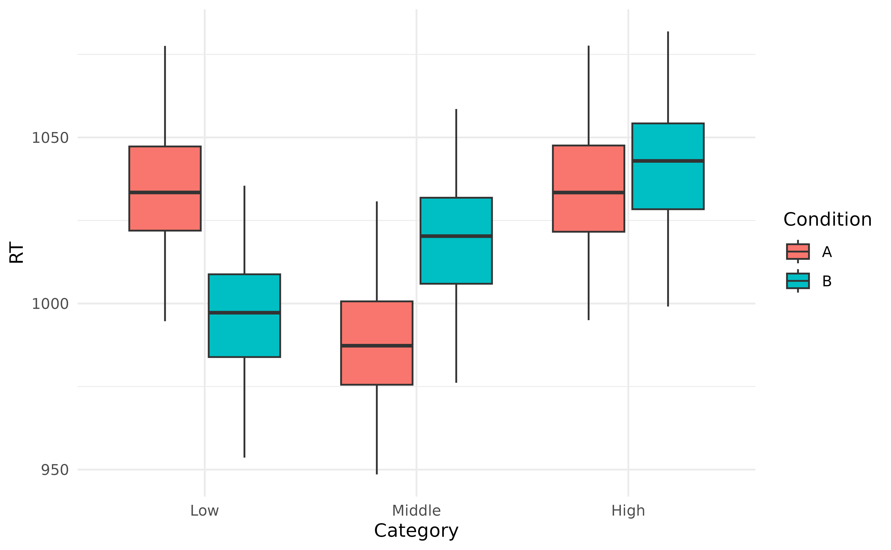

# The Modelisation Approach

For a long time, applied statistics, especially in psychology, revolved
around the idea of assessing differences between groups, using
***t*-tests** or **ANOVAs**, or by investigating the existence of a
significant linear relationship between two continuous variables using
**correlations**.

Every psychology student heard that *“ANOVAs, t-tests and correlations
are all linear models”* (aka, linear regressions). And thus, one can
only wonder why these different tests have not been yet replaced by a
unified model.


The tests mentioned above have major advantages. For instance, they are
very easy to compute (one can even figure them out by hand). This
partially explains their historical popularity, as these tests became
the norm at an age when computers and fancy programs weren’t available.
Moreover, they are easy to visualize (or so it is *believed*, as it’s
not always true - but we’ll come to that later) and, most importantly,
they have straightforward (or at least, *conventionally accepted*)
interpretations. After all, most of the time, statistics are used with
the aim to draw some conclusions from the data.

But here are some problems with this approach:

1.  We don’t know whether the model lying underlying the test (the
    *t*-test, the ANOVAs or the correlation) is any good to “represent”
    the data, preventing in turn to adjust the confidence in the
    results. For instance, we know that reaction times (RTs) have a
    non-normal distribution, and yet we often see the use of unsuited
    methods, like outliers-removal, scale-transformations, and
    computation of empirical scores like “mean” or “SD” that do not
    represent the data well.

2.  The visualisation are usually based on the data, rather than on the
    model (which is problematic in the case of complex models).

3.  New indices, such as *group means*, *contrasts*, etc., are also
    derived from the data, instead of using the model.

Thus, we will describe below another approach to statistics, centered
around statistical modelisation.

## The Empirical Approach (Classic)

``` r

library(easystats)
library(emmeans)
library(ggplot2)
```

### Data Simulation

First we will run the function below to simulate some data. There’s no
need to understand the hows and whys, as we will explain everything in
due time.

Click here to see the code to generate the data.

``` r

generate_data <- function(effect = 5, noise = 0.5) {
  data <- data.frame()
  n <- 100
  for (i in 1:length(effect)) {
    participant <- data.frame(Experimental_Variable = c(seq(-3, 3, length = n / 2), seq(-3, 3, length = n / 2)))
    participant$RT <- c(participant$Experimental_Variable[1:(n / 2)]**2 - effect[i], (participant$Experimental_Variable[(n / 2 + 1):n] + effect[i])) + rnorm(n, 0, abs(noise[i]))
    participant$Condition <- rep(c("A", "B"), each = n / 2)
    participant$Participant <- paste0("S", i)
    data <- rbind(data, participant)
  }
  data$RT <- (100 + data$RT) * 10
  data
}

data <- generate_data(effect = rnorm(30, 2, 2), noise = rnorm(30, 0, 0.4))
#
# library(rtdists)
#
# data <- data.frame(
#   Participant = paste0("S", speed_acc$id),
#   Item = as.numeric(speed_acc$stim),
#   Condition = speed_acc$condition,
#   Correct = ifelse(as.character(speed_acc$stim_cat) == as.character(speed_acc$response), 1, 0),
#   RT = speed_acc$rt * 1000
# )
```

### Preprocessing

### ANOVAs

In ANOVAs, it’s all about groups. Even though people also add in
continuous variables (creating these ANCOVAs, MANOVAs and other
monstrosities), it’s not really “in their spirit”: ANOVAs were made to
compare groups.

So we will take, for each participant, its 20…

``` r

data_anova <- data
data_anova$Category <- recode_into(
  Experimental_Variable < -1.5 ~ "Low",
  Experimental_Variable > 1.5 ~ "High",
  default = "Middle",
  data = data_anova
)
data_anova$Category <- factor(data_anova$Category, levels = c("Low", "Middle", "High"))

data_anova <<- data_anova |>
  data_group(c("Participant", "Condition", "Category")) |>
  data_summary(RT = mean(RT))

results <- aov(RT ~ Condition * Category + Error(Participant), data = data_anova)
parameters(results)
```

    > # Participant
    > 
    > Parameter | Sum_Squares | df | Mean_Square
    > ------------------------------------------
    > Residuals |       33.32 | 29 |        1.15
    > 
    > # Within
    > 
    > Parameter          | Sum_Squares |  df | Mean_Square |     F |      p
    > ---------------------------------------------------------------------
    > Condition          |       73.09 |   1 |       73.09 |  0.14 | 0.705 
    > Category           |    37375.24 |   2 |    18687.62 | 36.84 | < .001
    > Condition:Category |    36990.41 |   2 |    18495.20 | 36.46 | < .001
    > Residuals          |    73550.75 | 145 |      507.25 |       |       
    > 
    > Anova Table (Type 1 tests)

What can we conclude from that? Absolutely **nothing**! We need to
investigate in more details, for instance by running post-hoc comparison
tests. This uninformativeness is one reason why ANOVA should be banned
from psychological science.

### Post-hoc comparison tests

``` r

posthoc <- get_emmeans(results, by = c("Condition", "Category")) |>
  pairs()
parameters(posthoc)
```

    > contrast            | Coefficient |   SE |           95% CI | t(145) |      p
    > -----------------------------------------------------------------------------
    > A Low - B Low       |       36.83 | 5.82 | [ 25.33,  48.32] |   6.33 | < .001
    > A Low - A Middle    |       46.52 | 5.82 | [ 35.02,  58.01] |   8.00 | < .001
    > A Low - B Middle    |       14.18 | 5.82 | [  2.69,  25.67] |   2.44 | 0.491 
    > A Low - A High      |       -0.23 | 5.82 | [-11.73,  11.26] |  -0.04 | > .999
    > A Low - B High      |       -8.54 | 5.82 | [-20.04,   2.95] |  -1.47 | 0.979 
    > B Low - A Middle    |        9.69 | 5.82 | [ -1.80,  21.18] |   1.67 | 0.940 
    > B Low - B Middle    |      -22.65 | 5.82 | [-34.14, -11.15] |  -3.89 | 0.012 
    > B Low - A High      |      -37.06 | 5.82 | [-48.55, -25.56] |  -6.37 | < .001
    > B Low - B High      |      -45.37 | 5.82 | [-56.86, -33.87] |  -7.80 | < .001
    > A Middle - B Middle |      -32.34 | 5.82 | [-43.83, -20.84] |  -5.56 | < .001
    > A Middle - A High   |      -46.75 | 5.82 | [-58.24, -35.25] |  -8.04 | < .001
    > A Middle - B High   |      -55.06 | 5.82 | [-66.55, -43.57] |  -9.47 | < .001
    > B Middle - A High   |      -14.41 | 5.82 | [-25.90,  -2.92] |  -2.48 | 0.463 
    > B Middle - B High   |      -22.72 | 5.82 | [-34.21, -11.23] |  -3.91 | 0.012 
    > A High - B High     |       -8.31 | 5.82 | [-19.80,   3.18] |  -1.43 | 0.983 
    > 
    > p-value adjustment method: Tukey

``` r

data_anova |>
  ggplot(aes(x = Category, y = RT, fill = Condition)) +
  geom_boxplot() +
  theme_minimal()
```



## The Modelisation Approach

A model is made of parameters, which have ‘real’ meaning, as opposed to
indices of significance (which are abstract).

### Summary

### 1. Draw what you want to visualize

We can use
[`geom_smooth()`](https://ggplot2.tidyverse.org/reference/geom_smooth.html),
which can fit non-linear relationships in an empirical way, to give us
an idea of the shape of the relationships.

``` r

data |>
  data_group(c("Participant", "Condition")) |>
  ggplot(aes(x = Experimental_Variable, y = RT, color = Condition)) +
  geom_jitter(alpha = 0.4) +
  geom_smooth(method = "loess", se = FALSE) +
  theme_minimal()
```


### 2. Make models for it

### 3. Select the best Model

### 4. Visualize the best model

### 5. Investigate its Parameters

## References
