# Plotting estimated marginal means

This vignette provides a quick overview with different examples that
show how to plot estimated marginal means.

In summary, you can use the `length` and `range` arguments in
[`estimate_means()`](https://easystats.github.io/modelbased/reference/estimate_means.md)
(which are passed to
[`insight::get_datagrid()`](https://easystats.github.io/insight/reference/get_datagrid.html)),
as well as directly specifying meaningful values in the `by` argument,
which are also used to create a data grid, to control the
plot-appearance. See also the [vignette on data
grids](https://easystats.github.io/modelbased/articles/visualisation_matrix.html).

Although the **modelbased** package does not focus on publication-ready
plots, the default plots can already be used directly. Furthermore, a
few modifications are already applies, like a percentage-scale for
logistic regression models, or using variable labels for *labelled
data*.

## One predictor - categorical

The simplest case is possibly plotting one categorical predictor.
Predicted values for each level and its confidence intervals are shown.

\
[`library`](https://rdrr.io/r/base/library.html)`(`[`modelbased`](https://easystats.github.io/modelbased/)`)`\
[`data`](https://rdrr.io/r/utils/data.html)`(``efc``, package ``=`` ``"modelbased"``)`\
`efc`` ``<-`` ``datawizard``::`[`to_factor`](https://easystats.github.io/datawizard/reference/to_factor.html)`(``efc``, `[`c`](https://rdrr.io/r/base/c.html)`(``"e16sex"``, ``"c172code"``, ``"e42dep"``)``)`\
\
`m`` ``<-`` `[`lm`](https://rdrr.io/r/stats/lm.html)`(``neg_c_7`` ``~`` ``e16sex`` ``+`` ``c172code`` ``+`` ``barthtot``, data ``=`` ``efc``)`\
[`estimate_means`](https://easystats.github.io/modelbased/reference/estimate_means.md)`(``m``, ``"c172code"``)`` ``|>`` `[`plot`](https://rdrr.io/r/graphics/plot.default.html)`(``)`

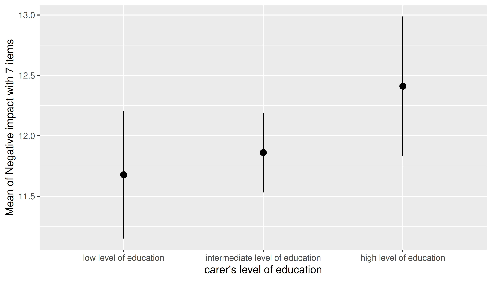

## One predictor - numeric

For numeric predictors, the range of predictions at different values of
the focal predictor are plotted, the uncertainty is displayed as
confidence band.

\
[`estimate_means`](https://easystats.github.io/modelbased/reference/estimate_means.md)`(``m``, ``"barthtot"``)`` ``|>`` `[`plot`](https://rdrr.io/r/graphics/plot.default.html)`(``)`

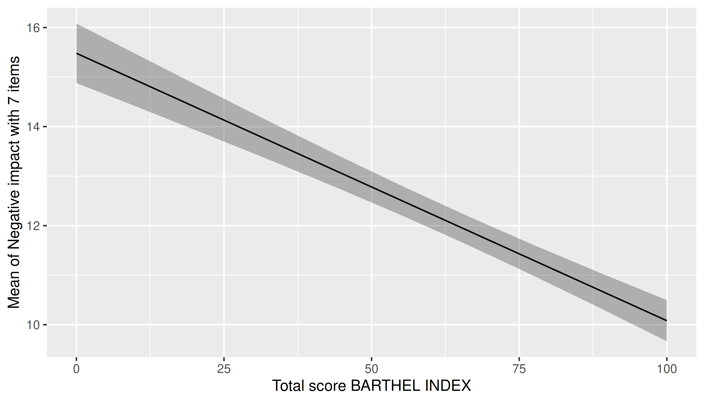

## Two predictors - categorical

For two categorical predictors, the first focal predictors is plotted
along the x-axis, while the levels of the second predictor are mapped to
different colors.

\
`m`` ``<-`` `[`lm`](https://rdrr.io/r/stats/lm.html)`(``neg_c_7`` ``~`` ``e16sex`` ``*`` ``c172code`` ``+`` ``e42dep``, data ``=`` ``efc``)`\
[`estimate_means`](https://easystats.github.io/modelbased/reference/estimate_means.md)`(``m``, `[`c`](https://rdrr.io/r/base/c.html)`(``"e16sex"``, ``"c172code"``)``)`` ``|>`` `[`plot`](https://rdrr.io/r/graphics/plot.default.html)`(``)`

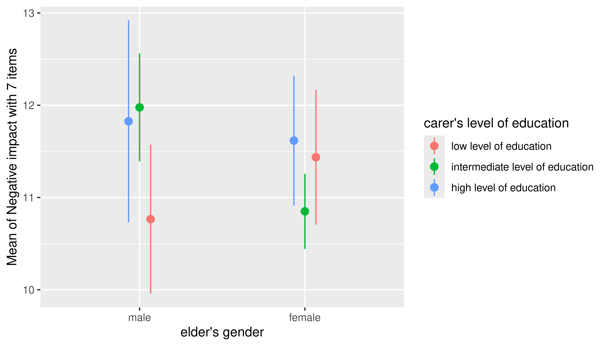

## Two predictors - numeric \* categorical

For two predictors, where the first is numeric and the second
categorical, range of predictions including confidence bands are shown,
with the different levels of the second (categorical) predictor mapped
to colors again.

\
`m`` ``<-`` `[`lm`](https://rdrr.io/r/stats/lm.html)`(``neg_c_7`` ``~`` ``barthtot`` ``*`` ``c172code`` ``+`` ``e42dep``, data ``=`` ``efc``)`\
[`estimate_means`](https://easystats.github.io/modelbased/reference/estimate_means.md)`(``m``, `[`c`](https://rdrr.io/r/base/c.html)`(``"barthtot"``, ``"c172code"``)``)`` ``|>`` `[`plot`](https://rdrr.io/r/graphics/plot.default.html)`(``)`

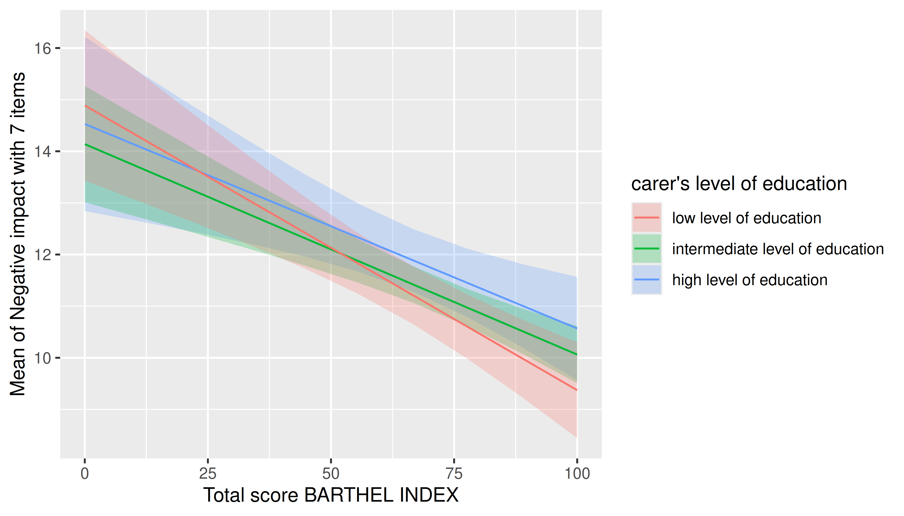

In general, plots can be further modified using functions from the
**ggplot2** package. Thereby, other themes, color scales, faceting and
so on, can be applies.

\
[`library`](https://rdrr.io/r/base/library.html)`(`[`ggplot2`](https://ggplot2.tidyverse.org)`)`\
[`estimate_means`](https://easystats.github.io/modelbased/reference/estimate_means.md)`(``m``, `[`c`](https://rdrr.io/r/base/c.html)`(``"barthtot"``, ``"c172code"``)``)`` ``|>`\
`  `[`plot`](https://rdrr.io/r/graphics/plot.default.html)`(``)`` ``+`\
`  ``see``::`[`theme_modern`](https://easystats.github.io/see/reference/theme_modern.html)`(``show.ticks ``=`` ``TRUE``)`

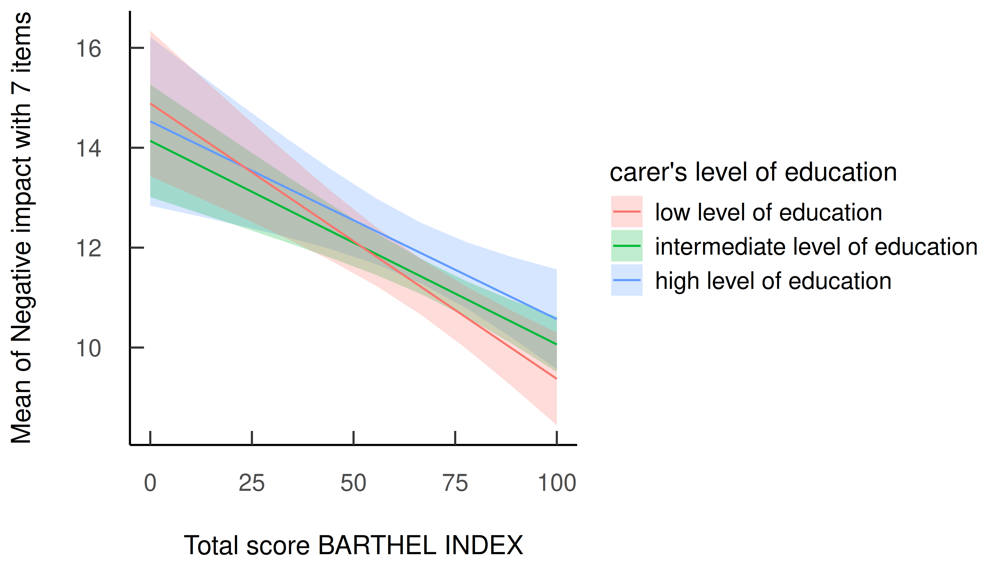

\
\
[`estimate_means`](https://easystats.github.io/modelbased/reference/estimate_means.md)`(``m``, `[`c`](https://rdrr.io/r/base/c.html)`(``"barthtot"``, ``"c172code"``)``)`` ``|>`\
`  `[`plot`](https://rdrr.io/r/graphics/plot.default.html)`(``)`` ``+`\
`  `[`facet_grid`](https://ggplot2.tidyverse.org/reference/facet_grid.html)`(``~``c172code``)`

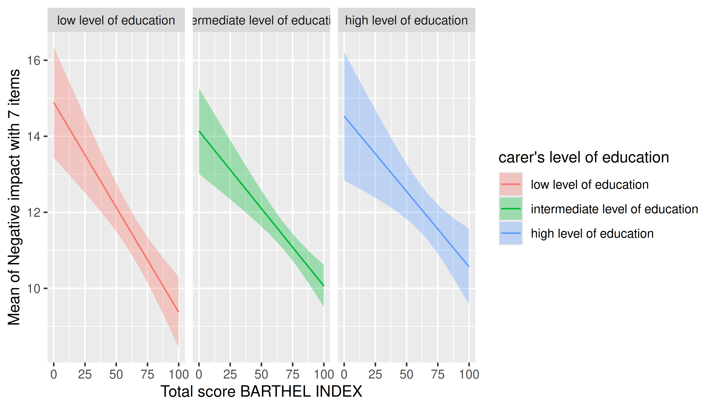

\
\
[`estimate_means`](https://easystats.github.io/modelbased/reference/estimate_means.md)`(``m``, `[`c`](https://rdrr.io/r/base/c.html)`(``"barthtot"``, ``"c172code"``)``)`` ``|>`\
`  `[`plot`](https://rdrr.io/r/graphics/plot.default.html)`(``)`` ``+`\
`  `[`scale_color_brewer`](https://ggplot2.tidyverse.org/reference/scale_brewer.html)`(``palette ``=`` ``"Dark2"``)`` ``+`\
`  `[`scale_fill_brewer`](https://ggplot2.tidyverse.org/reference/scale_brewer.html)`(``palette ``=`` ``"Dark2"``)`

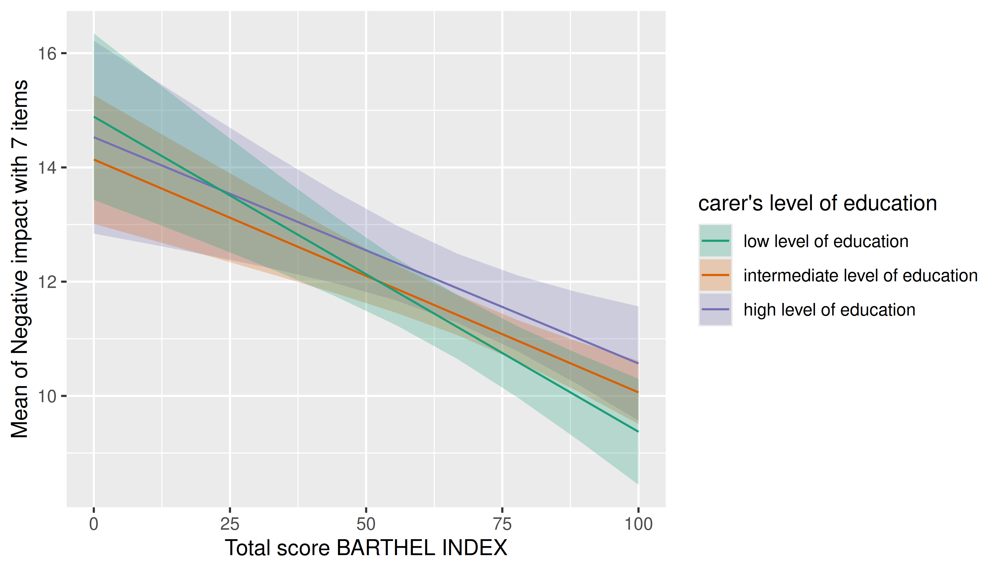

## Two predictors - categorical \* numeric

If the numeric predictor is the *second* focal term, its values are
still mapped to colors, however, by default to a continuous (gradient)
scale, because a range of representative values for that numeric
predictor is used by default.

Focal predictors specified in
[`estimate_means()`](https://easystats.github.io/modelbased/reference/estimate_means.md)
are passed to
[`insight::get_datagrid()`](https://easystats.github.io/insight/reference/get_datagrid.html).
If not specified otherwise, representative values for numeric predictors
are evenly distributed from the minimum to the maximum, with a total
number of `length` values covering that range.

I.e., by default, arguments `range = "range"` and `length = 10` in
[`insight::get_datagrid()`](https://easystats.github.io/insight/reference/get_datagrid.html),
and thus for numeric predictors, a *range* of *length* values is used to
estimate predictions.

\
`` # by default, `range = "range"` and `length = 10` ``\
[`estimate_means`](https://easystats.github.io/modelbased/reference/estimate_means.md)`(``m``, `[`c`](https://rdrr.io/r/base/c.html)`(``"c172code"``, ``"barthtot"``)``)`` ``|>`` `[`plot`](https://rdrr.io/r/graphics/plot.default.html)`(``)`

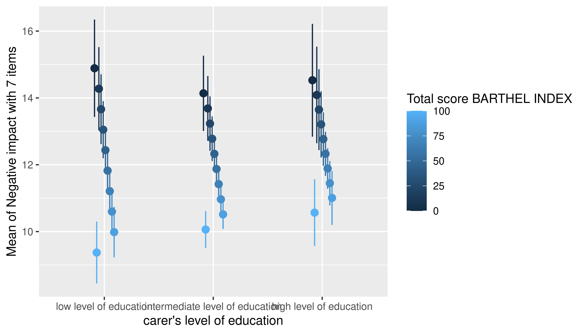

That means that the `length` argument can be used to control how many
values (lines) for the numeric predictors are chosen.

\
[`estimate_means`](https://easystats.github.io/modelbased/reference/estimate_means.md)`(``m``, `[`c`](https://rdrr.io/r/base/c.html)`(``"c172code"``, ``"barthtot"``)``, length ``=`` ``20``)`` ``|>`` `[`plot`](https://rdrr.io/r/graphics/plot.default.html)`(``)`

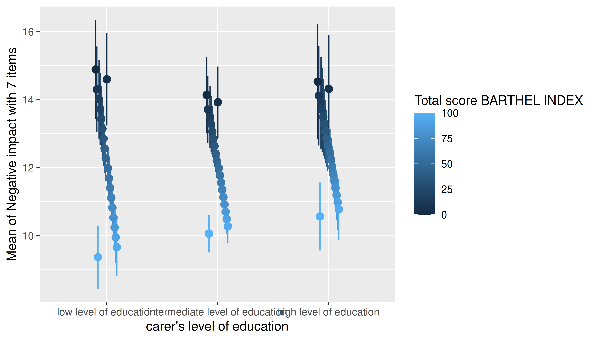

Another option would be to use `range = "grid"`, in which case the mean
and +/- one standard deviation around the mean are chosen as
representative values for numeric predictors.

\
[`estimate_means`](https://easystats.github.io/modelbased/reference/estimate_means.md)`(``m``, `[`c`](https://rdrr.io/r/base/c.html)`(``"c172code"``, ``"barthtot"``)``, range ``=`` ``"grid"``)`` ``|>`` `[`plot`](https://rdrr.io/r/graphics/plot.default.html)`(``)`

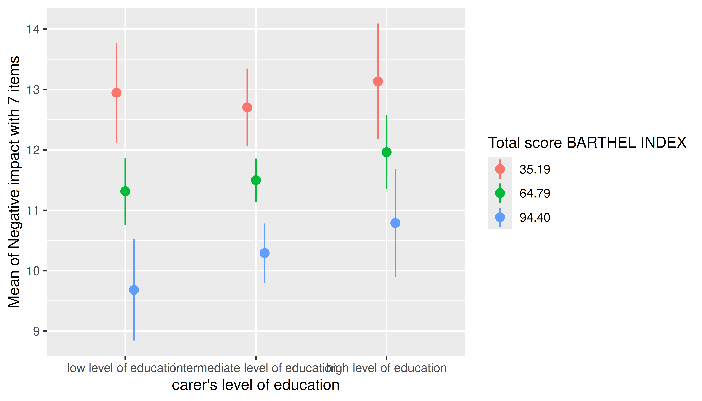

It is also possible to specify representative values, at which the
estimated marginal means of the outcome should be plotted. Again,
consult the documentation at `?ìnsight::get_datagrid` for further
details.

\
[`estimate_means`](https://easystats.github.io/modelbased/reference/estimate_means.md)`(`\
`  ``m``,`\
`  `[`c`](https://rdrr.io/r/base/c.html)`(`\
`    ``"c172code = c('low level of education', 'high level of education')"``,`\
`    ``"barthtot = c(30, 50, 80)"`\
`  ``)`\
`)`` ``|>`` `[`plot`](https://rdrr.io/r/graphics/plot.default.html)`(``)`

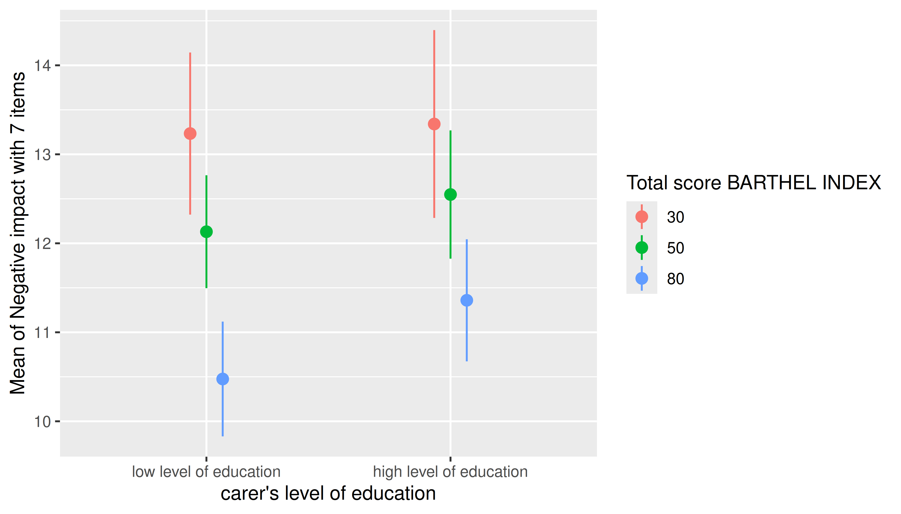

\
\
[`estimate_means`](https://easystats.github.io/modelbased/reference/estimate_means.md)`(``m``, `[`c`](https://rdrr.io/r/base/c.html)`(``"c172code"``, ``"barthtot = [fivenum]"``)``)`` ``|>`` `[`plot`](https://rdrr.io/r/graphics/plot.default.html)`(``)`

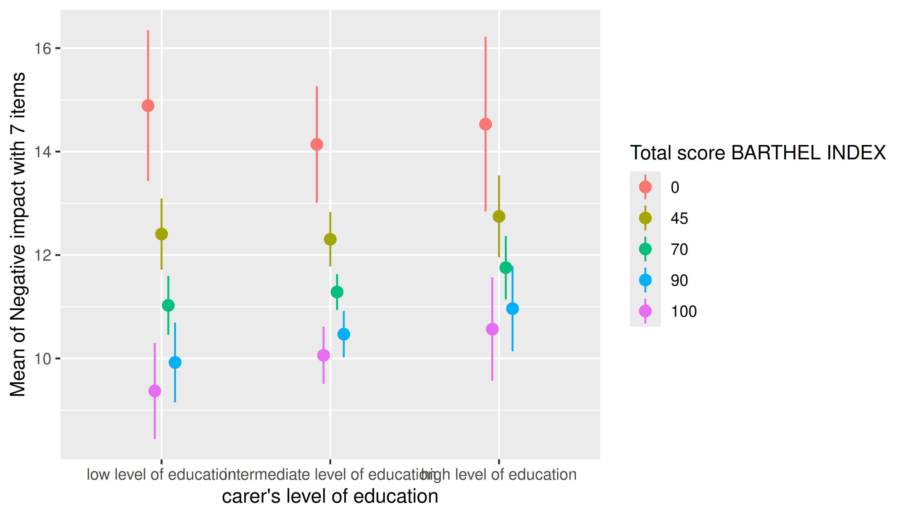

## Three numeric predictors

The default plot-setting for three numeric predictors can be rather
confusing.

\
`m`` ``<-`` `[`lm`](https://rdrr.io/r/stats/lm.html)`(``neg_c_7`` ``~`` ``c12hour`` ``*`` ``barthtot`` ``*`` ``c160age``, data ``=`` ``efc``)`\
[`estimate_means`](https://easystats.github.io/modelbased/reference/estimate_means.md)`(``m``, `[`c`](https://rdrr.io/r/base/c.html)`(``"c12hour"``, ``"barthtot"``, ``"c160age"``)``)`` ``|>`` `[`plot`](https://rdrr.io/r/graphics/plot.default.html)`(``)`

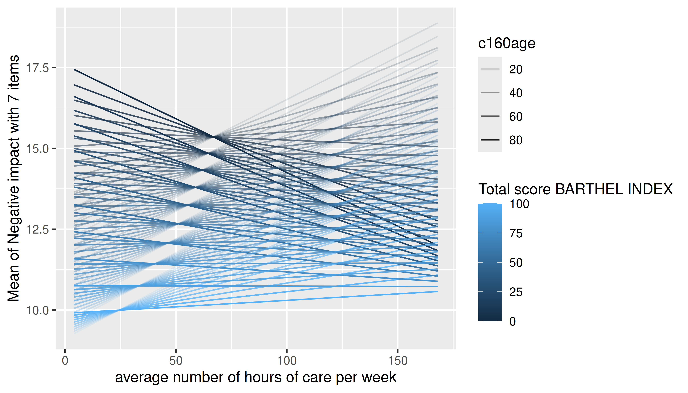

Instead, it is recommended to use `length`, create a “reference grid”,
or again specify meaningful values directly in the `by` argument.

\
[`estimate_means`](https://easystats.github.io/modelbased/reference/estimate_means.md)`(``m``, `[`c`](https://rdrr.io/r/base/c.html)`(``"c12hour"``, ``"barthtot"``, ``"c160age"``)``, length ``=`` ``2``)`` ``|>`` `[`plot`](https://rdrr.io/r/graphics/plot.default.html)`(``)`

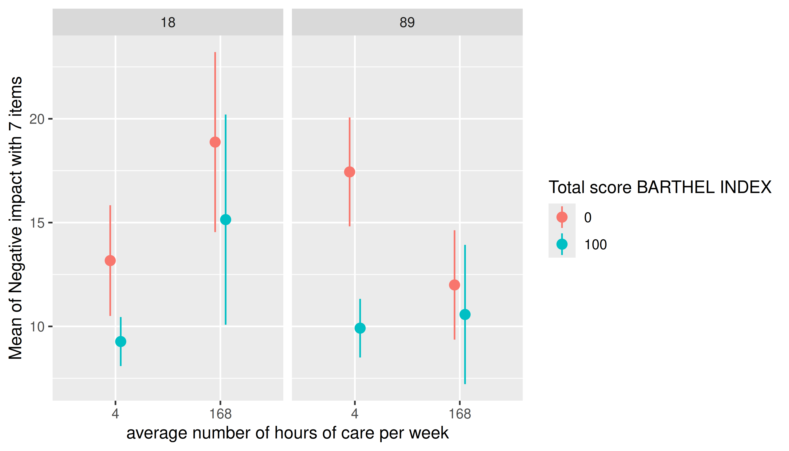

\
\
[`estimate_means`](https://easystats.github.io/modelbased/reference/estimate_means.md)`(``m``, `[`c`](https://rdrr.io/r/base/c.html)`(``"c12hour"``, ``"barthtot"``, ``"c160age"``)``, range ``=`` ``"grid"``)`` ``|>`` `[`plot`](https://rdrr.io/r/graphics/plot.default.html)`(``)`

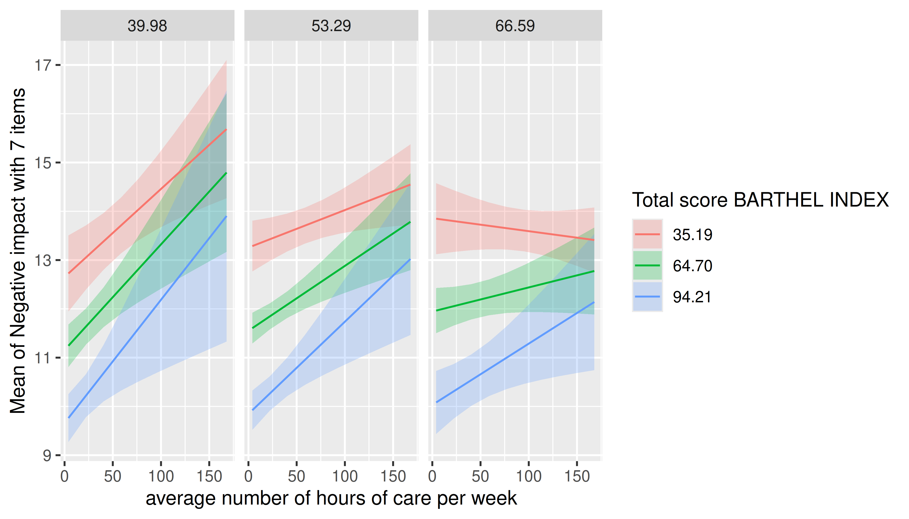

## Three categorical predictors

Multiple categorical predictors are usually less problematic, since
discrete color scales and faceting are used to distinguish between
factor levels.

\
`m`` ``<-`` `[`lm`](https://rdrr.io/r/stats/lm.html)`(``neg_c_7`` ``~`` ``e16sex`` ``*`` ``c172code`` ``*`` ``e42dep``, data ``=`` ``efc``)`\
[`estimate_means`](https://easystats.github.io/modelbased/reference/estimate_means.md)`(``m``, `[`c`](https://rdrr.io/r/base/c.html)`(``"e16sex"``, ``"c172code"``, ``"e42dep"``)``)`` ``|>`` `[`plot`](https://rdrr.io/r/graphics/plot.default.html)`(``)`

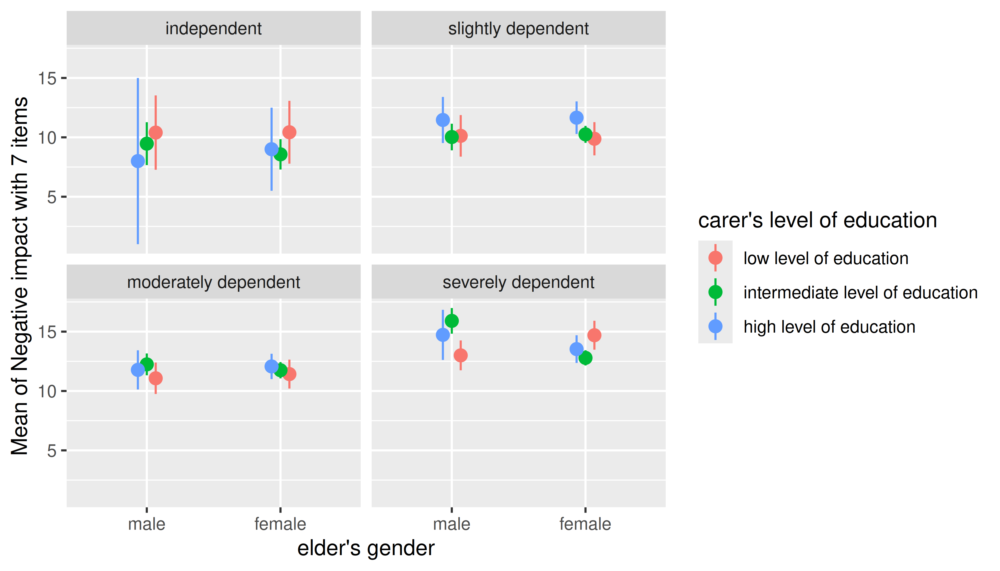

## Smooth plots

Remember that by default a range of ten values is chosen for numeric
focal predictors. While this mostly works well for plotting linear
relationships, plots may look less smooth for certain models that
involve quadratic or cubic terms, or splines, or for instance if you
have GAMs.

\
`m`` ``<-`` `[`lm`](https://rdrr.io/r/stats/lm.html)`(``neg_c_7`` ``~`` ``e16sex`` ``*`` ``c12hour`` ``+`` ``e16sex`` ``*`` `[`I`](https://rdrr.io/r/base/AsIs.html)`(``c12hour``^``2``)``, data ``=`` ``efc``)`\
[`estimate_means`](https://easystats.github.io/modelbased/reference/estimate_means.md)`(``m``, `[`c`](https://rdrr.io/r/base/c.html)`(``"c12hour"``, ``"e16sex"``)``)`` ``|>`` `[`plot`](https://rdrr.io/r/graphics/plot.default.html)`(``)`

In this case, simply increase the number of representative values by
setting `length` to a higher number.

\
[`estimate_means`](https://easystats.github.io/modelbased/reference/estimate_means.md)`(``m``, `[`c`](https://rdrr.io/r/base/c.html)`(``"c12hour"``, ``"e16sex"``)``, length ``=`` ``200``)`` ``|>`` `[`plot`](https://rdrr.io/r/graphics/plot.default.html)`(``)`

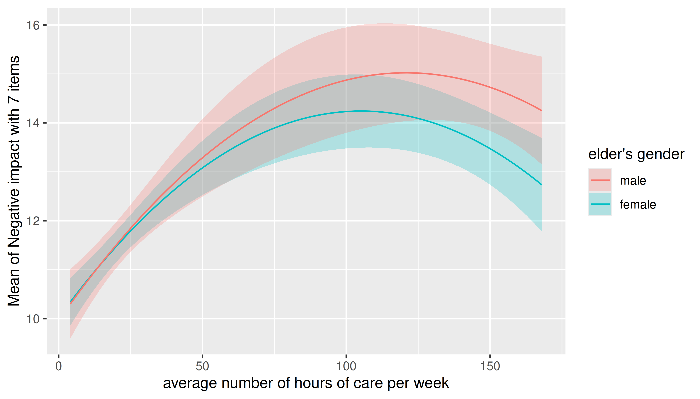

## Adding raw data points or partial residuals to the plot

It is possible to add a layer with the original data points to the plot
using `show_data = TRUE`.

\
[`set.seed`](https://rdrr.io/r/base/Random.html)`(``1234``)`\
`x`` ``<-`` `[`rnorm`](https://rdrr.io/r/stats/Normal.html)`(``200``)`\
`z`` ``<-`` `[`rnorm`](https://rdrr.io/r/stats/Normal.html)`(``200``)`\
`# quadratic relationship`\
`y`` ``<-`` ``2`` ``*`` ``x`` ``+`` ``x``^``2`` ``+`` ``4`` ``*`` ``z`` ``+`` `[`rnorm`](https://rdrr.io/r/stats/Normal.html)`(``200``)`\
\
`d`` ``<-`` `[`data.frame`](https://rdrr.io/r/base/data.frame.html)`(``x``, ``y``, ``z``)`\
`m`` ``<-`` `[`lm`](https://rdrr.io/r/stats/lm.html)`(``y`` ``~`` ``x`` ``+`` ``z``, data ``=`` ``d``)`\
`pr`` ``<-`` `[`estimate_means`](https://easystats.github.io/modelbased/reference/estimate_means.md)`(``m``, ``"x"``)`\
\
[`plot`](https://rdrr.io/r/graphics/plot.default.html)`(``pr``, show_data ``=`` ``TRUE``)`

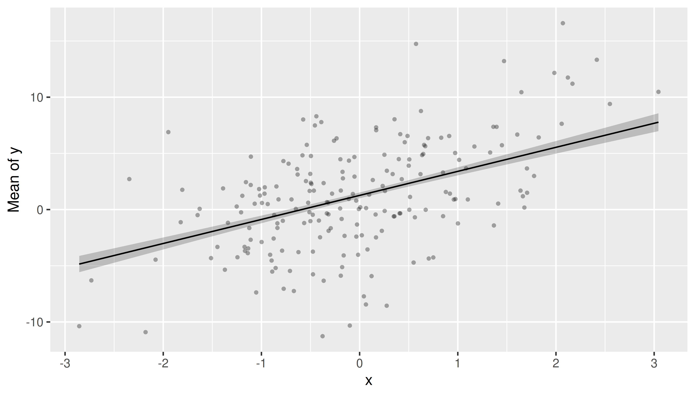

Plotting partial residuals on top of the estimated marginal means allows
detecting missed modeling, like unmodelled non-linear relationships or
unmodelled interactions. In a nutshell, it allows *Visualizing Fit and
Lack of Fit in Complex Regression Models with Predictor Effect Plots and
Partial Residuals* (Fox & Weisberg 2018).

To add partial residuals to a plot, add `show_residuals = TRUE` to the
[`plot()`](https://rdrr.io/r/graphics/plot.default.html) function call.
Unlike plotting raw data, partial residuals are much better in detecting
spurious patterns of relationships between predictors and outcome. In
the above example, we have a non-linear relationship. The missed pattern
is not obvious when looking at the raw data, however, it becomes more
apparent when plotting the partial residuals.

\
[`plot`](https://rdrr.io/r/graphics/plot.default.html)`(``pr``, show_residuals ``=`` ``TRUE``)`

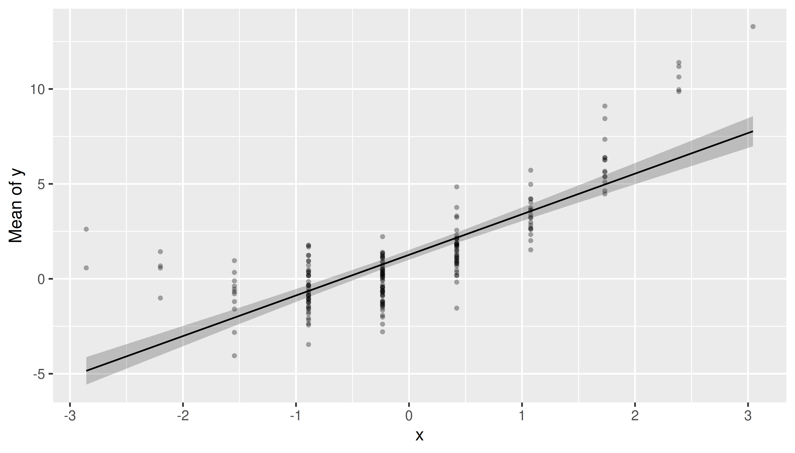

Data points will also be colored by groups automatically.

\
`m`` ``<-`` `[`lm`](https://rdrr.io/r/stats/lm.html)`(``neg_c_7`` ``~`` ``e16sex`` ``*`` ``c172code``, data ``=`` ``efc``)`\
`emm`` ``<-`` `[`estimate_means`](https://easystats.github.io/modelbased/reference/estimate_means.md)`(``m``, `[`c`](https://rdrr.io/r/base/c.html)`(``"e16sex"``, ``"c172code"``)``)`\
[`plot`](https://rdrr.io/r/graphics/plot.default.html)`(`\
`  ``emm``,`\
`  show_data ``=`` ``TRUE``, ``# show data points`\
`  point ``=`` `[`list`](https://rdrr.io/r/base/list.html)`(``size ``=`` ``2``)`` ``# adjust point geoms, increase size`\
`)`` ``+`` `[`facet_wrap`](https://ggplot2.tidyverse.org/reference/facet_wrap.html)`(``~``c172code``)`` ``# facet panels (group by category)`

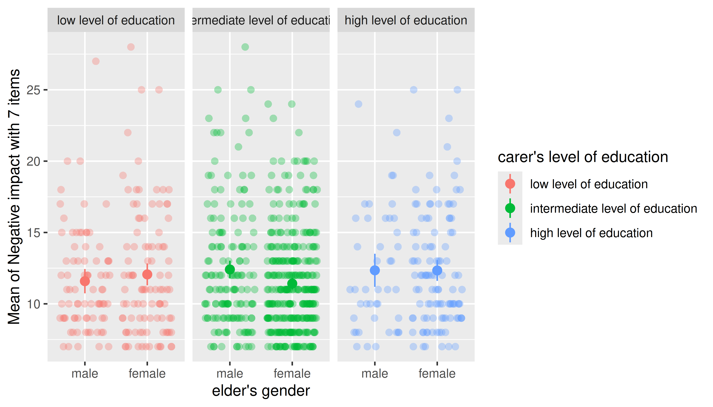

For mixed models, data points can be “collapsed” (i.e. averaged over)
grouping variables from the random effects. First, we show an example
that includes all data points.

\
[`library`](https://rdrr.io/r/base/library.html)`(`[`lme4`](https://github.com/lme4/lme4/)`)`\
\
[`data`](https://rdrr.io/r/utils/data.html)`(``efc``)`\
`efc``$``e15relat`` ``<-`` `[`as.factor`](https://rdrr.io/r/base/factor.html)`(``efc``$``e15relat``)`\
`efc``$``c161sex`` ``<-`` `[`as.factor`](https://rdrr.io/r/base/factor.html)`(``efc``$``c161sex``)`\
[`levels`](https://rdrr.io/r/base/levels.html)`(``efc``$``c161sex``)`` ``<-`` `[`c`](https://rdrr.io/r/base/c.html)`(``"male"``, ``"female"``)`\
`model`` ``<-`` `[`lmer`](https://rdrr.io/pkg/lme4/man/lmer.html)`(``neg_c_7`` ``~`` ``c161sex`` ``+`` ``(``1`` ``|`` ``e15relat``)``, data ``=`` ``efc``)`\
\
`me`` ``<-`` `[`estimate_means`](https://easystats.github.io/modelbased/reference/estimate_means.md)`(``model``, ``"c161sex"``)`\
[`plot`](https://rdrr.io/r/graphics/plot.default.html)`(``me``, show_data ``=`` ``TRUE``)`

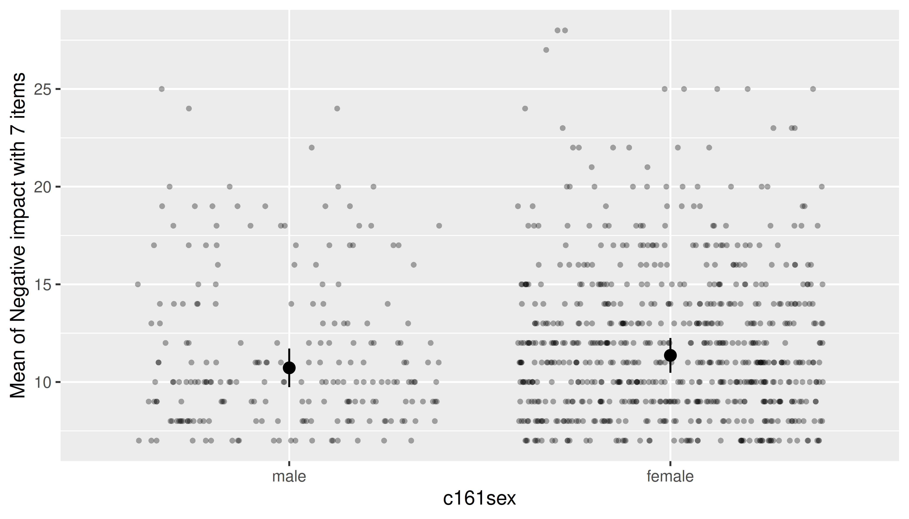

Next, we specify the `collapse_group` argument, to tell the
[`plot()`](https://rdrr.io/r/graphics/plot.default.html) function to
“average” data points over the random effects groups, represented by the
`e15relat` variable.

\
[`plot`](https://rdrr.io/r/graphics/plot.default.html)`(``me``, show_data ``=`` ``TRUE``, collapse_group ``=`` ``"e15relat"``)`

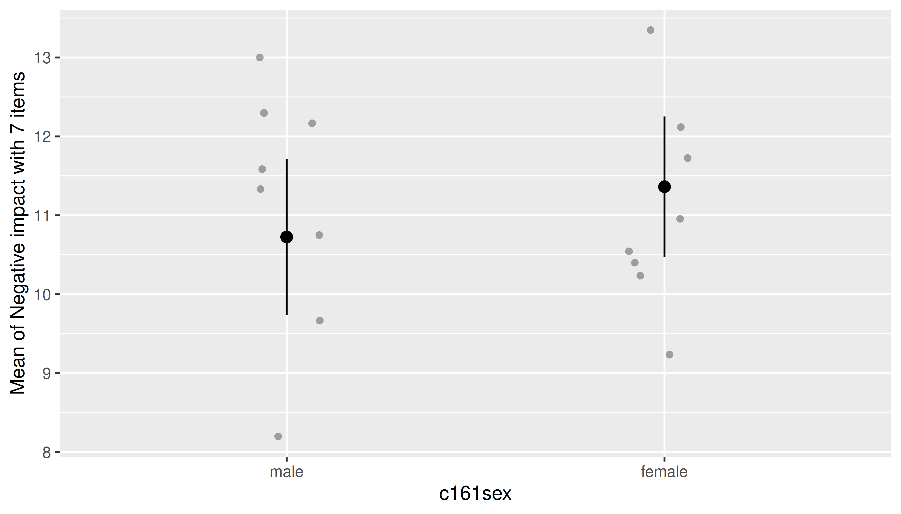
