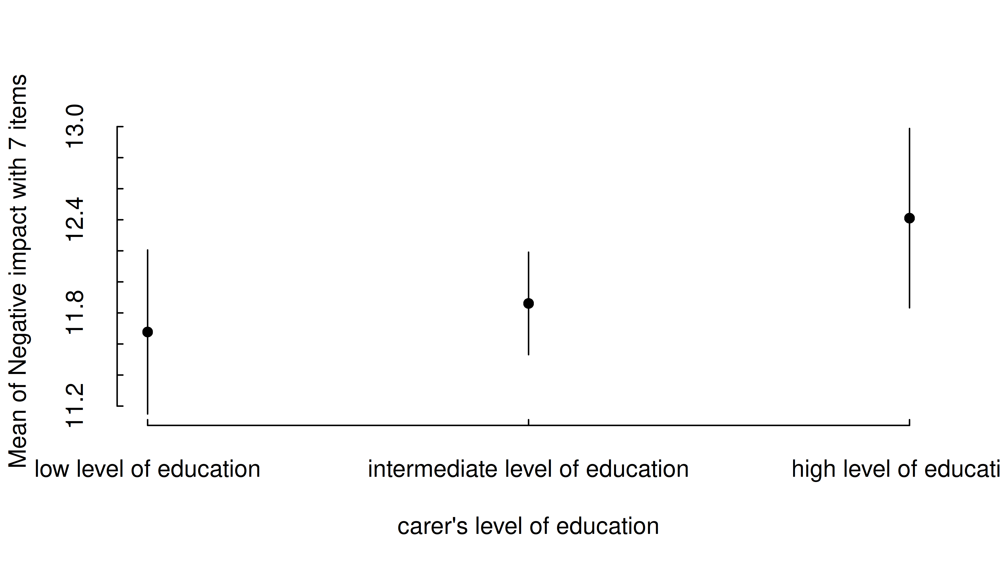
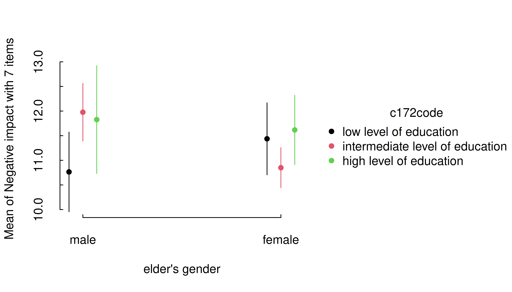
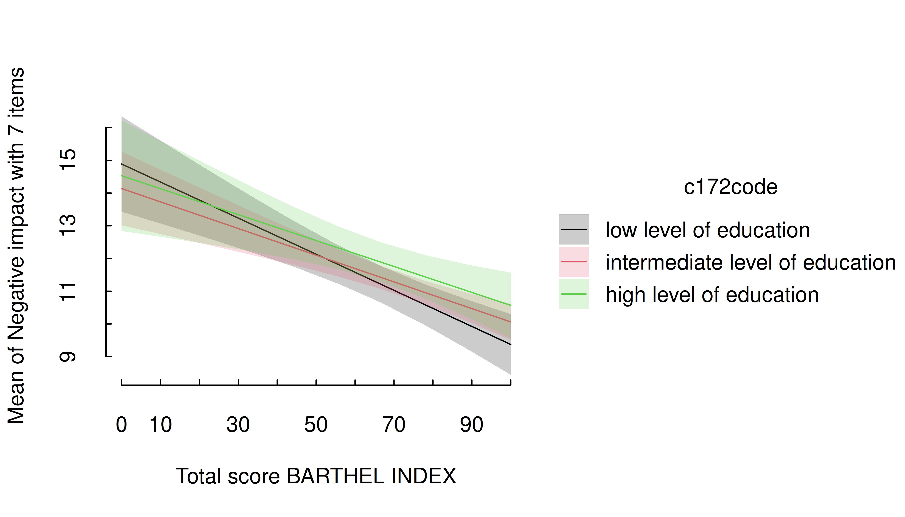
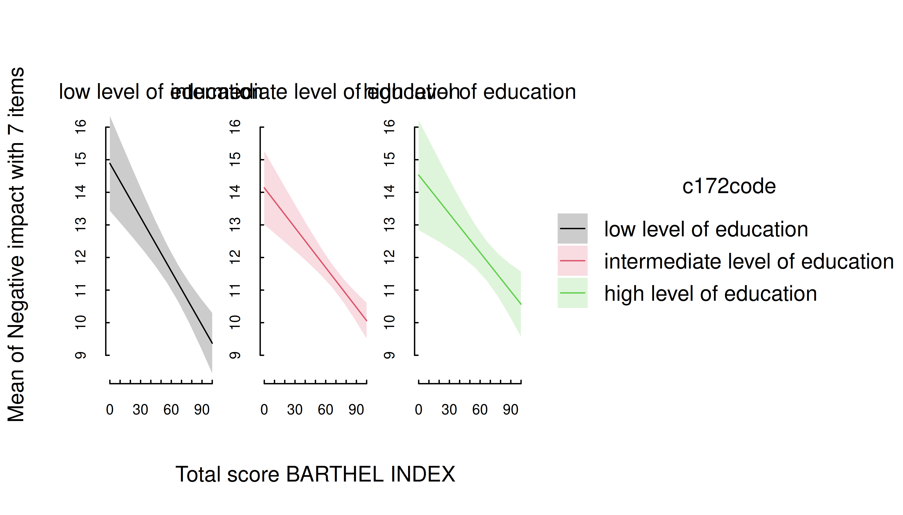
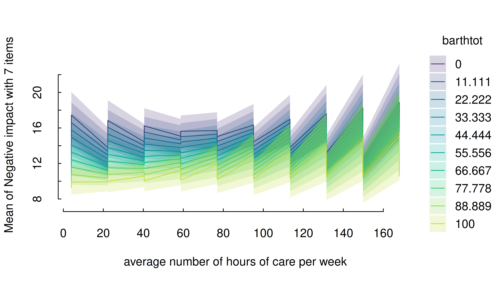
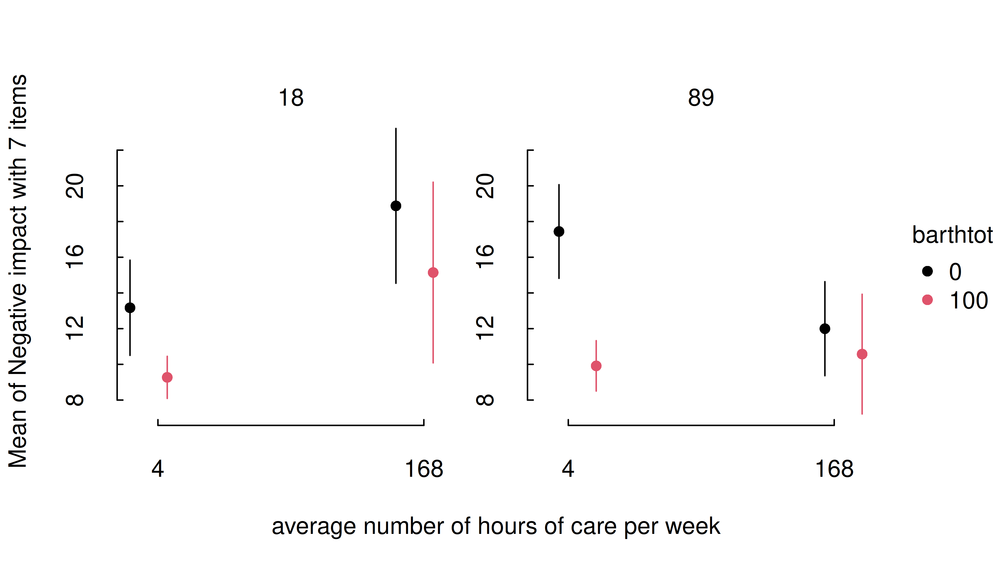
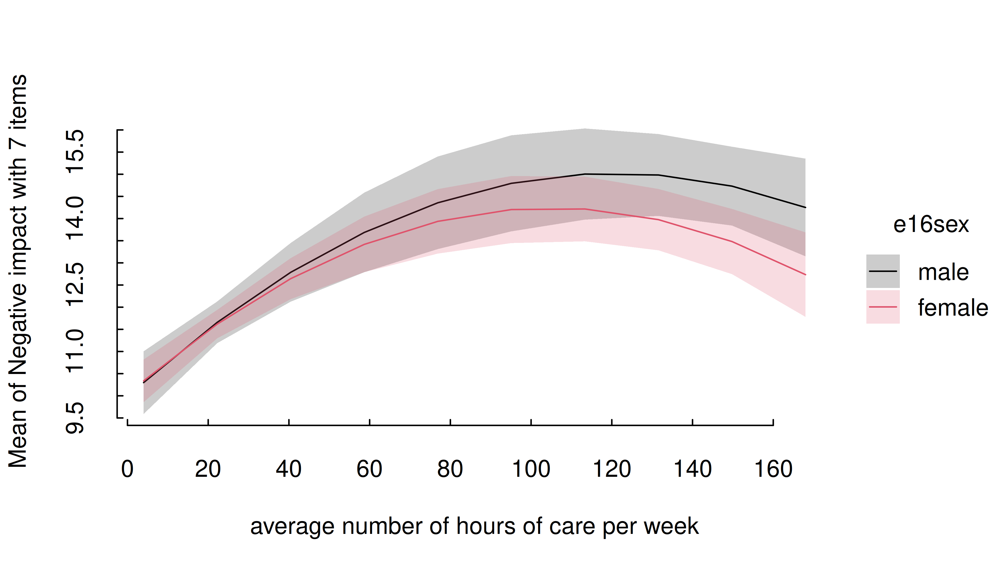

# Plotting estimated marginal means with tinyplot

This vignette provides a quick overview with different examples that
show how to plot estimated marginal means, like [in this
vignette](https://easystats.github.io/modelbased/articles/plotting.html),
however, here we use the
[`{tinyplot}`](https://grantmcdermott.com/tinyplot/) package instead of
[ggplot2](https://ggplot2.tidyverse.org) to create the plots.

## One predictor - categorical

The simplest case is possibly plotting one categorical predictor.
Predicted values for each level and its confidence intervals are shown.

``` r

library(modelbased)
library(tinyplot)
tinytheme("classic", palette.qualitative = "Tableau 10")

data(efc, package = "modelbased")
efc <- datawizard::to_factor(efc, c("e16sex", "c172code", "e42dep"))

m <- lm(neg_c_7 ~ e16sex + c172code + barthtot, data = efc)
estimate_means(m, "c172code") |> plt()
```



In general, plots can be further modified using functions or arguments
from the **tinyplot** package.

``` r

estimate_means(m, "c172code") |>
  plt(type = "errorbar", flip = TRUE)
plt_add(type = "l", lty = 2)
```


**Pro-tip:** You can pass a labeling function to wrap long axis labels.
Here we use one from the `scales` package.

``` r

estimate_means(m, "c172code") |>
  plt(xaxl = scales::label_wrap(20), flip = TRUE)
```



## One predictor - numeric

For numeric predictors, the range of predictions at different values of
the focal predictor are plotted, the uncertainty is displayed as
confidence band.

``` r

estimate_means(m, "barthtot") |> plt()
```



## Two predictors - categorical

For two categorical predictors, the first focal predictors is plotted
along the x-axis, while the levels of the second predictor are mapped to
different colors.

``` r

m <- lm(neg_c_7 ~ e16sex * c172code + e42dep, data = efc)
estimate_means(m, c("e16sex", "c172code")) |> plt()
```



Again, you can layer on top of this plot using standard **tinyplot**
functions and arguments.

``` r

estimate_means(m, c("e16sex", "c172code")) |> plt()
plt_add(type = "l", lty = 2)
```


## Two predictors - numeric \* categorical

For two predictors, where the first is numeric and the second
categorical, range of predictions including confidence bands are shown,
with the different levels of the second (categorical) predictor mapped
to colors again.

``` r

m <- lm(neg_c_7 ~ barthtot * c172code + e42dep, data = efc)
estimate_means(m, c("barthtot", "c172code")) |> plt()
```


One potentially useful customization for these numeric \* categorical
cases is mapping predictive groups by facets (in addition to, or instead
of colors). Below we make an additional tweak by wrapping the facet
names, since these are rather long.

``` r

estimate_means(m, c("barthtot", "c172code")) |>
  within({
    c172code = gsub(" of education$", "\nof education", c172code)
  }) |> 
  plt(facet = "by", legend = FALSE)
```


## Two predictors - categorical \* numeric

If the numeric predictor is the *second* focal term, its values are
still mapped to colors, however, by default to a continuous (gradient)
scale, because a range of representative values for that numeric
predictor is used by default.

Focal predictors specified in
[`estimate_means()`](https://easystats.github.io/modelbased/reference/estimate_means.md)
are passed to
[`insight::get_datagrid()`](https://easystats.github.io/insight/reference/get_datagrid.html).
If not specified otherwise, representative values for numeric predictors
are evenly distributed from the minimum to the maximum, with a total
number of `length` values covering that range.

I.e., by default, arguments `range = "range"` and `length = 10` in
[`insight::get_datagrid()`](https://easystats.github.io/insight/reference/get_datagrid.html),
and thus for numeric predictors, a *range* of *length* values is used to
estimate predictions.

``` r

# by default, `range = "range"` and `length = 10`
estimate_means(m, c("c172code", "barthtot")) |> plt()
```


That means that the `length` argument can be used to control how many
values (lines) for the numeric predictors are chosen.

``` r

estimate_means(m, c("c172code", "barthtot"), length = 20) |> plt()
```



Another option would be to use `range = "grid"`, in which case the mean
and +/- one standard deviation around the mean are chosen as
representative values for numeric predictors.

``` r

estimate_means(m, c("c172code", "barthtot"), range = "grid") |> plt()
```



It is also possible to specify representative values, at which the
estimated marginal means of the outcome should be plotted. Again,
consult the documentation at
[`?insight::get_datagrid`](https://easystats.github.io/insight/reference/get_datagrid.html)
for further details.

``` r

estimate_means(
  m,
  c(
    "c172code = c('low level of education', 'high level of education')",
    "barthtot = c(30, 50, 80)"
  )
) |> plt()
```


``` r

estimate_means(m, c("c172code", "barthtot = [fivenum]")) |> plt()
```


One aesthetic issue in the preceding plots is the fact that the middle
x-axis category is missing (hidden) due to space limitations. Again,
this is a common problem when we have several discrete categories and
long label strings. One option is to increase the horizontal spacing by
moving the legend (e.g., `legend = bottom!`). But a more sure-fire way
to ensure that all tick labels are printed is by using a labelling
function that wraps the text and/or flipping the plot.

``` r

estimate_means(m, c("c172code", "barthtot = [fivenum]")) |>
  plt(xaxl = scales::label_wrap(20), flip = TRUE)
```



## Three numeric predictors

The default plot-setting for three numeric predictors can be rather
confusing.

``` r

m <- lm(neg_c_7 ~ c12hour * barthtot * c160age, data = efc)
estimate_means(m, c("c12hour", "barthtot", "c160age")) |> plt()
```


Instead, it is recommended to use `length`, create a “reference grid”,
or again specify meaningful values directly in the `by` argument. Note
that this will have the ancillary effect of generating facets by the
third variable (here: “cs160age”, i.e. carer age).

``` r

estimate_means(m, c("c12hour", "barthtot", "c160age"), length = 2) |>
  plt(
    main = "Effect of care on elder outcomes",
    sub = "Facets denote representative carer ages"
  )
```


``` r

estimate_means(m, c("c12hour", "barthtot", "c160age"), range = "grid") |>
  plt(
    main = "Effect of care on elder outcomes",
    sub = "Facets denote representative carer ages (mean +/- 1 SD)"
  )
```


## Three categorical predictors

Multiple categorical predictors are usually less problematic, since
discrete color scales and faceting are used to distinguish between
factor levels.

``` r

m <- lm(neg_c_7 ~ e16sex * c172code * e42dep, data = efc)
estimate_means(m, c("e16sex", "c172code", "e42dep")) |> plt()
```


Again, though we can improve the final aesthetic with a few tweaks.

``` r

estimate_means(m, c("e16sex", "c172code", "e42dep")) |>
  plt(dodge = 0.02, theme = "clean2")
```


## Smooth plots

Remember that by default a range of ten values is chosen for numeric
focal predictors. While this mostly works well for plotting linear
relationships, plots may look less smooth for certain models that
involve quadratic or cubic terms, or splines, or for instance if you
have GAMs.

``` r

tinytheme("classic", palette.qualitative = "Tableau 10")
m <- lm(neg_c_7 ~ e16sex * c12hour + e16sex * I(c12hour^2), data = efc)
estimate_means(m, c("c12hour", "e16sex")) |> plt()
```


In this case, simply increase the number of representative values by
setting `length` to a higher number.

``` r

estimate_means(m, c("c12hour", "e16sex"), length = 200) |> plt()
```


``` r

# reset theme
tinytheme()
```
