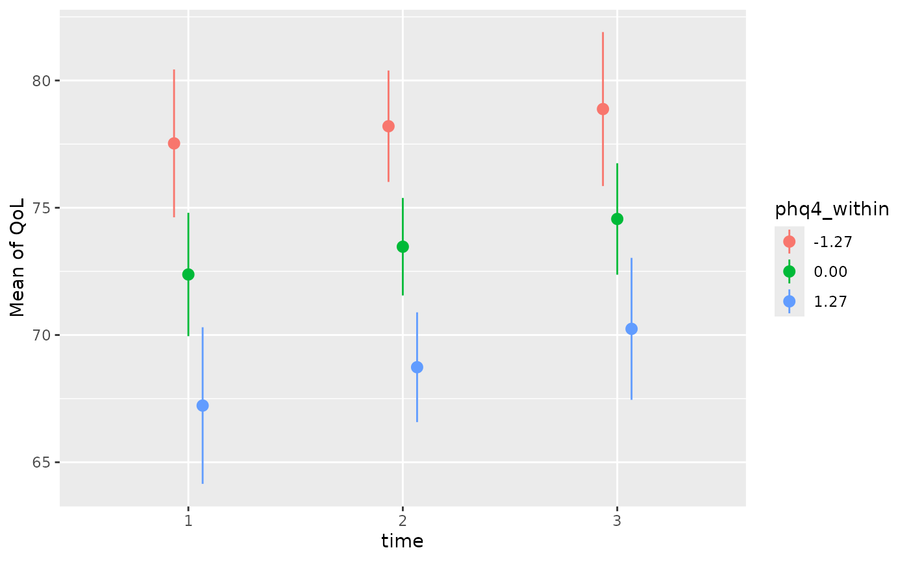
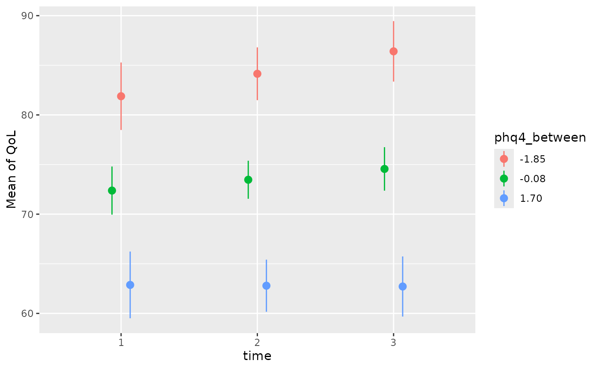

# Context Effects: How the Environment Shapes the Individual

When analyzing longitudinal or clustered data, a standard mixed-effects
model often blends two completely different processes into a single
coefficient: the overall differences between individuals (or groups) and
the acute fluctuations within an individual. However, separating these
effects is just the first step. By evaluating them side-by-side, we can
uncover a third, crucial piece of the puzzle: the *context effect*.

The context effect describes the additional influence that a broader
environment or a chronic baseline trait has on an individual,
independent of their immediate, momentary state (Rohrer and Murayama
(2023)). By using the
[`demean()`](https://easystats.github.io/datawizard/reference/demean.html)
function to separate our time-varying predictors, we can isolate the
within- and between-components, evaluate them independently, and
formally test how the overarching context shapes individual outcomes.

To understand the underlying problem of heterogeneity bias, demeaning
(person-mean centering), and within/between effects in more detail, it
is highly recommended to [read this vignette
first](https://easystats.github.io/parameters/articles/demean.html).

## Sample data used in this vignette

``` r

library(parameters)
data("qol_cancer")
```

- Variables:
  - `QoL` : Response (quality of life of patient)
  - `phq4` : Patient Health Questionnaire, **time-varying** variable
  - `education`: Educational level, **time-invariant** variable,
    co-variate
  - `ID` : patient ID
  - `time` : time-point of measurement

### Computing the de-meaned and group-meaned variables

To calculate the within- and between-effects, we perform a special way
of centering variables called
[*demeaning*](https://easystats.github.io/datawizard/reference/demean.html).
This “separates” the within-effect from a between-effect of a predictor.

``` r

library(datawizard)
qol_cancer <- demean(qol_cancer, select = c("phq4", "QoL"), by = "ID")
```

Now we have:

- `phq4_between`: time-varying variable with the mean of `phq4` across
  all time-points, for each patient (ID).

- `phq4_within`: the de-meaned time-varying variable `phq4`.

## Calculating the within- and between effects using mixed models

First, we start with calculating the within- and between-effects from
`phq4`, before we move on to investigate the context effects.

``` r

library(lme4)
mixed <- lmer(
  QoL ~ time + phq4_within + phq4_between + education + (1 + time | ID),
  data = qol_cancer
)
# effects = "fixed" will not display random effects, but split the
# fixed effects into its between- and within-effects components.
model_parameters(mixed, effects = "fixed") |> display(format = "tt")
```

| Parameter        | Coefficient | SE   | 95% CI         | t(554) | p       |
|------------------|-------------|------|----------------|--------|---------|
| (Intercept)      | 67.36       | 2.48 | (62.48, 72.23) | 27.15  | \< .001 |
| time             | 1.09        | 0.66 | (-0.21, 2.39)  | 1.65   | 0.099   |
| phq4 within      | -3.72       | 0.41 | (-4.52, -2.92) | -9.10  | \< .001 |
| phq4 between     | -6.13       | 0.52 | (-7.14, -5.11) | -11.84 | \< .001 |
| education (mid)  | 5.01        | 2.35 | (0.40, 9.62)   | 2.14   | 0.033   |
| education (high) | 5.52        | 2.75 | (0.11, 10.93)  | 2.00   | 0.046   |

Model Summary {#tinytable_5y9p9f3cy8vuib7ty05p .table .tinytable
style="width: auto; margin-left: auto; margin-right: auto;"
quarto-disable-processing="true"}

Looking at the fixed effects output for the `phq4` (Patient Health
Questionnaire) variable, we can interpret the coefficients as follows:

- *The Between-Effect (`phq4_between` = -6.13):* This captures the
  general, trait-like differences across patients. It answers the
  question: How does a patient’s overall average score affect their
  outcome compared to other patients? If Patient A has an overall
  average `phq4` score that is 1 unit higher than Patient B’s average,
  we expect Patient A’s Quality of Life (QoL) to be 6.13 points lower on
  average than Patient B’s.

- *The Within-Effect (`phq4_within` = -3.72):* This captures the
  state-like, time-to-time fluctuations for an individual. It answers
  the question: What happens when a patient deviates from their own
  baseline? If a patient scores 1 unit higher on the `phq4` at a
  specific time-point compared to their own personal average, their
  expected Quality of Life at that specific measurement decreases by an
  additional 3.72 points.

If we had entered `phq4` into the model as a single, uncentered
variable, the resulting coefficient would be a weighted average of these
two distinct effects. This can be highly misleading, as it obscures both
the overarching patient-to-patient differences and the specific
time-to-time dynamics. Separating them provides a much clearer picture
of how psychological burden impacts quality of life on multiple levels.

## Context effect - contrasting within- and between-effects

Conceptually, when analyzing clustered or longitudinal data, we are
looking at two distinct levels of influence:

- *Individual level (within-effect):* What is the impact of an
  individual’s temporary deviation from their own group mean? This
  captures state-like fluctuations or acute changes.

- *Group level (between-effect):* What is the impact of the group’s
  general environment or overall average, which affects all members
  equally? This captures trait-like, baseline differences or overarching
  environments.

The difference between these two effects is called the *context effect*.
A context effect describes the additional influence that the general
environment or baseline trait has on an individual, holding their raw,
current state constant. It demonstrates that people with identical
current, raw values (such as the exact same momentary income or symptom
severity) face different outcomes depending on their baseline or the
environment in which they live.

To test whether the within- and between-effects are significantly
different from each other, we can estimate their contrast:

``` r

library(modelbased)
estimate_contrasts(mixed, c("phq4_within", "phq4_between")) |> display(format = "tt")
```

[TABLE]

Marginal Contrasts Analysis {#tinytable_8ekkl354istvx52htw4c .table
.tinytable style="width: auto; margin-left: auto; margin-right: auto;"
quarto-disable-processing="true"}

The output shows a significant contrast of 2.41 between the within- and
between-effects. Since the between-effect in our model (-6.13) is
stronger (more negative) than the within-effect (-3.72), the
context-effect (Between minus Within) is -2.41.

**What does this mean practically?**

Imagine two patients who both report the exact same raw `phq4` score on
a given day. However, Patient A generally suffers from a higher
overarching psychological burden (their personal `phq4` average is 1
unit higher than Patient B’s). The context effect tells us that, despite
experiencing the exact same severity of symptoms today, Patient A’s
expected Quality of Life is an additional 2.41 points lower than Patient
B’s simply because of their higher baseline burden. The trait-like
baseline carries an extra “penalty” for the quality of life that goes
beyond mere day-to-day fluctuations.

## Time trends of within- and between-effects

To investigate whether the impact of `phq4` changes over time, we can
extend our model by adding interaction terms between the time of
measurement (`time`) and our two centered variables (`phq4_within` and
`phq4_between`).

``` r

mixed <- lmer(
  QoL ~ time * (phq4_within + phq4_between) + education + (1 + time | ID),
  data = qol_cancer
)
model_parameters(mixed, effects = "fixed") |> display(format = "tt")
```

| Parameter           | Coefficient | SE   | 95% CI         | t(552) | p       |
|---------------------|-------------|------|----------------|--------|---------|
| (Intercept)         | 67.33       | 2.49 | (62.43, 72.23) | 26.99  | \< .001 |
| time                | 1.04        | 0.66 | (-0.25, 2.33)  | 1.58   | 0.114   |
| phq4 within         | -4.37       | 1.25 | (-6.81, -1.92) | -3.50  | \< .001 |
| phq4 between        | -4.70       | 0.96 | (-6.58, -2.82) | -4.90  | \< .001 |
| education (mid)     | 5.19        | 2.38 | (0.52, 9.87)   | 2.18   | 0.029   |
| education (high)    | 5.61        | 2.76 | (0.18, 11.04)  | 2.03   | 0.043   |
| time × phq4 within  | 0.33        | 0.61 | (-0.87, 1.52)  | 0.54   | 0.592   |
| time × phq4 between | -0.66       | 0.37 | (-1.39, 0.07)  | -1.77  | 0.077   |

Model Summary {#tinytable_owgxjdse3ee8szwh88fn .table .tinytable
style="width: auto; margin-left: auto; margin-right: auto;"
quarto-disable-processing="true"}

The results table now shows us whether time has a moderating influence
on our effects. To see this, we look at the two interaction terms at the
bottom of the table:

- Interaction `time × phq4_within`: The coefficient (0.33) is small and
  not statistically significant (p = 0.592). This means that the
  negative effect of individual, temporary fluctuations remains largely
  stable over time. When a patient’s psychological burden acutely
  increases, their quality of life decreases to a very similar extent at
  any given time point.

- Interaction `time × phq4_between`: This coefficient (-0.66) is also
  not statistically significant (p = 0.077). The negative sign suggests
  that the gap between patients potentially widens slightly over time.
  The “disadvantage” in quality of life experienced by patients with a
  generally high psychological baseline burden might further increase
  over the course of the study compared to less burdened patients.

These temporal dynamics can be best understood visually using Estimated
Marginal Means. The generated plots confirm the statistical results from
the table very clearly.

``` r

estimate_means(mixed, c("time", "phq4_within=[sd]")) |> plot()
```



In the first plot (*within-effects over time*), the lines for the
different levels of `phq4_within` (mean as well as +/- one standard
deviation) run almost parallel. The constant distance between the lines
visualizes the lack of interaction: An acute increase in psychological
symptoms (shifting to the blue line) depresses the quality of life
uniformly across all time points.

``` r

estimate_means(mixed, c("time", "phq4_between=[sd]")) |> plot()
```



In the second plot (*between-effects over time*), a slight divergence of
the lines is visible. While patients with a generally low burden (red
line) experience a slight increase in their quality of life over time,
the quality of life for patients with a generally high burden (blue
line) stagnates at a lower level or even drops minimally.

## Time trends of context effects

Finally, we might ask whether the context effect itself - the difference
between the within- and between-effects - is stable, or if the “penalty”
of a high baseline burden changes over the course of the study.

Before calculating the context effect directly, it is helpful to first
look at the marginal effects (slopes) of both the within- and
between-components separately at each time point. This helps us
understand the underlying dynamics.

``` r

# average marginal effect of within-effect at each time point
estimate_slopes(mixed, "phq4_within", by = "time") |> display(format = "tt")
```

[TABLE]

Estimated Marginal Effects {#tinytable_e515lf5an0r6ki5nus7b .table
.tinytable style="width: auto; margin-left: auto; margin-right: auto;"
quarto-disable-processing="true"}

``` r

# average marginal effect of between-effect at each time point
estimate_slopes(mixed, "phq4_between", by = "time") |> display(format = "tt")
```

[TABLE]

Estimated Marginal Effects {#tinytable_4ruzykjx4c9d9hk120z9 .table
.tinytable style="width: auto; margin-left: auto; margin-right: auto;"
quarto-disable-processing="true"}

Looking at these separate slopes reveals two opposing trends. The acute
impact of a temporary symptom spike (`phq4_within`) slightly decreases
in magnitude over time (shifting from -4.04 at Time 1 to -3.39 at Time
3). Conversely, the detrimental impact of a chronically high baseline
burden (`phq4_between`) becomes progressively more severe, worsening
from -5.36 to -6.68.

Because these two effects drift further apart over time, we can now
formally test their difference — the context effect — by calculating the
marginal contrasts at each specific time point.

``` r

estimate_contrasts(
  mixed,
  c("phq4_within", "phq4_between"),
  by = "time"
) |>
  display(format = "tt")
```

[TABLE]

Marginal Contrasts Analysis {#tinytable_q9touutk41n7o79i1wsi .table
.tinytable style="width: auto; margin-left: auto; margin-right: auto;"
quarto-disable-processing="true"}

The contrast analysis reveals a clear and interesting trajectory: the
context effect grows substantially stronger as time progresses.

- *At Time 1 (Baseline):* The difference between the within- and
  between-effect is relatively small (1.32) and not statistically
  significant (p = 0.188). This indicates that at the beginning of the
  observations, it does not matter much whether a patient’s
  psychological burden is acute (a temporary spike) or chronic (a
  generally high baseline). The immediate impact on their Quality of
  Life is very similar.

- *At Time 2 and Time 3:* As the study progresses, the contrast becomes
  highly significant and the gap widens (increasing to 2.31, then 3.29).

**What does this mean practically?**

Over time, having a chronically high baseline of psychological symptoms
(the trait-level burden) becomes increasingly detrimental compared to
merely experiencing a temporary, acute spike in symptoms. While patients
might be able to buffer or cope with an acute worsening of their mental
state similarly well at any point, the cumulative “wear and tear” of a
chronically high burden takes an increasing toll on their quality of
life as time goes on.

## Testing the Change in the Context Effect Over Time

While the previous table showed the context effect at each specific time
point, we also need to formally test whether the change in this effect
over time is statistically significant. We can do this by computing
pairwise comparisons of the context effect across the different time
points.

``` r

estimate_contrasts(
  mixed,
  c("phq4_within", "phq4_between", "time")
) |>
  display(format = "tt")
```

[TABLE]

Marginal Contrasts Analysis {#tinytable_dyse2vkpin83ur7hy0pg .table
.tinytable style="width: auto; margin-left: auto; margin-right: auto;"
quarto-disable-processing="true"}

This pairwise comparison table adds a crucial statistical caveat to our
visual and descriptive observations. The Difference column here
represents the mathematical change in the size of the context effect
between two specific time points (e.g., the context effect grew by 0.99
points from Time 1 to Time 2).

However, looking at the statistics, you will notice that the estimated
difference between any two adjacent time points is exactly identical,
yielding the exact same standard error and p-value.

This uniformity is a direct mathematical consequence of our model
assuming a *strictly linear time trend*. Under a linear assumption, the
rate of change (the slope) is constrained to be constant. Therefore, the
estimated change in the context effect from Time 1 to Time 2 is forced
to be exactly the same as the change from Time 2 to Time 3. These
point-to-point comparisons would only vary if we had modeled time
non-linearly (for instance, by adding a quadratic term).

Because a linear model yields constant step-by-step changes, testing
these identical individual intervals is often less informative. To test
whether the context effect meaningfully changes over time overall, it is
more appropriate to evaluate the average contrast of the slopes across
the entire study period. To do this, we calculate the contrast between
the within- and between-effects without stratifying by time.

``` r

estimate_contrasts(mixed, c("phq4_within", "phq4_between")) |> display(format = "tt")
```

[TABLE]

Marginal Contrasts Analysis {#tinytable_njgqbx7jgaghpe806phr .table
.tinytable style="width: auto; margin-left: auto; margin-right: auto;"
quarto-disable-processing="true"}

**What does this mean practically?**

The highly significant overall contrast (2.31, p \< .001) confirms that
a substantial context effect is at play throughout the entire
observation period.

In clinical terms, while an acute, temporary spike in psychological
symptoms (the within-effect) definitely harms a patient’s quality of
life, carrying a chronically high baseline burden (the between-effect)
takes a significantly heavier toll. A patient who generally suffers from
high psychological distress faces an overarching “trait penalty” that
consistently depresses their quality of life more severely than mere
day-to-day fluctuations would suggest.

## Trends of Context Effects Across Educational Levels

To explore whether socioeconomic factors influence these dynamics, we
can test if the context effect varies across different educational
backgrounds. A reasonable assumption might be that highly educated
individuals possess more resources (cognitive, financial, or social) and
thus cope better with psychological burden.

To formally test this, we extend our model to include a three-way
interaction between `time`, `education`, and our centered `phq4`
variables.

``` r

mixed <- lmer(
  QoL ~ time * education * (phq4_within + phq4_between) + (1 + time | ID),
  data = qol_cancer
)
estimate_contrasts(
  mixed,
  c("phq4_within", "phq4_between"),
  by = "education"
) |>
  display(format = "tt")
```

[TABLE]

Marginal Contrasts Analysis {#tinytable_ygcvqvb0upd8ltz2u8bf .table
.tinytable style="width: auto; margin-left: auto; margin-right: auto;"
quarto-disable-processing="true"}

The marginal contrasts analysis yields nuanced results that add an
important layer to our understanding of the context effect:

- *Low Education:* The contrast (1.69) is not statistically significant
  (p = 0.192). For these patients, there is no meaningful difference
  between an acute symptom spike and a chronically high baseline. Both
  states depress their quality of life similarly.
- *Mid Education:* The contrast (3.92) is large and highly significant
  (p \< .001). This group actually drives the overall context effect we
  observed in the previous models. For middle-educated patients, a
  chronically high psychological burden carries a massive additional
  penalty compared to a temporary acute spike.
- *High Education:* Interestingly, the contrast reverses its sign
  (-1.76) but is not statistically significant (p = 0.337). This
  indicates that for highly educated patients, the context effect
  disappears entirely.

**What does this mean practically?**

The hypothesis that highly educated people “fare better” is supported
here, but in a very specific, mechanistic way. While we would need to
look at the main effects to see if their *absolute* Quality of Life is
higher, this contrast analysis tells us how they *process* psychological
burden.

Highly educated patients appear to be buffered against the specific
“chronic penalty”. For them, carrying a chronic baseline burden is no
more destructive to their quality of life than experiencing an acute,
temporary spike. They likely possess the resources needed to manage a
chronic psychological load without letting it compound into an
overarching environmental penalty.

Conversely, the middle-educated group represents a highly vulnerable
population regarding these dynamics. They suffer disproportionately from
a chronically high baseline burden.

## Are the Trends of Context Effects Significantly Different Between Groups?

In the previous step, we observed that the context effect seemed to be
entirely driven by the middle-educated group, while highly educated
patients appeared to be buffered against it. However, to rigorously test
whether the size of the context effect is statistically different
*between* these groups, we need to compute pairwise comparisons across
the educational levels.

We can do this by adding the grouping variable (`education`) as a third
term to our contrast statement.

``` r

estimate_contrasts(
  mixed,
  c("phq4_within", "phq4_between", "education")
) |>
  display(format = "tt")
```

[TABLE]

Marginal Contrasts Analysis {#tinytable_iovn3u2rzcfv1xzehka6 .table
.tinytable style="width: auto; margin-left: auto; margin-right: auto;"
quarto-disable-processing="true"}

The output now displays the mathematical difference in the size of the
context effect between two specific groups.

- *Mid vs. Low (p = 0.154) & High vs. Low (p = 0.124):* The differences
  involving the low-education group are not statistically significant.
  The confidence intervals are quite wide, suggesting high variance or a
  smaller sample size within this specific intersection of the data.
- *High vs. Mid (Difference = -5.69, p = 0.005):* This is the crucial
  finding. The context effect for the highly educated group is
  significantly smaller (by 5.69 points) than for the middle-educated
  group.

**What does this mean practically?**

This pairwise comparison formally solidifies our previous suspicion: The
buffering effect of higher education is statistically robust.

It proves that the “chronic penalty” for long-term psychological burden
does not hit everyone equally. The structural or psychological
advantages possessed by the highly educated group (such as better access
to support networks, financial stability, or coping resources) create a
mathematically significant difference in how chronic distress is
processed. Compared directly to the middle-educated tier—who bear the
full weight of the context effect—highly educated patients are
significantly better protected from the cumulative “wear and tear” of a
chronically high baseline burden.

## Disclaimer

Do not base your conclusions solely on the rigid dichotomy of
statistical significance.

## References

Bell, Andrew, Kelvyn Jones, and Malcolm Fairbrother. 2018.
“Understanding and Misunderstanding Group Mean Centering: A Commentary
on Kelley Et Al.’s Dangerous Practice.” *Quality & Quantity* 52 (5):
2031–36. <https://doi.org/10.1007/s11135-017-0593-5>.

Rohrer, Julia M., and Kou Murayama. 2023. “These Are Not the Effects You
Are Looking for: Causality and the Within-/Between-Persons Distinction
in Longitudinal Data Analysis.” *Advances in Methods and Practices in
Psychological Science* 6 (1): 25152459221140842.
<https://doi.org/10.1177/25152459221140842>.
