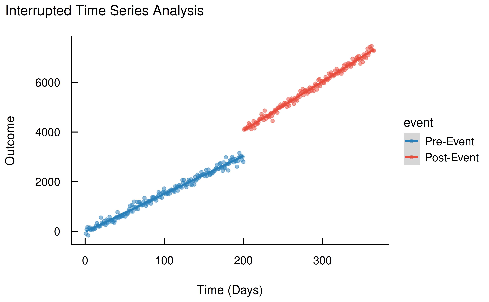

# Interrupted Time Series Analysis

## Introduction

Interrupted Time Series (ITS) analysis is a powerful quasi-experimental
design used to evaluate the effects of an intervention, policy change,
or event. The core idea is to study a sequence of observations on an
outcome over time, both before and after a specific intervention. By
modeling the trend before the intervention, we can create a
counterfactual scenario of what would have happened if the intervention
had not occurred. Comparing this counterfactual to the actual trend
observed after the intervention allows us to estimate the intervention’s
impact.

Two key effects are typically of interest in an ITS analysis:

1.  **Level Change**: An immediate, abrupt change in the outcome right
    after the intervention.
2.  **Slope Change**: A change in the trend or rate of change of the
    outcome following the intervention.

The `modelbased` package provides an intuitive and powerful set of tools
to estimate, test, and visualize these effects. This vignette will walk
you through a complete example of an ITS analysis.

## Setup and Data Simulation

First, let’s load the necessary package. We’ll use `modelbased` for the
analysis.

``` r

library(modelbased)
```

To demonstrate the method, we will simulate a dataset. Our time series
will have 365 time points (e.g., days). A known intervention occurs at
day 200.

``` r

set.seed(1234)

# Total number of days
n <- 365

# The day the event/intervention starts
event_start <- 200

# Time index from 1 to 365
time <- seq_len(n)

# Event variable: 0 before the intervention and 1 after
event <- c(rep_len(0, event_start), rep_len(1, n - event_start))
```

Now, we’ll generate our outcome variable. The formula below explicitly
defines the pre- and post-intervention dynamics:

``` r

# Outcome equation
outcome <-
  10 +                 # 1. Pre-intervention intercept
  15 * time +          # 2. Pre-intervention slope (trend)
  20 * event +         # 3. Level change (a jump of +20)
  5 * event * time +   # 4. Slope change (slope becomes 15 + 5 = 20)
  rnorm(n, mean = 0, sd = 100) # Add some random noise

dat <- data.frame(outcome, time, event)
# make event a factor for easier interpretation
dat$event <- factor(dat$event, labels = c("Pre-Event", "Post-Event"))
```

First, let’s visualize the data to see the intervention’s effect. We can
clearly see both the immediate jump at day 200 and the change in trend
afterward.

``` r

library(ggplot2)
library(see)

# Visualize the simulated data
ggplot(dat, aes(x = time, y = outcome, colour = event, group = event)) +
  geom_point(alpha = 0.5) +
  geom_smooth(method = "lm") +
  labs(title = "Interrupted Time Series Analysis", x = "Time (Days)", y = "Outcome") +
  theme_modern(show.ticks = TRUE) +
  scale_color_flat()
```



## Modeling the Time Series

The standard approach to modeling a simple ITS is with a linear model.
The key is to include the `time` variable, the `event` variable, and
their interaction.

- `time`: Models the underlying trend.
- `event`: Models the immediate level change.
- `time:event`: Models the change in trend (slope) after the
  intervention.

``` r

mod <- lm(outcome ~ time * event, data = dat)
```

## Analyzing the Intervention Effects

With our model fitted, we can now use `modelbased` to quantify and test
the intervention’s effects.

### 1. The Interruption: Level Change

First, let’s examine what the model estimates for the outcome right
before and right after the intervention at `time = 200`. We can use
[`estimate_means()`](https://easystats.github.io/modelbased/reference/estimate_means.md)
to get the predicted values at `time = 199` and `time = 200` for both
the factual (`event = Post-Event`) and counterfactual
(`event = Pre-Event`) scenarios.

``` r

estimate_means(mod, by = c("time=c(199,200)", "event"))
#> Estimated Marginal Means
#> 
#> time | event      |                  Mean (CI)
#> ----------------------------------------------
#> 199  | Pre-Event  | 3016.42 (2989.26, 3043.59)
#> 200  | Pre-Event  | 3031.70 (3004.33, 3059.07)
#> 199  | Post-Event | 4035.72 (4005.05, 4066.38)
#> 200  | Post-Event | 4055.53 (4025.14, 4085.92)
#> 
#> Variable predicted: outcome
#> Predictors modulated: time=c(199,200), event
```

To directly test if the immediate “jump” or “level change” at the moment
of the intervention is statistically significant, we can use
[`estimate_contrasts()`](https://easystats.github.io/modelbased/reference/estimate_contrasts.md).
We ask for the difference between `event = Post-Event` and
`event = Pre-Event` specifically at `time = 200`.

``` r

estimate_contrasts(mod, contrast = "event", by = "time=200")
#> Marginal Contrasts Analysis
#> 
#> Level1     | Level2    | time |           Difference (CI) |      p
#> ------------------------------------------------------------------
#> Post-Event | Pre-Event |  200 | 1023.83 (982.94, 1064.73) | <0.001
#> 
#> Variable predicted: outcome
#> Predictors contrasted: event
#> p-values are uncorrected.
```

The output shows a large, statistically significant difference of about
1020. This is our estimated **level change**. It represents the
immediate impact of the intervention.

### 2. The Change in Trend: Slope Change

Next, we want to know if the intervention changed the long-term trend of
the outcome. We can use
[`estimate_slopes()`](https://easystats.github.io/modelbased/reference/estimate_slopes.md)
to compute the slope of `time` for the pre-intervention period
(`event = Pre-Event`) and the post-intervention period
(`event = Post-Event`).

``` r

estimate_slopes(mod, trend = "time", by = "event")
#> Estimated Marginal Effects
#> 
#> event      |           Slope (CI) |      p
#> ------------------------------------------
#> Pre-Event  | 15.28 (15.04, 15.51) | <0.001
#> Post-Event | 19.82 (19.50, 20.13) | <0.001
#> 
#> Marginal effects estimated for time
#> Type of slope was dY/dX
```

The results show the pre-intervention slope was around 15, while the
post-intervention slope was around 20. But is this difference
statistically significant? We can again use
[`estimate_contrasts()`](https://easystats.github.io/modelbased/reference/estimate_contrasts.md),
this time contrasting the slopes of `time` across the levels of `event`.

``` r

estimate_contrasts(mod, contrast = "time", by = "event")
#> Marginal Contrasts Analysis
#> 
#> Level1     | Level2    |   Difference (CI) |      p
#> ---------------------------------------------------
#> Post-Event | Pre-Event | 4.54 (4.14, 4.94) | <0.001
#> 
#> Variable predicted: outcome
#> Predictors contrasted: time
#> Predictors averaged: time (1.8e+02)
#> p-values are uncorrected.
```

The result is a significant difference of approximately 5. This is our
estimated **slope change**. It tells us that after the intervention, the
outcome not only jumped to a new level but also started increasing at a
significantly faster rate.

## Conclusion

This vignette demonstrates how the `modelbased` package can be used to
conduct a comprehensive Interrupted Time Series analysis. By combining a
simple linear model with the
[`estimate_means()`](https://easystats.github.io/modelbased/reference/estimate_means.md),
[`estimate_slopes()`](https://easystats.github.io/modelbased/reference/estimate_slopes.md),
and
[`estimate_contrasts()`](https://easystats.github.io/modelbased/reference/estimate_contrasts.md)
functions, we can easily estimate and test for both immediate (level)
and sustained (slope) changes following an intervention. This workflow
provides a clear, powerful, and interpretable approach to evaluating the
impact of real-world events.
