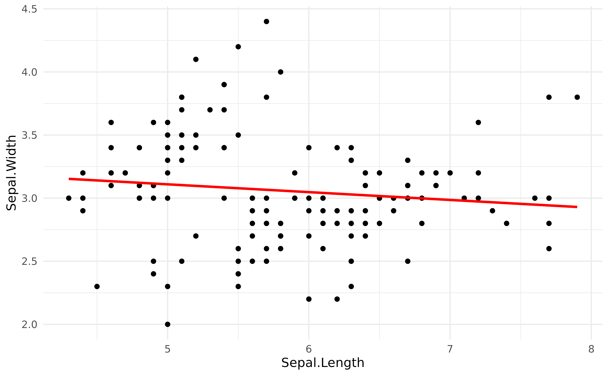
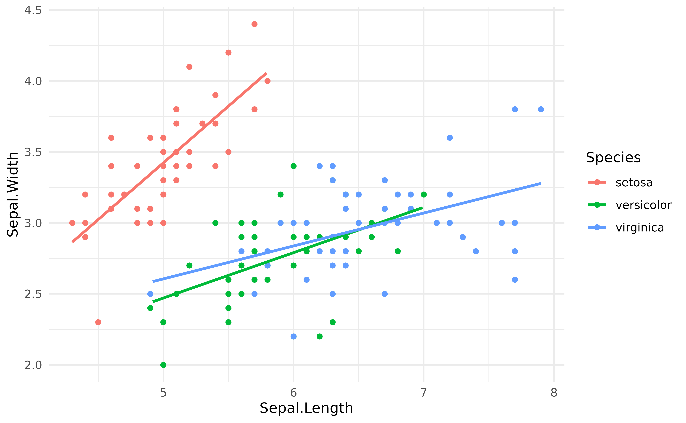
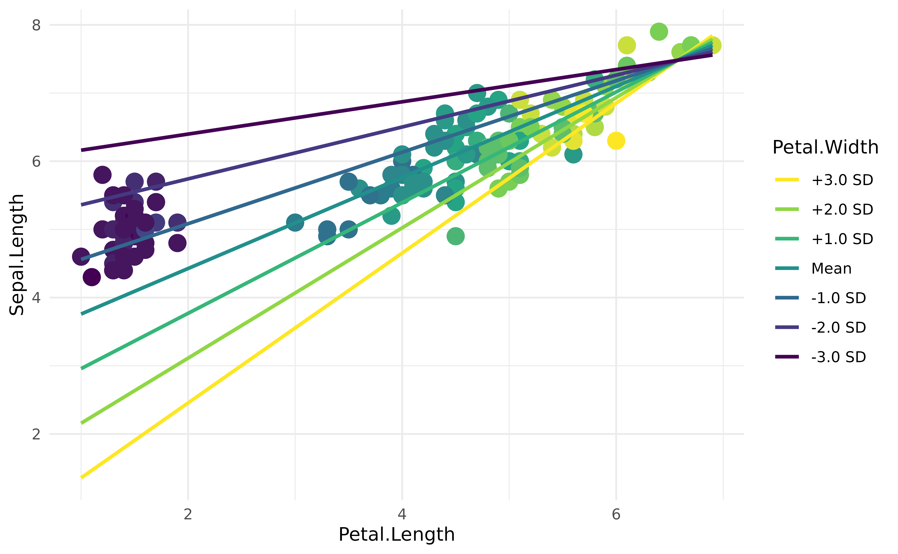

# Data grids

Sometimes, for instance for **visualization** purposes, we want to
extract a **reference grid** (or *data grid*) of our dataset, that we
will call a **visualisation matrix**. This reference grid usually
contains the same variables than the original dataset, but reorganized
in a particular, **balanced**, way. For instance, it might contain all
the combinations of factors, or equally spread points of a continuous
variable. These reference grids are often used as data for predictions
of statistical models, to help us represent and understand them.

## Simple linear regression

For instance, let’s fit a simple linear model that models the
relationship between `Sepal.Width` and `Sepal.Length`.

``` r

library(easystats)
library(ggplot2)

model <- lm(Sepal.Width ~ Sepal.Length, data = iris)
parameters(model)
```

    > Parameter    | Coefficient |   SE |        95% CI | t(148) |      p
    > -------------------------------------------------------------------
    > (Intercept)  |        3.42 | 0.25 | [ 2.92, 3.92] |  13.48 | < .001
    > Sepal Length |       -0.06 | 0.04 | [-0.15, 0.02] |  -1.44 | 0.152

The most obvious way of representing this model is to plot the data
points and add the regression line using the `geom_smooth` function from
`ggplot2`:

``` r

ggplot(iris, aes(x = Sepal.Length, y = Sepal.Width)) +
  geom_point() +
  geom_smooth(method = "lm") +
  theme_minimal()
```


But how to “access” the data of this regression line? One good option is
to select some values of of the predictor (`Sepal.Length`), and
**predict** (using the base R
[`predict()`](https://rdrr.io/r/stats/predict.html) method for now) the
response (`Sepal.Width`) using the model. Using these *x* and *y*
points, we can then create the regression line.

Let’s try the
[`get_datagrid()`](https://easystats.github.io/insight/reference/get_datagrid.html)
function from the **insight** package.

``` r

get_datagrid(iris["Sepal.Length"])
```

    > Visualisation Grid
    > 
    > Sepal.Length
    > ------------
    > 4.30        
    > 4.70        
    > 5.10        
    > 5.50        
    > 5.90        
    > 6.30        
    > 6.70        
    > 7.10        
    > 7.50        
    > 7.90

If we pass a numeric column to the function, it will return a vector of
**equally spread points** (having the same range, i.e., the same minimum
and maximum, than the original data). The default **length** is 10, but
we can adjust that through the `length` argument. For instance, for
linear relationships (i.e., a straight line), two points are in theory
sufficient. Let’s generate predictions using this reference grid of the
predictor.

``` r

vizdata <- get_datagrid(iris["Sepal.Length"], length = 2)
vizdata$Predicted <- predict(model, vizdata)
vizdata
```

    > Visualisation Grid
    > 
    > Sepal.Length | Predicted
    > ------------------------
    > 4.30         |      3.15
    > 7.90         |      2.93

Now that we have our *x* and *y* values, we can plot the line as an
overlay to the actual data points:

``` r

ggplot(iris, aes(x = Sepal.Length, y = Sepal.Width)) +
  geom_point() +
  geom_line(data = vizdata, aes(y = Predicted), linewidth = 1, color = "red") +
  theme_minimal()
```



As we can see, it is quite similar to the previous plot. So, when can
this be useful?

## Mixed models

Data grids are useful to represent more complex models. For instance, in
the models above, the **negative** relationship between the length and
width of the sepals is in fact biased by the presence of three different
species. One way of adjusting the model for this grouping structure is
to add it as a **random effect** in a **mixed model**. In the model
below, the “fixed” effects (the parameters of interest) will be adjusted
(“averaged over”) to the random effects.

``` r

library(lme4)

model <- lmer(Sepal.Width ~ Sepal.Length + (1 | Species), data = iris)
parameters(model)
```

    > # Fixed Effects
    > 
    > Parameter    | Coefficient |   SE |       95% CI | t(146) |      p
    > ------------------------------------------------------------------
    > (Intercept)  |        1.04 | 0.43 | [0.20, 1.89] |   2.45 | 0.015 
    > Sepal Length |        0.34 | 0.05 | [0.25, 0.44] |   7.47 | < .001
    > 
    > # Random Effects
    > 
    > Parameter               | Coefficient
    > -------------------------------------
    > SD (Intercept: Species) |        0.57
    > SD (Residual)           |        0.29

As we can see, when adjusting for the species, the relationship between
the two variables **has become positive**!

We can represent it using the same procedure as above, but note that
instead of using the base R
[`predict()`](https://rdrr.io/r/stats/predict.html) function, we will be
using
[*get_predicted()*](https://easystats.github.io/insight/reference/get_predicted.html),
from the **insight** package, which is a more robust and user-friendly
version of [`predict()`](https://rdrr.io/r/stats/predict.html).

``` r

vizdata <- get_datagrid(iris["Sepal.Length"])
vizdata$Predicted <- get_predicted(model, vizdata)

ggplot(iris, aes(x = Sepal.Length, y = Sepal.Width)) +
  geom_point(aes(color = Species)) +
  geom_line(data = vizdata, aes(y = Predicted), linewidth = 1) +
  theme_minimal()
```


## Fixed variables

The above way of constructing the reference grid, i.e., by providing a
single column of data to the function, is almost equivalent to the
following:

``` r

vizdata <- get_datagrid(iris, by = "Sepal.Length")
vizdata
```

    > Visualisation Grid
    > 
    > Sepal.Length | Sepal.Width | Petal.Length | Petal.Width | Species
    > -----------------------------------------------------------------
    > 4.30         |        3.06 |         3.76 |        1.20 | setosa 
    > 4.70         |        3.06 |         3.76 |        1.20 | setosa 
    > 5.10         |        3.06 |         3.76 |        1.20 | setosa 
    > 5.50         |        3.06 |         3.76 |        1.20 | setosa 
    > 5.90         |        3.06 |         3.76 |        1.20 | setosa 
    > 6.30         |        3.06 |         3.76 |        1.20 | setosa 
    > 6.70         |        3.06 |         3.76 |        1.20 | setosa 
    > 7.10         |        3.06 |         3.76 |        1.20 | setosa 
    > 7.50         |        3.06 |         3.76 |        1.20 | setosa 
    > 7.90         |        3.06 |         3.76 |        1.20 | setosa 
    > 
    > Maintained constant: Sepal.Width, Petal.Length, Petal.Width, Species

However, the other variables (present in the dataframe but not selected
as `at`) are “fixed”, *i.e.*, they are maintained at specific values.
This is useful when we have other variables in the model in whose effect
we are not interested.

By default, **factors** are fixed by their **“reference” level** and
**numeric variables** are fixed at their **mean**. However, this can be
easily changed:

``` r

vizdata <- get_datagrid(iris, by = "Sepal.Length", numerics = "min")
vizdata
```

    > Visualisation Grid
    > 
    > Sepal.Length | Sepal.Width | Petal.Length | Petal.Width | Species
    > -----------------------------------------------------------------
    > 4.30         |           2 |            1 |        0.10 | setosa 
    > 4.70         |           2 |            1 |        0.10 | setosa 
    > 5.10         |           2 |            1 |        0.10 | setosa 
    > 5.50         |           2 |            1 |        0.10 | setosa 
    > 5.90         |           2 |            1 |        0.10 | setosa 
    > 6.30         |           2 |            1 |        0.10 | setosa 
    > 6.70         |           2 |            1 |        0.10 | setosa 
    > 7.10         |           2 |            1 |        0.10 | setosa 
    > 7.50         |           2 |            1 |        0.10 | setosa 
    > 7.90         |           2 |            1 |        0.10 | setosa 
    > 
    > Maintained constant: Sepal.Width, Petal.Length, Petal.Width, Species

## Target variables

If more than one target variable is selected,
[`get_datagrid()`](https://easystats.github.io/insight/reference/get_datagrid.html)
will return the **combination** of them (*i.e.*, all unique values
crossed together). This can be useful in the case of an **interaction**
between a numeric variable and a factor.

Let’s visualise the regression line for each of the levels of `Species`:

``` r

model <- lm(Sepal.Width ~ Sepal.Length * Species, data = iris)

vizdata <- get_datagrid(iris, by = c("Sepal.Length", "Species"), length = 5)
vizdata$Predicted <- get_predicted(model, vizdata)
vizdata
```

    > Visualisation Grid
    > 
    > Sepal.Length | Species    | Sepal.Width | Petal.Length | Petal.Width | Predicted
    > --------------------------------------------------------------------------------
    > 4.30         | setosa     |        3.06 |         3.76 |        1.20 |      2.86
    > 5.20         | setosa     |        3.06 |         3.76 |        1.20 |      3.58
    > 6.10         | setosa     |        3.06 |         3.76 |        1.20 |      4.30
    > 7.00         | setosa     |        3.06 |         3.76 |        1.20 |      5.02
    > 7.90         | setosa     |        3.06 |         3.76 |        1.20 |      5.74
    > 4.30         | versicolor |        3.06 |         3.76 |        1.20 |      2.25
    > 5.20         | versicolor |        3.06 |         3.76 |        1.20 |      2.53
    > 6.10         | versicolor |        3.06 |         3.76 |        1.20 |      2.82
    > 7.00         | versicolor |        3.06 |         3.76 |        1.20 |      3.11
    > 7.90         | versicolor |        3.06 |         3.76 |        1.20 |      3.40
    > 4.30         | virginica  |        3.06 |         3.76 |        1.20 |      2.44
    > 5.20         | virginica  |        3.06 |         3.76 |        1.20 |      2.65
    > 6.10         | virginica  |        3.06 |         3.76 |        1.20 |      2.86
    > 7.00         | virginica  |        3.06 |         3.76 |        1.20 |      3.07
    > 7.90         | virginica  |        3.06 |         3.76 |        1.20 |      3.28
    > 
    > Maintained constant: Sepal.Width, Petal.Length, Petal.Width

``` r

ggplot(iris, aes(x = Sepal.Length, y = Sepal.Width, color = Species)) +
  geom_point() +
  geom_line(data = vizdata, aes(y = Predicted), linewidth = 1) +
  theme_minimal()
```


## Preserve range

However, it is generally not a good practice to extend the regression
lines beyond the range of its original data, as it is the case here for
the **red line**. The `preserve_range` option allows to remove
observations that are “outside” the original dataset (however, the
length should be increased to improve the precision toward the edges):

``` r

vizdata <- get_datagrid(iris,
  by = c("Sepal.Length", "Species"),
  length = 100,
  preserve_range = TRUE
)

vizdata$Predicted_Sepal.Width <- get_predicted(model, vizdata)

ggplot(iris, aes(x = Sepal.Length, y = Sepal.Width, color = Species)) +
  geom_point() +
  geom_line(data = vizdata, aes(y = Predicted_Sepal.Width), linewidth = 1) +
  theme_minimal()
```



## Visualising an interaction between two numeric variables (three-way interaction)

``` r

model <- lm(Sepal.Length ~ Petal.Length * Petal.Width, data = iris)
parameters(model)
```

    > Parameter                  | Coefficient |   SE |         95% CI | t(146) |      p
    > ----------------------------------------------------------------------------------
    > (Intercept)                |        4.58 | 0.11 | [ 4.36,  4.80] |  40.89 | < .001
    > Petal Length               |        0.44 | 0.07 | [ 0.31,  0.57] |   6.74 | < .001
    > Petal Width                |       -1.24 | 0.22 | [-1.67, -0.81] |  -5.65 | < .001
    > Petal Length × Petal Width |        0.19 | 0.03 | [ 0.12,  0.25] |   5.62 | < .001

This idea can also be used to visualise interactions between two numeric
variables, **aka the nightmare of every scientist**. One possibility is
to basically represent the relationship between the response and one
predictor **at a few representative values of the second predictor**.

In this case, we will represent the regression line between
`Sepal.Length` and `Petal.Length` and a 5 equally spaced values of
`Petal.Length`, to get a feel for the interaction.

We can obtain the right reference grid quite easily by chaining two data
grids together as follows:

``` r

vizdata <- iris |>
  get_datagrid(c("Petal.Length", "Petal.Width"), length = 10) |>
  get_datagrid("Petal.Width", length = 5, numerics = "all")
```

What did we do here? We started by generating a reference grid
containing all the combinations between the 10 equally spread values of
the two target variables, creating `10 * 10 = 100` rows. The next step
was to reduce `Petal.Length` to a set of 5 values, but without touching
the other variables (*i.e.*, keeping the 10 values created for
`Petal.Length`). This was achieved using `numerics = "all"`.

We can then visualise it as follows:

``` r

vizdata$Predicted <- get_predicted(model, vizdata)

iris |>
  ggplot(aes(x = Petal.Length, y = Sepal.Length, color = Petal.Width)) +
  geom_point() +
  geom_line(data = vizdata, aes(y = Predicted, group = Petal.Width), linewidth = 1) +
  scale_color_viridis_c() +
  theme_minimal()
```


Such plot can be more clear by expressing the interaction variable in
terms of deviations from the mean (as a standardized variable).

``` r

# Express values in an abstract way
vizdata$Petal.Width <- effectsize::format_standardize(
  vizdata$Petal.Width,
  reference = iris$Petal.Width
)

ggplot(iris, aes(x = Petal.Length, y = Sepal.Length)) +
  # Only shapes from 21 to 25 have a fill aesthetic
  geom_point2(aes(fill = Petal.Width), color = "white", shape = 21, size = 5) +
  geom_line(data = vizdata, aes(y = Predicted, color = Petal.Width), linewidth = 1) +
  scale_color_viridis_d(direction = -1) +
  scale_fill_viridis_c(guide = "none") +
  theme_minimal()
```


As the `Petal.Width` increases (becomes yellow), the coefficient between
`Petal.Length` and `Sepal.Length` increases (the slope is more steep).
Although, as we can guess, this in fact captures the underlying effect
of species… **but we’ll leave discussing the meaningfulness of your
models to you :)**

## `get_datagrid()` also runs directly on model objects

To illustrate this, let’s set up a **general additive mixed model
(GAMM)**, where we are going to specify a **smooth term** (a non-linear
relationship; specified by [`s()`](https://rdrr.io/pkg/mgcv/man/s.html)
function) and some **random effects** structure.

``` r

library(gamm4)

model <- gamm4::gamm4(
  formula = Petal.Length ~ Petal.Width + s(Sepal.Length),
  random = ~ (1 | Species),
  data = iris
)
```

One can directly extract the visualization matrix for this model by
entering the entire object into the function:

``` r

get_datagrid(model, length = 3, include_random = FALSE)
```

    > Visualisation Grid
    > 
    > Petal.Width | Sepal.Length
    > --------------------------
    > 0.10        |         4.30
    > 1.30        |         4.30
    > 2.50        |         4.30
    > 0.10        |         6.10
    > 1.30        |         6.10
    > 2.50        |         6.10
    > 0.10        |         7.90
    > 1.30        |         7.90
    > 2.50        |         7.90

We also skip the smooth term if we are interested only in the fixed
effects:

``` r

get_datagrid(model, length = 3, include_random = FALSE, include_smooth = FALSE)
```

    > Visualisation Grid
    > 
    > Petal.Width
    > -----------
    > 0.10       
    > 1.30       
    > 2.50       
    > 
    > Maintained constant: Sepal.Length

We can also include random effects:

``` r

get_datagrid(model, length = 5, include_random = TRUE)
```

    > Visualisation Grid
    > 
    > Petal.Width | Sepal.Length | Species   
    > ---------------------------------------
    > 0.10        |         4.30 | setosa    
    > 0.10        |         5.20 | setosa    
    > 1.30        |         5.20 | versicolor
    > 1.30        |         6.10 | versicolor
    > 1.30        |         7.00 | versicolor
    > 1.90        |         5.20 | virginica 
    > 2.50        |         5.20 | virginica 
    > 1.90        |         6.10 | virginica 
    > 2.50        |         6.10 | virginica 
    > 1.90        |         7.00 | virginica 
    > 2.50        |         7.00 | virginica 
    > 1.90        |         7.90 | virginica 
    > 2.50        |         7.90 | virginica

## Controlled standardized change

Although the plot above is nice, and all, we would like the standardized
changes in SD to be smoother (e.g., by increments of 1 SD). This can be
achieved by first requesting the values that we want, and then
**unstandardizing** it.

Let’s use the same model as above, and then obtain a data grid with
specific values for `Petal.Width`.

``` r

vizdata <- lm(Sepal.Length ~ Petal.Length * Petal.Width, data = iris) |>
  get_datagrid(by = c("Petal.Length", "Petal.Width = seq(-3, 3)")) |>
  unstandardize(vizdata, select = "Petal.Width") |>
  estimate_relation(vizdata)

vizdata$Petal.Width <- effectsize::format_standardize(vizdata$Petal.Width, reference = iris$Petal.Width)

# 6. Plot
ggplot(iris, aes(x = Petal.Length, y = Sepal.Length)) +
  geom_point2(aes(fill = Petal.Width), shape = 21, size = 5) +
  geom_line(data = vizdata, aes(y = Predicted, color = Petal.Width), linewidth = 1) +
  scale_color_viridis_d(direction = -1) +
  scale_fill_viridis_c(guide = "none") +
  theme_minimal()
```


