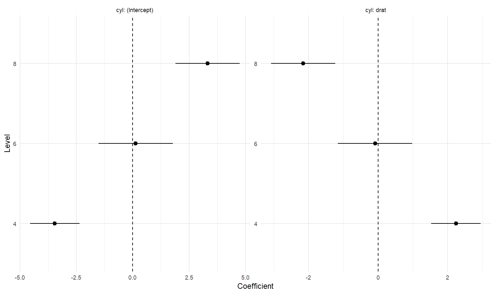
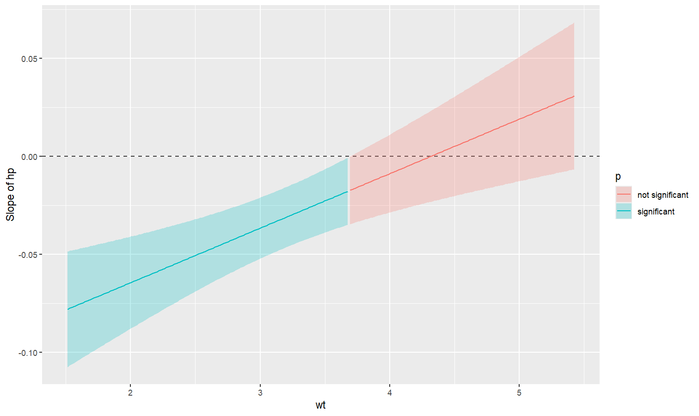
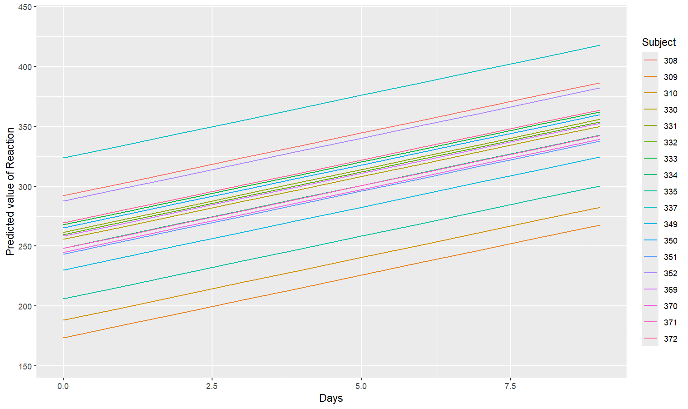
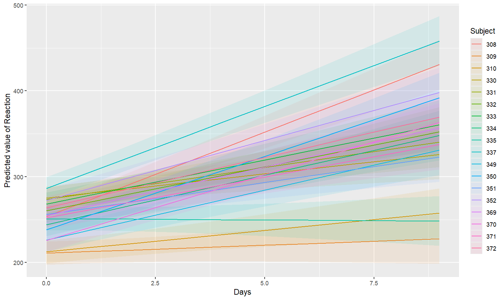
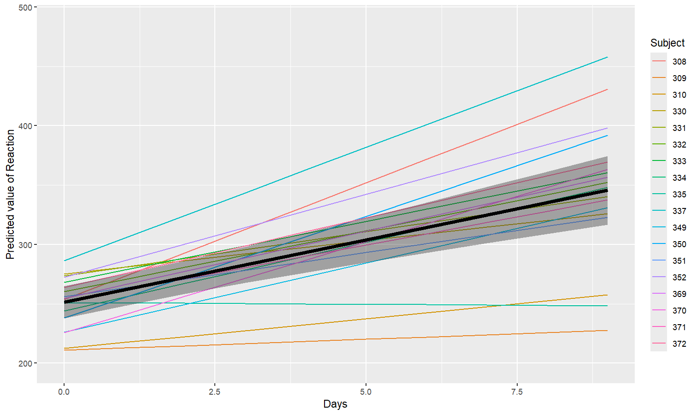

# modelbased

[](https://doi.org/10.21105/joss.07969)
[](https://cran.r-project.org/package=modelbased)
[](https://cranlogs.r-pkg.org/)

***Make the most out of your models***

------------------------------------------------------------------------

**modelbased** is a package helping with model-based estimations, to
easily compute marginal means, contrast analysis and model predictions.

The two probably most popular R packages for extracting these quantities
of interest are **emmeans** (Lenth, 2024) and **marginaleffects**
(Arel-Bundock et al., 2024). These packages pack an enormously rich set
of features and cover (almost) all imaginable needs for post-hoc
analysis of statistical models. But their power and flexibility can be
intimidating for users not familiar with the underlying statistical
concepts.

**modelbased**, built on top of these two packages, aims to unleash this
untapped potential by providing a unified interface to extract marginal
means, marginal effects, contrasts, comparisons, and model predictions
from a wide range of statistical models. In line with the **easystats**’
*raison d’être*, **modelbased** focuses on simplicity, flexibility, and
user-friendliness to help researchers harness the full power of their
models.

*How to start?*

The package’s approach simplifies estimation by focusing on three key
questions:

1.  Predictor of Interest: Which variable’s effect do you want to
    analyze? This is specified with the `by`, `contrast`, or `trend`
    arguments.

2.  Evaluation Points: At which specific values should the predictor be
    evaluated? This is also defined in the `by` argument. For a more
    refined control over the evaluation points, see the [data
    grids](https://easystats.github.io/insight/reference/get_datagrid.html)
    vignette.

3.  Target Population: What population should the inferences generalize
    to? The `estimate` argument controls this by defining whether
    predictions are for a typical individual, an average of the sample,
    or an average of a broader population.

## Installation

[](https://cran.r-project.org/package=modelbased)
[](https://easystats.r-universe.dev)
[](https://app.codecov.io/gh/easystats/modelbased)

The *modelbased* package is available on CRAN, while its latest
development version is available on R-universe (from *rOpenSci*).

| Type | Source | Command |
|----|----|----|
| Release | CRAN | `install.packages("modelbased")` |
| Development | R-universe | `install.packages("modelbased", repos = "https://easystats.r-universe.dev")` |

Once you have downloaded the package, you can then load it using:

``` r

library("modelbased")
```

> **Tip:**
>
> Instead of
> [`library(modelbased)`](https://easystats.github.io/modelbased/), use
> [`library(easystats)`](https://easystats.github.io/easystats/). This
> will make all features of the easystats-ecosystem available.
>
> To stay updated, use
> [`easystats::install_latest()`](https://easystats.github.io/easystats/reference/install_latest.html).

## Documentation

[](https://easystats.github.io/modelbased/)
[](https://easystats.github.io/blog/posts/)
[](https://easystats.github.io/modelbased/reference/index.html)

Access the package
[**documentation**](https://easystats.github.io/modelbased/), and
check-out these vignettes:

- [Data
  grids](https://easystats.github.io/insight/reference/get_datagrid.html)
- [What are, why use and how to get marginal
  means](https://easystats.github.io/modelbased/articles/estimate_means.html)
- [Contrast
  analysis](https://easystats.github.io/modelbased/articles/estimate_contrasts.html)
- [Marginal effects and
  derivatives](https://easystats.github.io/modelbased/articles/estimate_slopes.html)
- [Use a model to make
  predictions](https://easystats.github.io/modelbased/articles/estimate_response.html)
- [Interpret simple and complex models using the power of effect
  derivatives](https://easystats.github.io/modelbased/articles/derivatives.html)
- [How to use mixed models to estimate individuals’
  scores](https://easystats.github.io/modelbased/articles/estimate_grouplevel.html)
- [Visualize effects and
  interactions](https://easystats.github.io/modelbased/articles/estimate_relation.html)
- [The modelisation approach to
  statistics](https://easystats.github.io/modelbased/articles/modelisation_approach.html)

## Features

The core idea behind the **modelbased** package is that statistical
models often contain a lot more insights than what you get from simply
looking at the model parameters. In many cases, like models with
multiple interactions, non-linear effects, non-standard families,
complex random effect structures, the parameters can be hard to
interpret. This is where the **modelbased** package comes in.

To give a very simply example, imagine that you are interested in the
effect of 3 conditions *A*, *B* and *C* on a variable *Y*. A simple
linear model `Y ~ Condition` will give you 3 parameters: the intercept
(the average value of *Y* in condition *A*), and the relative effect of
condition *B* and *C*. But what you would like to also get is the
average value of *Y* in the other conditions too. Many people will
compute the average “by hand” (i.e., the *empirical average*) by
directly averaging their observed data in these groups. But did you know
that the *estimated average* (which can be much more relevant, e.g., if
you adjust for other variables in the model) is contained in your model,
and that you can get them easily by running
[`estimate_means()`](https://easystats.github.io/modelbased/reference/estimate_means.md)?

The **modelbased** package is built around 4 main functions:

- [`estimate_means()`](https://easystats.github.io/modelbased/reference/estimate_means.html):
  Estimates the average values at each factor levels
- [`estimate_contrasts()`](https://easystats.github.io/modelbased/reference/estimate_contrasts.html):
  Estimates and tests contrasts between different factor levels
- [`estimate_slopes()`](https://easystats.github.io/modelbased/reference/estimate_slopes.html):
  Estimates the slopes of numeric predictors at different factor levels
  or alongside a numeric predictor
- [`estimate_prediction()`](https://easystats.github.io/modelbased/reference/estimate_expectation.html):
  Make predictions using the model

These functions are based on important statistical concepts, like [data
grids](https://easystats.github.io/insight/reference/get_datagrid.html),
[predictions](https://easystats.github.io/insight/reference/get_predicted.html)
and *marginal effects*, and leverages other packages like
[**emmeans**](https://rvlenth.github.io/emmeans/) and
[**marginaleffects**](https://marginaleffects.com/). We recommend
reading about all of that to get a deeper understanding of the hidden
power of your models.

## Examples

### Estimate marginal means

- **Problem**: My model has a factor as a predictor, and the parameters
  only return the difference between levels and the intercept. I want to
  see the values *at* each factor level.
- **Solution**: Estimate model-based means (“marginal means”). You can
  visualize them by plotting their confidence interval and the original
  data.

Check-out the function
[**documentation**](https://easystats.github.io/modelbased/reference/estimate_means.html)
and [**this
vignette**](https://easystats.github.io/modelbased/articles/estimate_means.html)
for a detailed walkthrough on *marginal means*.

``` r

library(modelbased)
library(ggplot2)

# 1. The model
model <- lm(Sepal.Width ~ Species, data = iris)

# 2. Obtain estimated means
means <- estimate_means(model, by = "Species")
means
## Estimated Marginal Means
## 
## Species    | Mean |   SE |       95% CI | t(147)
## ------------------------------------------------
## setosa     | 3.43 | 0.05 | [3.33, 3.52] |  71.36
## versicolor | 2.77 | 0.05 | [2.68, 2.86] |  57.66
## virginica  | 2.97 | 0.05 | [2.88, 3.07] |  61.91
## 
## Variable predicted: Sepal.Width
## Predictors modulated: Species

# 3. Custom plot
ggplot(iris, aes(x = Species, y = Sepal.Width)) +
  # Add base data
  geom_violin(aes(fill = Species), color = "white") +
  geom_jitter(width = 0.1, height = 0, alpha = 0.5, size = 3) +
  # Add pointrange and line for means
  geom_line(data = means, aes(y = Mean, group = 1), linewidth = 1) +
  geom_pointrange(
    data = means,
    aes(y = Mean, ymin = CI_low, ymax = CI_high),
    size = 1,
    color = "white"
  ) +
  # Improve colors
  scale_fill_manual(values = c("pink", "lightblue", "lightgreen")) +
  theme_minimal()
```


You can also get a “quick” plot using the
[`plot()`](https://rdrr.io/r/graphics/plot.default.html) function:

``` r

plot(means)
```


### Contrast analysis

- **Problem**: The parameters of my model only return the difference
  between some of the factor levels and the intercept. I want to see the
  differences between each levels, as I would do with post-hoc
  comparison tests in ANOVAs.
- **Solution**: Estimate model-based contrasts (“marginal contrasts”).
  You can visualize them by plotting their confidence interval.

Check-out [**this
vignette**](https://easystats.github.io/modelbased/articles/estimate_contrasts.html)
for a detailed walkthrough on *contrast analysis*.

``` r

# 1. The model
model <- lm(Sepal.Width ~ Species, data = iris)

# 2. Estimate marginal contrasts
contrasts <- estimate_contrasts(model, contrast = "Species")
contrasts
## Marginal Contrasts Analysis
## 
## Level1     | Level2     | Difference |   SE |         95% CI | t(147) |      p
## ------------------------------------------------------------------------------
## versicolor | setosa     |      -0.66 | 0.07 | [-0.79, -0.52] |  -9.69 | < .001
## virginica  | setosa     |      -0.45 | 0.07 | [-0.59, -0.32] |  -6.68 | < .001
## virginica  | versicolor |       0.20 | 0.07 | [ 0.07,  0.34] |   3.00 |  0.003
## 
## Variable predicted: Sepal.Width
## Predictors contrasted: Species
## p-values are uncorrected.
```


### Check the contrasts at different points of another linear predictor

- **Problem**: In the case of an interaction between a factor and a
  continuous variable, you might be interested in computing how the
  differences between the factor levels (the contrasts) change depending
  on the other continuous variable.
- **Solution**: You can estimate the marginal contrasts at different
  values of a continuous variable (the *modulator*), and plot these
  differences (they are significant if their 95% CI doesn’t cover 0).

``` r

model <- lm(Sepal.Width ~ Species * Petal.Length, data = iris)
difference <- estimate_contrasts(
  model,
  contrast = "Species",
  by = "Petal.Length",
  length = 3
)
# no line break for table
print(difference, table_width = Inf)
## Marginal Contrasts Analysis
## 
## Level1     | Level2     | Petal.Length | Difference |   SE |         95% CI | t(144) |      p
## ---------------------------------------------------------------------------------------------
## versicolor | setosa     |         1.00 |      -1.70 | 0.34 | [-2.37, -1.02] |  -4.97 | < .001
## virginica  | setosa     |         1.00 |      -1.34 | 0.40 | [-2.13, -0.56] |  -3.38 | < .001
## virginica  | versicolor |         1.00 |       0.36 | 0.49 | [-0.61,  1.33] |   0.73 |  0.468
## versicolor | setosa     |         3.95 |      -1.74 | 0.65 | [-3.03, -0.45] |  -2.67 |  0.008
## virginica  | setosa     |         3.95 |      -1.79 | 0.66 | [-3.11, -0.48] |  -2.70 |  0.008
## virginica  | versicolor |         3.95 |      -0.06 | 0.15 | [-0.35,  0.24] |  -0.37 |  0.710
## versicolor | setosa     |         6.90 |      -1.78 | 1.44 | [-4.62,  1.06] |  -1.24 |  0.218
## virginica  | setosa     |         6.90 |      -2.25 | 1.42 | [-5.06,  0.56] |  -1.58 |  0.116
## virginica  | versicolor |         6.90 |      -0.47 | 0.28 | [-1.03,  0.09] |  -1.65 |  0.101
## 
## Variable predicted: Sepal.Width
## Predictors contrasted: Species
## p-values are uncorrected.
```

``` r

# Recompute contrasts with a higher precision (for a smoother plot)
contrasts <- estimate_contrasts(
  model,
  contrast = "Species",
  by = "Petal.Length",
  length = 20,
  # we use a emmeans here because marginaleffects doesn't
  # generate more than 25 rows for pairwise comparisons
  backend = "emmeans"
)

# Add Contrast column by concatenating
contrasts$Contrast <- paste(contrasts$Level1, "-", contrasts$Level2)

# Plot
ggplot(contrasts, aes(x = Petal.Length, y = Difference, )) +
  # Add line and CI band
  geom_line(aes(color = Contrast)) +
  geom_ribbon(aes(ymin = CI_low, ymax = CI_high, fill = Contrast), alpha = 0.2) +
  # Add line at 0, indicating no difference
  geom_hline(yintercept = 0, linetype = "dashed") +
  # Colors
  theme_modern()
```


### Create smart grids to represent complex interactions

- **Problem**: I want to graphically represent the interaction between
  two continuous variable. On top of that, I would like to express one
  of them in terms of standardized change (i.e., standard deviation
  relative to the mean).
- **Solution**: Create a data grid following the desired specifications,
  and feed it to the model to obtain predictions. Format some of the
  columns for better readability, and plot using **ggplot**.

Check-out [**this
vignette**](https://easystats.github.io/modelbased/articles/visualisation_matrix.html)
for a detailed walkthrough on *visualisation matrices*.

``` r

# 1. Fit model and get visualization matrix
model <- lm(Sepal.Length ~ Petal.Length * Petal.Width, data = iris)

# 2. Create a visualisation matrix with expected Z-score values of Petal.Width
vizdata <- insight::get_datagrid(model, by = c("Petal.Length", "Petal.Width = c(-1, 0, 1)"))

# 3. Revert from expected SD to actual values
vizdata <- unstandardize(vizdata, select = "Petal.Width")

# 4. Add predicted relationship from the model
vizdata <- modelbased::estimate_expectation(vizdata)

# 5. Express Petal.Width as z-score ("-1 SD", "+2 SD", etc.)
vizdata$Petal.Width <- effectsize::format_standardize(vizdata$Petal.Width, reference = iris$Petal.Width)

# 6. Plot
ggplot(iris, aes(x = Petal.Length, y = Sepal.Length)) +
  # Add points from original dataset (only shapes 21-25 have a fill aesthetic)
  geom_point(aes(fill = Petal.Width), size = 5, shape = 21) +
  # Add relationship lines
  geom_line(data = vizdata, aes(y = Predicted, color = Petal.Width), linewidth = 1) +
  # Improve colors / themes
  scale_color_viridis_d(direction = -1) +
  scale_fill_viridis_c(guide = "none") +
  theme_minimal()
```


### Generate predictions from your model to compare it with original data

- **Problem**: You fitted different models, and you want to intuitively
  visualize how they compare in terms of fit quality and prediction
  accuracy, so that you don’t only rely on abstract indices of
  performance.
- **Solution**: You can predict the response variable from different
  models and plot them against the original true response. The closest
  the points are on the identity line (the diagonal), the closest they
  are from a perfect fit.

Check-out [**this
vignette**](https://easystats.github.io/modelbased/articles/estimate_response.html)
for a detailed walkthrough on *predictions*.

``` r

# Fit model 1 and predict the response variable
model1 <- lm(Petal.Length ~ Sepal.Length, data = iris)
pred1 <- estimate_expectation(model1)
pred1$Petal.Length <- iris$Petal.Length # Add true response

# Print first 5 lines of output
head(pred1, n = 5)
## Model-based Predictions
## 
## Sepal.Length | Predicted |   SE |       95% CI | Residuals | Petal.Length
## -------------------------------------------------------------------------
## 5.10         |      2.38 | 0.10 | [2.19, 2.57] |     -0.98 |         1.40
## 4.90         |      2.00 | 0.11 | [1.79, 2.22] |     -0.60 |         1.40
## 4.70         |      1.63 | 0.12 | [1.39, 1.87] |     -0.33 |         1.30
## 4.60         |      1.45 | 0.13 | [1.19, 1.70] |      0.05 |         1.50
## 5.00         |      2.19 | 0.10 | [1.99, 2.39] |     -0.79 |         1.40
## 
## Variable predicted: Petal.Length

# Same for model 2
model2 <- lm(Petal.Length ~ Sepal.Length * Species, data = iris)
pred2 <- estimate_expectation(model2)
pred2$Petal.Length <- iris$Petal.Length


# Initialize plot for model 1
ggplot(data = pred1, aes(x = Petal.Length, y = Predicted)) +
  # with identity line (diagonal) representing perfect predictions
  geom_abline(linetype = "dashed") +
  # Add the actual predicted points of the models
  geom_point(aes(color = "Model 1")) +
  geom_point(data = pred2, aes(color = "Model 2")) +
  # Aesthetics changes
  labs(y = "Petal.Length (predicted)", color = NULL) +
  scale_color_manual(values = c("Model 1" = "blue", "Model 2" = "red")) +
  theme_modern()
```


### Extract and format group-level random effects

- **Problem**: You have a mixed model and you would like to easily
  access the random part, i.e., the group-level effects (e.g., the
  individuals scores).
- **Solution**: You can apply `estimate_grouplevel` on a mixed model.

See [**this
vignette**](https://easystats.github.io/modelbased/articles/estimate_grouplevel.html)
for more information.

``` r

library(lme4)

model <- lmer(mpg ~ drat + (1 + drat | cyl), data = mtcars)

random <- estimate_grouplevel(model)
random
## Group | Level | Parameter   | Coefficient |   SE |         95% CI
## -----------------------------------------------------------------
## cyl   | 4     | (Intercept) |       -3.45 | 0.56 | [-4.55, -2.36]
## cyl   | 4     | drat        |        2.24 | 0.36 | [ 1.53,  2.95]
## cyl   | 6     | (Intercept) |        0.13 | 0.84 | [-1.52,  1.78]
## cyl   | 6     | drat        |       -0.09 | 0.54 | [-1.15,  0.98]
## cyl   | 8     | (Intercept) |        3.32 | 0.73 | [ 1.89,  4.74]
## cyl   | 8     | drat        |       -2.15 | 0.47 | [-3.07, -1.23]

plot(random) +
  geom_hline(yintercept = 0, linetype = "dashed") +
  theme_minimal()
```



### Estimate derivative of non-linear relationships (e.g., in GAMs)

- **Problem**: You model a non-linear relationship using polynomials,
  splines or GAMs. You want to know which parts of the curve are
  significant positive or negative trends.
- **Solution**: You can estimate the *derivative* of smooth using
  `estimate_slopes`.

The two plots below represent the modeled (non-linear) effect estimated
by the model, i.e., the relationship between the outcome and the
predictor, as well as the “trend” (or slope) of that relationship at any
given point. You can see that whenever the slope is negative, the effect
is below 0, and vice versa, with some regions of the effect being
significant (i.e., positive or negative with enough confidence) while
the others denote regions where the relationship is rather flat.

Check-out [**this
vignette**](https://easystats.github.io/modelbased/articles/estimate_slopes.html)
for a detailed walkthrough on *marginal effects*.

``` r

library(patchwork)

# Fit a non-linear General Additive Model (GAM)
model <- mgcv::gam(Sepal.Width ~ s(Petal.Length), data = iris)

# 1. Compute derivatives
deriv <- estimate_slopes(model,
  trend = "Petal.Length",
  by = "Petal.Length",
  length = 200
)

# 2. Visualize predictions and derivative
plot(estimate_relation(model, length = 200)) /
  plot(deriv) +
  geom_hline(yintercept = 0, linetype = "dashed")
```


### Describe the smooth term by its linear parts

- **Problem**: You model a non-linear relationship using polynomials,
  splines or GAMs. You want to describe it in terms of linear parts:
  where does it decrease, how much, where does it increase, etc.
- **Solution**: You can apply
  [`describe_nonlinear()`](https://easystats.github.io/modelbased/reference/describe_nonlinear.md)
  on a predicted relationship that will return the different parts of
  increase and decrease.

``` r

model <- lm(Sepal.Width ~ poly(Petal.Length, 2), data = iris)

# 1. Visualize
vizdata <- estimate_relation(model, length = 30)

ggplot(vizdata, aes(x = Petal.Length, y = Predicted)) +
  geom_ribbon(aes(ymin = CI_low, ymax = CI_high), alpha = 0.3) +
  geom_line() +
  # Add original data points
  geom_point(data = iris, aes(x = Petal.Length, y = Sepal.Width)) +
  # Aesthetics
  theme_modern()
```


``` r


# 2. Describe smooth line
describe_nonlinear(vizdata, x = "Petal.Length")
## Start |  End | Length | Change | Slope |   R2
## ---------------------------------------------
## 1.00  | 4.05 |   0.50 |  -0.84 | -0.28 | 0.05
## 4.05  | 6.90 |   0.47 |   0.66 |  0.23 | 0.05
```

### Plot all posterior draws for Bayesian models predictions

See [**this
vignette**](https://easystats.github.io/modelbased/articles/estimate_response.html)
for a walkthrough on how to do that.

### Understand interactions between two continuous variables

Also referred to as **Johnson-Neyman intervals**, this plot shows how
the effect (the “slope”) of one variable varies depending on another
variable. It is useful in the case of complex interactions between
continuous variables.

For instance, the plot below shows that the effect of `hp` (the y-axis)
is significantly negative only when `wt` is low (`< ~4`).

``` r

model <- lm(mpg ~ hp * wt, data = mtcars)

slopes <- estimate_slopes(model, trend = "hp", by = "wt", length = 200)

plot(slopes)
```



### Visualize predictions with random effects

Aside from plotting the coefficient of each random effect (as done
[here](https://github.com/easystats/modelbased#extract-and-format-group-level-random-effects)),
we can also visualize the predictions of the model for each of these
levels, which can be useful to diagnostic or see how they contribute to
the fixed effects. We will do that by making predictions with
[`estimate_relation()`](https://easystats.github.io/modelbased/reference/estimate_expectation.md)
and setting `include_random` to `TRUE`.

Let’s model the reaction time with the number of days of sleep
deprivation as fixed effect and the participants as random intercept.

``` r

library(lme4)

model <- lmer(Reaction ~ Days + (1 | Subject), data = sleepstudy)

preds <- estimate_relation(model, include_random = TRUE)

plot(preds, ribbon = list(alpha = 0)) # Make CI ribbon transparent for clarity
```



As we can see, each participant has a different “intercept” (starting
point on the y-axis), but all their slopes are the same: this is because
the only slope is the “general” one estimated across all participants by
the fixed effect. Let’s address that and allow the slope to vary for
each participant too.

``` r

model <- lmer(Reaction ~ Days + (1 + Days | Subject), data = sleepstudy)

preds <- estimate_relation(model, include_random = TRUE)

plot(preds, ribbon = list(alpha = 0.1))
```



As we can see, the effect is now different for all participants. Let’s
plot, on top of that, the “fixed” effect estimated across all these
individual effects.

``` r

fixed_pred <- estimate_relation(model) # This time, include_random is FALSE (default)

plot(preds, ribbon = list(alpha = 0)) + # Previous plot
  geom_ribbon(data = fixed_pred, aes(x = Days, ymin = CI_low, ymax = CI_high), alpha = 0.4) +
  geom_line(data = fixed_pred, aes(x = Days, y = Predicted), linewidth = 2)
```



## Technical Details

The algorithmic heavy lifting is done by
[modelbased](https://easystats.github.io/modelbased/)’s two back-end
packages, [emmeans](https://rvlenth.github.io/emmeans/) and
[marginaleffects](https://marginaleffects.com/) (the default), which can
be set as a global option (e.g., with
`options(modelbased_backend = "emmeans")`).

Of the two, [emmeans](https://rvlenth.github.io/emmeans/) [(Russell,
2024)](https://doi.org/10.32614/CRAN.package.emmeans) is the more senior
package and was originally known as `{lsmeans}` (for “Least-Squares
Means”). This term has been historically used to describe what are now
more commonly referred to as “Estimated Marginal Means” or EMMs:
predictions made over a regular grid—a grid typically constructed from
all possible combinations of the categorical predictors in the model and
the mean of numerical predictors. The package was renamed in 2016 to
[emmeans](https://rvlenth.github.io/emmeans/) to clarify its extension
beyond least-squares estimation and its support of a wider range of
models (e.g., Bayesian models).

Within [emmeans](https://rvlenth.github.io/emmeans/), estimates are
generated as a linear function of the model’s coefficients, with
standard errors produced in a similar manner by taking a linear
combination of the coefficients’ variance-covariance matrix. For example
if b is a vector of 4 coefficients, and V is a 4-by-4 matrix of the
coefficients’ variance-covariance, we can get an estimate and SE for a
linear combination (or set of linear combinations) L like so:

\hat{b} = L \cdot b

SE\_{\hat{b}} = \sqrt{\text{diag}(L \cdot V \cdot L^T)}

These grid predictions are sometimes averaged over (averaging being a
linear operation itself) to produce “marginal” predictions (in the sense
of marginalized-over): means. These predictions can then be contrasted
using various built-in or custom contrasts weights to obtain meaningful
estimates of various effects. Using linear combinations with regular
grids often means that results from
[emmeans](https://rvlenth.github.io/emmeans/) directly correspond to a
models coefficients (which is a benefit for those who are used to
understanding models by examining coefficient tables).

[marginaleffects](https://marginaleffects.com/) [(Arel-Bundock et al.,
2024)](https://doi.org/10.18637/jss.v111.i09) was more recently
introduced and also relies on the Delta method, but uses numeric
differentiation (and can easily switch to bootstrap or simulation-based
approaches). By default, it estimates various effects by generating two
counter-factual predictions of unit-level observations, then taking the
difference between them - which can easily be done on the response
scale, rather than the link scale. Because these effects are calculated
for every observation, they can then be averaged (e.g., as an Average
Treatment Effect). This approach is more iterative compared to the
linear matrix multiplication used by
[emmeans](https://rvlenth.github.io/emmeans/), but is similarly
efficient.

While both packages employ the Delta method to obtain standard errors on
transformed scales, they differ in how they construct and average
predictions. [emmeans](https://rvlenth.github.io/emmeans/) often
produces *effects at the mean* of non-focal predictors (via linear
contrasts), whereas [marginaleffects](https://marginaleffects.com/)
tends to compute *mean effects* by averaging over observations.
Depending on the model and the type of quantity you want to estimate,
results from these two approaches can be very similar—or differ in
interesting ways.

Note that [emmeans](https://rvlenth.github.io/emmeans/) can also perform
numeric differentiation or use non-regular grids, just as
[marginaleffects](https://marginaleffects.com/) can construct linear
predictions at the mean. Because each package has evolved with slightly
different philosophies regarding how to form and interpret predictions,
users can select whichever approach best suits their research questions.
In [modelbased](https://easystats.github.io/modelbased/), you can switch
easily between either back end by setting the global option, for example
`options(modelbased_backend = "marginaleffects")`, to access these
features.

Finally, [modelbased](https://easystats.github.io/modelbased/) leverages
the `get_datagrid()` function from the
[insight](https://easystats.github.io/insight/) package [(Lüdecke et
al., 2019)](https://doi.org/10.21105/joss.01412) to intuitively generate
an appropriate grid of data points for which predictions or effects or
slopes will be estimated. Since these packages support a wider range of
models - including generalized linear models, mixed models, and Bayesian
models - [modelbased](https://easystats.github.io/modelbased/) also
inherits the support for such models.

## Citation

If this package helped you, please consider citing as follows:

Makowski, D., Ben-Shachar, M. S., Wiernik, B. M., Patil, I., Thériault,
R., & Lüdecke, D. (2025). modelbased: An R package to make the most out
of your statistical models through marginal means, marginal effects, and
model predictions. Journal of Open Source Software, 10(109), 7969. doi:
10.21105/joss.07969

## Code of Conduct

Please note that the modelbased project is released with a [Contributor
Code of
Conduct](https://easystats.github.io/modelbased/CODE_OF_CONDUCT.html).
By contributing to this project, you agree to abide by its terms.

Arel-Bundock, V., Greifer, N., & Heiss, A. (2024). How to interpret
statistical models using marginaleffects for R and Python. *Journal of
Statistical Software*, *111*, 1–32.
<https://doi.org/10.18637/jss.v111.i09>

Lenth, R. V. (2024). *emmeans: Estimated marginal means, aka
least-squares means*. <https://doi.org/10.32614/CRAN.package.emmeans>
