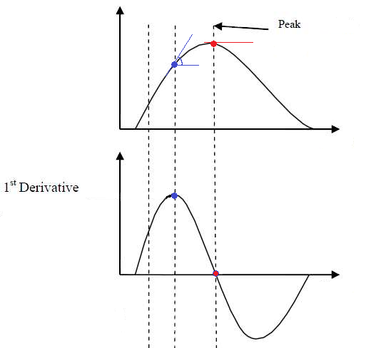

```{r, include=FALSE, message=FALSE, warning=FALSE}
library(knitr)
options(knitr.kable.NA = "")
knitr::opts_chunk$set(
  comment = ">",
  dpi = 450,
  out.width = "100%",
  warning = FALSE,
  message = FALSE
)
options(digits = 2)

if (!requireNamespace("ggplot2", quietly = TRUE) ||
  !requireNamespace("see", quietly = TRUE) ||
  !requireNamespace("rstanarm", quietly = TRUE) ||
  !requireNamespace("dplyr", quietly = TRUE)) {
  knitr::opts_chunk$set(eval = FALSE)
}

set.seed(333)
```


One floating assumption that can be encountered is that "complex models" should be used for "complex" stuff (data, designs, ...), and that simple models are enough for simple tasks. **Why shoot a fly with a bazooka?** In this vignette, we are going to show that, sometimes, the bazooka can be so versatile that it works just as easily on a fly as a flyswatter. In particular, we will investigate how the combination **GAM + Effect Derivative** can be used, even in simple contexts, to **make your data analysis easier**.

# The Traditional Approach

Let's say we are interested in the relationship between *y* and *x* in the following dataset:

```{r}
# Package to fit GAMs
library(mgcv)

# Tidyverse
library(dplyr)
library(ggplot2)

# Easystats
library(datawizard)
library(parameters)
library(modelbased)
library(report)
library(see)

set.seed(333)

# Generate data
data <- bayestestR::simulate_correlation(r = 0.85, n = 1000, names = c("y", "x"), mean = c(100, 0), sd = c(15, 1))

ggplot(data, aes(x, y)) +
  geom_point()
```

Upon visualizing the data, some people might say: "well, the most straightforward thing to do is to run a **correlation analysis**" (they might not be wrong, but for the sake of the demonstration, we will push things further here). Let's do that:

```{r eval=FALSE}
rez <- cor.test(data$y, data$x)
report::report(rez)
```
```{r echo=FALSE, results='markup'}
print(report::report(cor.test(data$y, data$x)), width = 80)
```

Great, we know there is a significant correlation between the two variables! 🥳 

But what we would like to know is **for every increase of 1 on *x*, how much does *y* increase?** In other words, what is the **slope** of the relationship?

The traditional approach to this is to fit a **linear model**, and assess its **parameters**. Indeed, the slope of the linear relationship between a predictor and its outcome is actually what the **effects** estimated by the regression correspond to.

Let's fit a linear regression model, visualize it, and describe its parameters.

```{r}
model_lm <- lm(y ~ x, data = data)

plot(modelbased::estimate_relation(model_lm))

parameters::parameters(model_lm)
```

The parameters table shows us that the **effect of x** is `12.75`. This means that for every increase of 1 on `x`, `y` increases by `12.75`. 

Congrats, we've answered our question!

# GAMs can be used for linear relationships too!

> *A new player has entered the game.*

You might have heard of **General Additive Models**, aka **GAMs**, that extend general linear models (GLMs) by enabling an elegant and robust way of modelling non-linear relationships. But it's not because they are good with curvy relationships that they cannot do simple stuff too! We can even use them **for linear links**, or, in general, when we are not sure about the exact shape of the relationship. Because GAMs usually penalize wiggly patterns, they have no problems with approximating linear relationship, if this is what the data indicates.

GAMs can be fitted using the `mgcv` package, and the only change is that we need to specify a **smooth** term (`s()`) for the variable for which we want to estimate the (non-necessarily linear) relationship.

```{r}
model_gam <- mgcv::gam(y ~ s(x), data = data)

plot(modelbased::estimate_relation(model_gam), line = list(color = "blue"))

parameters::parameters(model_gam)
```

Wow, the GAM-based modeled relationship is near-exactly the same as that of the GLM! **GAMs are powerful** 😎

Okay, that's cool, but there's one *slight* issue. If you look at the parameters table, there is indeed one line for the "smooth term", but it has... **no coefficient!** Indeed, because GAMs don't model straight lines, it doesn't return the value of the slope. That's why some people consider GAMs complicated to discuss statistically, as their parameters are not easily interpretable.


> Owww, so it is an issue considering our question about the effect of *x* on *y* 😕

Or **is it?**


# Effect Derivatives

Let us introduce another concept that is likely to get very popular in the near future within the world of regressions. **Derivatives**. You might remember from your math class in high school that derivatives are basically the *pattern of the slope of a pattern* <sub>(pattern-ception much)</sub>.

```{r echo=FALSE, fig.align='center', out.width="66%"}

```


In the figure above, the above plot shows a non-linear relationship between the variables, and the below-plot shows its **1st order derivative**, i.e., the evolution of the slope of that curve. It might take a bit of time to mentally wrap your head around this transformation, but once you get it, it will become very easy to think in terms of derivatives.

You can see that the derivative peaks when the slope of the relationship is at its highest (when it is the steepest), and then decrease again until reaching 0. A zero-crossing of the derivative means an inversion of the the trend; it is when the relationship starts to be negative.

Derivatives can be computed for statistical models, including simple ones such as linear regressions. Before you look at the answer below, try to think and imagine what would the derivative plot of our previously computed linear model would look like? 

We know that the slope is `12.75` (from our parameters analysis). Does it change across the course of the relationship? No, because it is a straight line, so the slope is constant. If the slope is constant, then the derivative should be... a constant line too, right? Let's verify this.

To compute the derivative, we can use the `estimate_slopes()` function, and specify that we want to know: the trend of *x* **over the course of** ("at") itself.

```{r}
deriv <- modelbased::estimate_slopes(model_lm, trend = "x", at = "x")

plot(deriv) + # add a dashed line at 0 to show absence of effect
  geom_hline(yintercept = 0, linetype = "dashed") 

summary(deriv)
```

The plot shows a straight horizontal line at 12.75, with a fixed confidence interval (the same as in the parameter table). That is expected, by definition, a linear model models a straight line with a fixed slope.

By running `summary()` on the derivative, we obtain a summary by "segments" (positive, flat, negative). Here, there is only one segment, which average coefficient corresponds to the regression parameter.

**This means that we don't really need the parameters table.** Indeed, all the information about the slope can be retrieved from the effect derivative. And guess what... it can be applied to **any model**!

Such as GAMs. Lets' to the same for our GAM model:

```{r}
deriv <- modelbased::estimate_slopes(model_gam, trend = "x", at = "x")

plot(deriv, line = list(color = "blue")) +
  geom_hline(yintercept = 0, linetype = "dashed")

summary(deriv)
```

Isn't that amazing, the results are *identical*. The moral of the story is that **GAMs can be used in a wide variety of contexts, even for simple cases**, and that derivatives are an easy way of interpreting them.

Let's jump to another example!


# GAM + Derivatives > LM: a polynomial regression example

We mentioned that one of the GAMs "limitation" is that their parameters are not easily interpretable. We were assuming that for other classes of models, such as GLMs, it was the case.

However, it is **very common to have difficult-to-interpret parameters in normal regression models too!** Let's take the case of a **polynomial regression**, that we could use to model the following data:

```{r}
data$y2 <- data$x^2 + rnorm(nrow(data), sd = 0.5)

ggplot(data, aes(x, y2)) +
  geom_point()
```

Let us fit a polynomial regression:

```{r}
model_poly <- lm(y2 ~ poly(x, 2), data = data)

# Length is increased to have a smoother line
plot(modelbased::estimate_relation(model_poly, length = 30))

parameters::parameters(model_poly)
```

If you look at the parameters table, it is also a bit unclear what do the coefficient refer too. How to interpret these numbers? Trying to understand that would require you a lot of search and understanding about how polynomials work. **Ain't nobody got time for dat'!**

Instead, we can rely on our *good ol'* derivatives to obtain the "linear slope" at every point of the curve.


```{r}
deriv <- modelbased::estimate_slopes(model_poly, trend = "x", at = "x")

plot(deriv) +
  geom_hline(yintercept = 0, linetype = "dashed")

summary(deriv)
```

If you know a bit theory about derivatives, you won't be suprised to find out that the derivative of a 2nd order polynomial (`x + x^2`) is actually a linear line. We can conclude from this plot that the slope is (**significantly**, because the confidence interval does not cover 0) negative until 0, and then becomes positive. 0 corresponds indeed to the point of inversion of the curve.

Moral of the story? **Derivatives can be used to easily interpret and draw conclusions about relationships from models in which parameters are not straightforward to interpret.**

But, if you've been attentive up to this point, you might wonder: **why bother with polynomials at all when GAMs can do the trick?**


```{r}
model_gam2 <- mgcv::gam(y2 ~ s(x), data = data)

plot(modelbased::estimate_relation(model_gam2, length = 100), line = list(color = "blue"))

# Increase precision
deriv <- modelbased::estimate_slopes(model_gam2, trend = "x", at = "x", length = 100)

plot(deriv, line = list(color = "blue")) +
  geom_hline(yintercept = 0, linetype = "dashed")

summary(deriv)
```


The conclusion is very similar, it shows a significant effect that goes from negative to positive and becomes flat (i.e., non-significant) around 0.

What about *3rd-degree-type* relationships? It works the same way:

```{r}
data$y3 <- data$x^3 + rnorm(nrow(data), sd = 1)

model_gam3 <- mgcv::gam(y3 ~ s(x), data = data)

plot(modelbased::estimate_relation(model_gam3, length = 100), line = list(color = "blue"))

deriv <- modelbased::estimate_slopes(model_gam3, trend = "x", at = "x", length = 100)

plot(deriv, line = list(color = "blue")) +
  geom_hline(yintercept = 0, linetype = "dashed")
```

Again, the GAM nicely recovered the shape of the relationship. 

**In summary, effects derivatives can be used to easily leverage the power of GAMs.**
