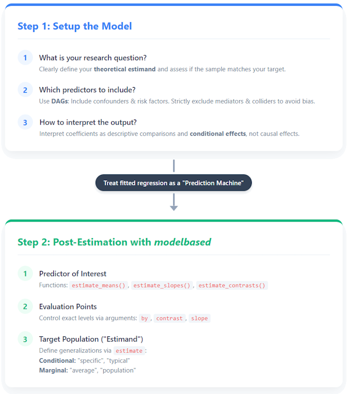
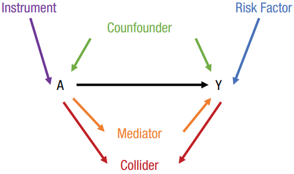

Completing the analytic workflow means understanding that fitting the model is just the beginning. The `modelbased` package helps you extract multiple insights from one comprehensive model, moving from exploratory analysis to formal hypothesis testing.

This vignette illustrates a two-step framework for statistical modeling:

1. **Setup the Model**: Defining the estimand, selecting predictors via Directed Acyclic Graphs (DAGs), and understanding coefficients as descriptive comparisons.

2. **Post-Estimation**: Utilizing `modelbased` functions to query the model using specific predictors of interest, evaluation points, and target populations.

```{r set-options, echo = FALSE, warning=FALSE}
knitr::opts_chunk$set(
  collapse = TRUE,
  comment = "#>",
  dev = "png",
  out.width = "100%",
  dpi = 300,
  message = FALSE,
  warning = FALSE,
  package.startup.message = FALSE
)

options(modelbased_join_dots = FALSE)
options(modelbased_select = "minimal")

pkgs <- c(
  "glmmTMB",
  "grid",
  "marginaleffects",
  "ggplot2"
)

if (!all(insight::check_if_installed(pkgs, quietly = TRUE))) {
  knitr::opts_chunk$set(eval = FALSE)
}
if (getRversion() < "4.1.0") {
  knitr::opts_chunk$set(eval = FALSE)
}

```

```{css, echo=FALSE, eval = TRUE}
.custom_note {
  border-left: solid 5px hsl(220, 100%, 30%);
  background-color: hsl(220, 100%, 95%);
  padding: 10px;
  margin-bottom: 10px;
  font-size: 0.9em;
}

```

## Step 1: Setup the Model

To answer our research question - *Does perceived stigmatization predict an increase in somatic symptom severity (PHQ-15)?* - we first build a model complex enough to capture our core theoretical assumptions. We fit a linear mixed model for hierarchical, longitudinal data predicting `phq15` (somatic symptom burden) using an interaction between `stigma_unreal` and `time`. We include random intercepts for baseline differences and random slopes to allow the time trend to vary by patient and disease group.

<details>
<summary>Click to show code for data generation</summary>

```{r}
# Load necessary packages for modeling and visualization
library(easystats)
library(glmmTMB)
library(ggplot2)
library(grid)

# Load the example dataset 'stigma' from the modelbased package
data(stigma, package = "modelbased")

# Shift the 'time' variable so that the baseline starts at 0 instead of 1
stigma$time <- slide(stigma$time3)

# Recode the stigma variable to combine levels into a binary-like
# structure for simplicity
stigma$stigma_unreal <- recode_into(
  stigma_unreal %in%
    c("strongly disagree", "disagree") ~ "(strongly) disagree",
  stigma_unreal %in%
    c("strongly agree", "agree") ~ "(strongly) agree",
  data = stigma
)

# Define priors for the mixed model
prior <- data.frame(
  prior = c("normal(0, 10)", "gamma(1, 2.5)"),
  class = c("fixef", "ranef")
)

# Set a global clean theme for all subsequent plots
set_theme(
  theme_minimal() +
    theme(plot.title = element_text(face = "bold", size = 14))
)
```

</details>

```{r}
# Fit a linear mixed-effects model using glmmTMB: We predict 'phq15' based on
# the interaction of stigma and time, plus several covariates. Random effects
# include random intercepts and slopes for time across disease groups and
# patients.
model <- glmmTMB(
  phq15 ~ stigma_unreal *
    time +
    sex +
    age_z +
    education_casmin +
    migration_history +
    (1 + time | disease_group / patid),
  priors = prior,
  data = stigma
)
```

### From Model to Meaning

Regression coefficients should be interpreted as descriptive comparisons and conditional effects, not causal effects. To draw valid conclusions, we treat the fitted regression as a "Prediction Machine" to extract meaningful answers through post-estimation.

```{r, echo=FALSE, out.width = "700px", fig.align="center"}

```

### Which predictors to include?

We use Directed Acyclic Graphs (DAGs) to visually map out theoretical causal assumptions behind the model. This acts as a practical guide to determine which variables must be included (confounders) or may be included (risk factors) to prevent bias and increase precision. It also tells us which variables must strictly be excluded (mediators, colliders, and instrumental variables) to avoid overadjustment bias or bias amplification.

```{r, echo=FALSE, out.width = "500px", fig.align="center"}

```

Here is the DAG checking the theoretical structure of our variables before proceeding:

```{r}
# Define and check the theoretical causal structure using a Directed Acyclic
# Graph (DAG). We specify our outcome, exposure, and the covariates we plan
# to adjust for.
dag <- check_dag(
  phq15 ~ stigma_unreal + sex + age + education + migration_history,
  stigma_unreal ~ sex + age + education + migration_history,
  education ~ age,
  outcome = "phq15",
  exposure = "stigma_unreal",
  adjusted = ~ sex + age + education + migration_history
)

# Visualize the DAG to confirm our adjustment strategy
plot(dag, which = "current")
```

## Step 2: Post-Estimation with modelbased

Now we query our model using the core functions of the `modelbased` toolkit: `estimate_means()`, `estimate_slopes()`, and `estimate_contrasts()`. We evaluate specific target populations using the `estimate = "average"` argument, which calculates predictions using the actual empirical distribution of covariates in our sample before averaging the results.

### Predicted overall PHQ-15 scores: Comparing stigma groups

First, we ask: How does symptom severity differ between stigma groups?
We use `estimate_means()` to calculate the estimated marginal means for each stigma group, comparing their overall average score.

```{r}
# Calculate overall marginal means for each stigma group. Using
# estimate = "average" computes predictions based on the actual sample
# distribution
emm <- estimate_means(
  model,
  by = "stigma_unreal",
  estimate = "average"
)

# Plot the estimated marginal means
plot(emm) +
  labs(
    title = "Estimated Marginal Means",
    x = "Stigma Group",
    y = "Estimated PHQ-15 score"
  )
```

### Predicted PHQ-15 trajectories: Overlaying modeled trend

Next, we ask: How does symptom severity evolve over time across different stigma groups? We evaluate the interaction between time and stigma group.

```{r}
# Calculate marginal means for the interaction between time and stigma group
emm <- estimate_means(
  model,
  by = c("time", "stigma_unreal"),
  estimate = "average"
)

# Plot the estimated trajectories over time
plot(emm) +
  labs(
    title = "Estimated Marginal Means",
    x = "time",
    y = "Estimated PHQ-15 score"
  )
```

### Quantifying the change (trend) in PHQ-15 scores

How strong is the time trend in symptom severity within each stigma group? We use `estimate_slopes()` to calculate the average linear slope of the PHQ-15 score per time unit.

We can then formally test if the rate of change depends on stigma by running `estimate_contrasts()` to see whether the difference between the two slopes is significantly different from zero. We set `integer_as_continuous = TRUE` so that numeric predictors with few unique values are correctly treated for slope contrasts.

```{r}
# Estimate the linear trend (slope) of PHQ-15 scores over time
# for each stigma group
slopes <- estimate_slopes(
  model,
  "time",
  by = "stigma_unreal",
  estimate = "average"
)

# Test if the difference between the two slopes is statistically significant
# 'integer_as_continuous = TRUE' ensures the 3 time points are treated as
# a continuous trend
contrast1 <- estimate_contrasts(
  model,
  "time",
  by = "stigma_unreal",
  integer_as_continuous = TRUE,
  estimate = "average"
)
```

<details>
<summary>Click to show code for plot generation</summary>

```{r}
# Create a dataframe to hold custom annotations for the slopes in the plot
anno_slopes <- data.frame(
  stigma_unreal = c("(strongly) agree", "(strongly) disagree"),
  x_pos = c(1, 1),
  y_pos = c(emm$Mean[3] + 0.2, emm$Mean[4] + 0.2),
  angle = c(slopes$Slope[1] * 19, slopes$Slope[2] * 19),
  label = c(
    paste0("Slope (", round(slopes$Slope[1], 2), ") of 'agree'"),
    paste0("Slope (", round(slopes$Slope[2], 2), ") of 'disagree'")
  )
)

# Plot the trends and overlay the statistical test results
result <- plot(emm, numeric_as_discrete = FALSE) +
  labs(
    title = "Comparison of Trends",
    x = "time",
    y = "Estimated PHQ-15 score"
  ) +
  annotate(
    "label",
    x = 1,
    y = mean(emm$Mean),
    label = paste0(
      "Difference in slopes: ",
      round(contrast1$Difference, 2),
      "\n95% CI ",
      insight::format_ci(contrast1),
      ", ",
      insight::format_p(contrast1$p),
      "\n(no significant difference in trends)"
    ),
    size = 3.5,
    fill = "white",
    fontface = "italic"
  ) +
  geom_text(
    data = anno_slopes,
    mapping = aes(
      x = x_pos,
      y = y_pos,
      label = label,
      angle = angle,
      color = stigma_unreal
    ),
    vjust = -0.5,
    size = 3.5,
    show.legend = FALSE
  )
```

</details>

```{r}
plot(result)
```

### Testing the interaction: Does the group gap change over time?

Is there a significant gap between the groups at specific measurement points, and does this gap change? We can run an interaction contrast to test whether the group difference at time point 0 differs significantly from the difference at time point 2.

```{r}
# Calculate contrasts between stigma groups at specific time points
contrast2 <- estimate_contrasts(
  model,
  "stigma_unreal",
  by = "time=c(0,2)",
  estimate = "average"
)

# Calculate interaction contrasts: Does the group gap at time 0 differ from
# the gap at time 2?
# We specify a custom comparison: (Group 1 at T0 - Group 2 at T0) vs
# (Group 1 at T2 - Group 2 at T2)
contrast3 <- estimate_contrasts(
  model,
  c("time", "stigma_unreal"),
  comparison = "(b1 - b4) = (b3 - b6)",
  estimate = "average"
)
```

<details>
<summary>Click to show code for plot generation</summary>

```{r}
# Re-create the base plot and add annotations highlighting the differences
# at specific time points
result <- plot(emm) +
  labs(
    title = "Comparison of group differences over time",
    x = "time",
    y = "Estimated PHQ-15 score"
  ) +
  # Annotate the gap at time = 0
  annotate(
    "segment", x = 1, xend = 1,
    y = min(emm$Mean[emm$time == 0]) + 0.15,
    yend = max(emm$Mean[emm$time == 0]) - 0.15,
    arrow = arrow(ends = "both", length = unit(0.15, "cm")),
    color = "#FFC107", linewidth = 0.8
  ) +
  annotate(
    "text", x = 0.9, y = mean(emm$Mean[emm$time == 0]),
    label = paste0("Diff: ", round(contrast2$Difference[1], 2), "\np < .001"),
    hjust = 1, size = 3.5, fontface = "italic", color = "#333333"
  ) +
  # Annotate the gap at time = 2
  annotate(
    "segment", x = 3, xend = 3,
    y = min(emm$Mean[emm$time == 2]) + 0.15,
    yend = max(emm$Mean[emm$time == 2]) - 0.15,
    arrow = arrow(ends = "both", length = unit(0.15, "cm")),
    color = "#FFC107", linewidth = 0.8
  ) +
  annotate(
    "text", x = 3.1, y = mean(emm$Mean[emm$time == 2]),
    label = paste0("Diff: ", round(contrast2$Difference[2], 2), "\np < .001"),
    hjust = 0, size = 3.5, fontface = "italic", color = "#333333"
  ) +
  # Annotate the "Difference of Differences" (interaction contrast)
  annotate(
    "curve", x = 1.02, xend = 2.98,
    y = min(emm$CI_high[emm$time == 0]) + 0.3,
    yend = max(emm$CI_low[emm$time == 2]) - 0.3,
    curvature = -0.15,
    arrow = arrow(ends = "both", length = unit(0.15, "cm")),
    color = "#FFC107", linewidth = 0.5, linetype = "dashed"
  ) +
  annotate(
    "label", x = 2, y = mean(emm$Mean[emm$time %in% c(0, 2)]) + 0.3,
    label = paste0(
      "Δ of differences = ", round(-1 * contrast3$Difference, 2),
      "\n", format_p(contrast3$p),
      if (contrast3$p >= 0.05) " (n.s.)"
    ),
    hjust = 0.5, size = 3.5, fontface = "bold", color = "#333333", fill = "white"
  )
```

</details>

```{r}
plot(result)
```

### Exploring Heterogeneity Across Clusters

Because our model contains complex hierarchical structures, we can utilize `modelbased` to further unpack these interactions conditionally across the random effects hierarchy (e.g., specific disease groups).

```{r}
# Calculate marginal means conditional on higher-level groupings (disease_group)
emm <- estimate_means(model,
  by = c("time=c(0,2)", "stigma_unreal", "disease_group"),
  estimate = "average"
)

# Estimate pairwise contrasts between stigma groups at
# specific time points and disease groups
int_contrasts <- estimate_contrasts(
  model,
  "stigma_unreal",
  by = c("time", "disease_group"),
  estimate = "average",
  post_process = ~ revpairwise | disease_group
)
```

<details>
<summary>Click to show code for plot generation</summary>

```{r, fig.width = 10, fig.height = 8}
# Filter out comparisons that we are not interested in
# (e.g., comparing time 0 to time 1)
remove <- endsWith(int_contrasts$Parameter, "0 - 1") |
  endsWith(int_contrasts$Parameter, "1 - 2")

int_contrasts <- int_contrasts[!remove, ]

# Initiate new columns in the dataframe to store coordinates
# and labels for custom annotations
emm$p_label <- emm$arrow_start <- emm$arrow_end <- emm$y_min_arrows <- emm$y_max_arrows <- emm$x_start <- emm$x_end <- NA_real_

# Loop through each disease group to dynamically position
# the arrows and text labels
for (i in unique(emm$disease_group)) {
  # Calculate positions for arrows at time 0
  rows <- emm$time == 0 & emm$disease_group == i
  emm$y_min_arrows[rows] <- min(emm$Mean[rows]) + 0.15
  emm$y_max_arrows[rows] <- max(emm$Mean[rows]) - 0.15
  emm$x_start[rows] <- 1
  emm$x_end[rows] <- 1

  # Calculate positions for arrows at time 2
  rows <- emm$time == 2 & emm$disease_group == i
  emm$y_min_arrows[rows] <- min(emm$Mean[rows]) + 0.15
  emm$y_max_arrows[rows] <- max(emm$Mean[rows]) - 0.15
  emm$x_start[rows] <- 2
  emm$x_end[rows] <- 2

  # Calculate positions for the curved 'difference of differences' arrow
  rows1 <- emm$time == 0 & emm$disease_group == i
  rows2 <- emm$time == 2 & emm$disease_group == i
  emm$arrow_start[rows1] <- mean(emm$Mean[rows1])
  emm$arrow_end[rows1] <- mean(emm$Mean[rows2])

  # Format the statistical significance labels
  rows <- emm$time == 0 &
    emm$disease_group == i &
    emm$stigma_unreal == "(strongly) agree"

  emm$p_label[rows] <- paste0(
    "Δ = ",
    round(int_contrasts$Difference[int_contrasts$disease_group == i], 2),
    "\n",
    format_p(int_contrasts$p[int_contrasts$disease_group == i]),
    if (int_contrasts$p[int_contrasts$disease_group == i] >= 0.05) " (n.s.)"
  )
}

# Render the faceted base plot and overlay the calculated annotations
result <- plot(emm) +
  labs(
    title = "Did the gap of stigma-groups change over time?",
    x = "Time point",
    y = "Estimated PHQ-15 score"
  ) +
  geom_segment(
    aes(x = x_start, xend = x_end, y = y_min_arrows, yend = y_max_arrows),
    arrow = arrow(ends = "both", length = unit(0.15, "cm")),
    color = "#FFC107",
    linewidth = 0.5
  ) +
  geom_curve(
    aes(
      x = 1.02,
      xend = 1.98,
      y = arrow_start,
      yend = arrow_end
    ),
    curvature = -0.15,
    arrow = arrow(ends = "both", length = unit(0.15, "cm")),
    color = "#FFC107",
    linewidth = 0.3,
    linetype = "dashed"
  ) +
  geom_label(
    aes(x = 1.5, y = Mean, label = p_label),
    size = 3,
    color = "#333333",
    fill = "white"
  ) +
  theme(legend.position = "bottom")
```

</details>

```{r, fig.width = 10, fig.height = 8}
plot(result)
```
